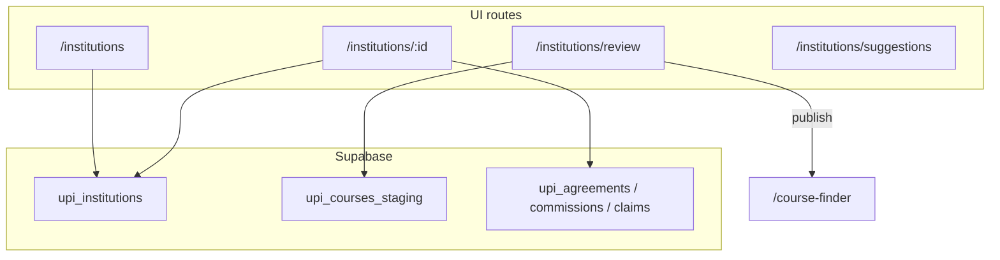
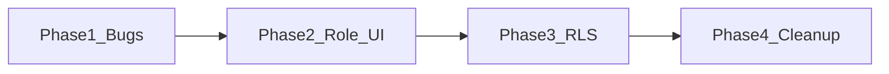

# Institutions & Course Review — audit and improvement plan

## Current state (error-free?)

| Area | Status |
|------|--------|
| **TypeScript / build** | Passes — no compile errors under [`src/institutions/`](src/institutions/) |
| **Automated tests** | None for institutions/UPI |
| **Runtime correctness** | Several bugs and permission gaps (below) |

The module is **real Supabase-backed code** (not a mock UI), wired to `upi_*` tables and 14 edge functions (`upi-extract-programs-from-doc`, `upi-publish-courses`, etc.).

---

## Confirmed bugs (fix first)

### 1. Broken Course Finder links
[`CourseReviewPage.tsx`](src/institutions/pages/CourseReviewPage.tsx) links to `/courses`, but the app route is **`/course-finder`** ([`App.tsx`](src/App.tsx) ~184).

- Lines 164, 192, 381: change to `/course-finder` and `/course-finder?courseId=…`
- After publish toast “View” action will stop opening a 404

### 2. Infinite “Loading…” on missing institution
[`InstitutionDetailPage.tsx`](src/institutions/pages/InstitutionDetailPage.tsx) line 383: `if (!inst) return Loading…` but `load()` never checks `i.error` (line 122). Invalid UUID → spinner forever.

- Track `loadError` / `loading` state
- Show “Institution not found” + link back to list when `error` or empty row

### 3. Silent Supabase failures
Multiple pages ignore `error` on queries:
- [`CourseReviewPage.tsx`](src/institutions/pages/CourseReviewPage.tsx) `load()` line 68 — empty table with no toast when RLS denies access
- [`InstitutionsListPage.tsx`](src/institutions/pages/InstitutionsListPage.tsx) `load()` line 29
- [`repositories/index.ts`](src/institutions/repositories/index.ts) `fetchLiveScoped` swallows errors → `[]` (lines 20–22)

- Surface `toast.error(error.message)` (or inline banner) instead of silent empty UI

### 4. Production config defaults too permissive
[`config.ts`](src/institutions/config.ts): `VITE_USE_MOCK_DATA` defaults **`true`** → `ALLOW_TEST_DELETIONS` enables delete buttons on agreements/promotions in production unless env is set.

- Default mock flag to **`false`** for production builds
- Document required env vars in README or `.env.example`

---

## Permission / RLS mismatch (your main operational risk)

**UI today:** [`InstitutionsProtectedRoute`](src/institutions/components/InstitutionsProtectedRoute.tsx) grants access via **`institutions` module** view/edit.

**Database today (migrations):**
- [`20260523040245_*.sql`](supabase/migrations/20260523040245_3d66be0e-06b8-49b9-bece-ed0cd91af3a5.sql): **`upi_courses_staging` SELECT** → admin or `commission_admin` only
- [`20260522210956_*.sql`](supabase/migrations/20260522210956_57585623-1fa9-4346-a760-3a2957b3a6d8.sql): **writes** on institutions, staging, sources, promotions, etc. → admin or `commission_admin` only

**Result:** A counselor with **Institutions EDIT** can open Course Review and edit institution profile, but queries/updates may **fail silently or return empty** unless they are also commission admin.

### Recommended two-tier model (matches your answer)

| Tier | Who | Can do |
|------|-----|--------|
| **Catalog / institutions staff** | `institutions` module VIEW/EDIT | List institutions, add sources (website URLs), upload **program/brochure** docs, run extraction, **Course Review** (approve/publish to Course Finder), promotions/campaigns, AI suggestions |
| **Confidential / commission staff** | `commission_admin`, accounting, or `commissions` module | Agreements, commission sheets, **invoice templates**, claims, commission students, audit logs |

**UI changes:**
- Gate **document upload kinds** on [`InstitutionDetailPage.tsx`](src/institutions/pages/InstitutionDetailPage.tsx) (~626): hide `agreement`, `commission_sheet`, `invoice_template`, `renewal_document` unless `canSeeCommissions`
- Keep agreements/commissions/claims tabs locked (already done via `canSeeCommissions`)
- Add **`requireEdit`** on mutating routes or disable save/publish when `!canEdit`
- Optional: split Documents tab into “Program materials” vs “Confidential” sections

**RLS migration (new SQL file):**
- Add helper e.g. `can_manage_upi_catalog(uid)` → admin OR institutions module edit (via existing permissions table)
- Add `can_manage_upi_confidential(uid)` → admin OR `is_commission_admin()` OR commissions module edit
- **SELECT/INSERT/UPDATE** on `upi_courses_staging`, `upi_institution_sources`, `upi_uploaded_documents` (non-confidential kinds), `upi_institutions` → catalog tier
- **Agreements, commissions, commission rules, claim cycles, invoice-related docs** → confidential tier only
- Keep audit logs / pipeline events admin-only

This resolves empty Course Review for catalog staff without opening commission data.

---

## Improvements (quality, not blockers)

### Program extraction (your requirement: website + uploads)
Already partially wired on institution detail:
- **Website sources:** `upi_institution_sources` + `upi-sync-source` edge function
- **Uploads:** `upi-document-orchestrator` + `upi-extract-programs-from-doc` for `program_sheet` / `brochure` kinds ([`config.ts`](src/institutions/config.ts) `DOC_KIND_TO_EXTRACTOR`)

Suggested polish:
- After adding a **website URL** source, auto-trigger sync (or clearer “Sync now” CTA)
- Show extraction errors from `upi_sync_jobs.error_summary` prominently (partially done in `sourceErrors`)
- On Course Review empty state, explain **permission** vs **no extracted courses** (different messages)

### Dead / confusing code cleanup
- Remove unused [`mock/types.ts`](src/institutions/mock/types.ts)
- Remove dead `sourcesMockRepo` + `useMockSources` demo block (always `[]`)
- Remove duplicate parent fetches in `InstitutionDetailPage.load()` (panels refetch via hooks)
- Remove debug `console.log` in `addSource` (~185)
- Replace `type Row = any` in Course Review with [`UpiCourseStaging`](src/institutions/types/upi.ts) or generated Supabase types

### Course Review UX
- Sync filter state to URL (`?status=&institutionId=`) so list stat cards and browser back work consistently
- Check `error` on bulk approve/publish and show partial-failure summary

### Client ↔ commission bridge
[`planned/clientIntegrationBridge.ts`](src/institutions/planned/clientIntegrationBridge.ts) remains **PLANNED** (`BRIDGE_ENABLED = false`). No action unless you want Phase 2 activation — keep out of this fix batch.

---

## Suggested implementation order

1. **Phase 1 — Quick fixes** (~1 PR): Course Finder URLs, loading/error states, error toasts, config defaults
2. **Phase 2 — Role UI** (~1 PR): Document kind gating, `canEdit` guards on save/publish, clearer locked messaging
3. **Phase 3 — RLS** (~1 migration): Two-tier policies aligned with module permissions
4. **Phase 4 — Cleanup** (optional): types, dead code, URL sync, minimal smoke tests for `claimEngine` / publish flow

---

## What you can verify today (no code)

1. Log in as a user with **Institutions EDIT** but **not** commission admin → open `/institutions/review` — likely empty or errors in network tab
2. Click “View in Course Finder” from Course Review — likely 404 (`/courses`)
3. Open invalid `/institutions/bad-uuid` — stuck on Loading

After Phase 1–3, catalog staff should manage programs/websites/uploads; commission staff alone see agreements/claims/invoice templates.
