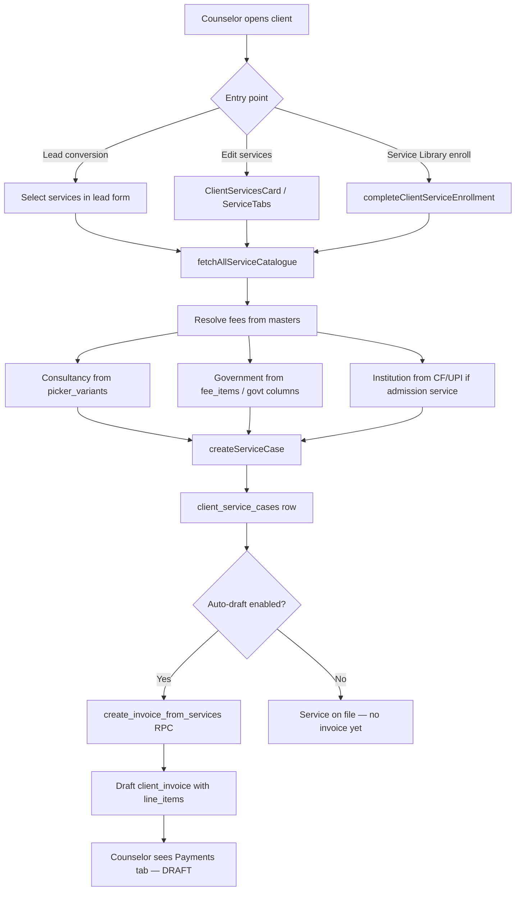
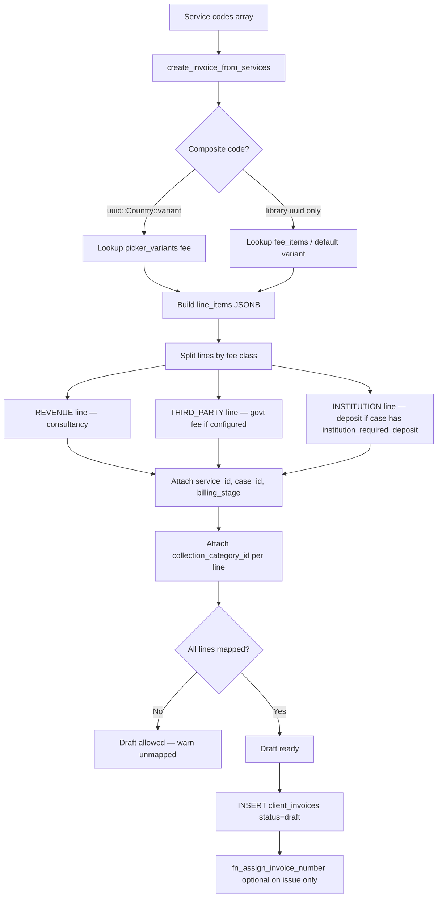
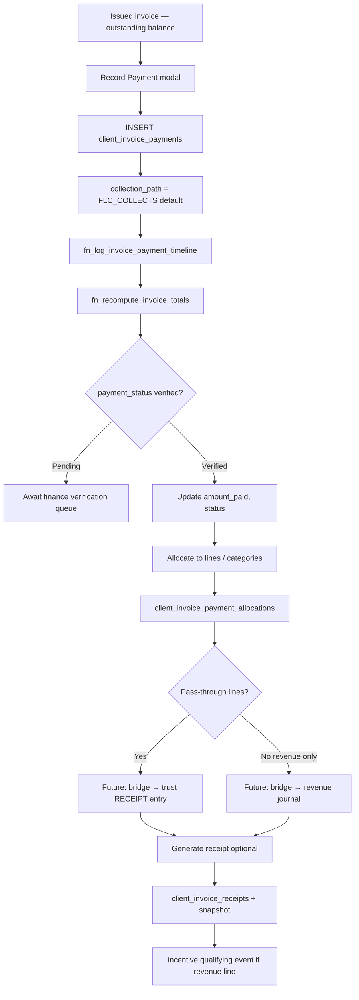
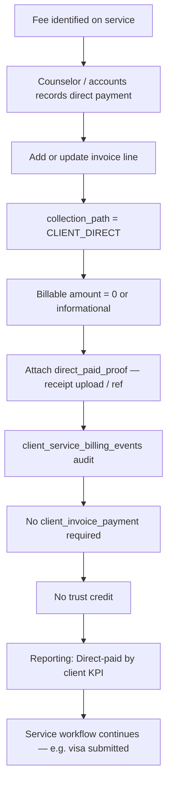
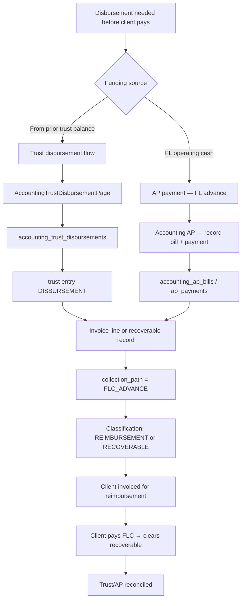
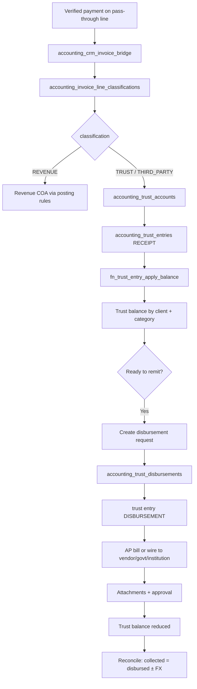
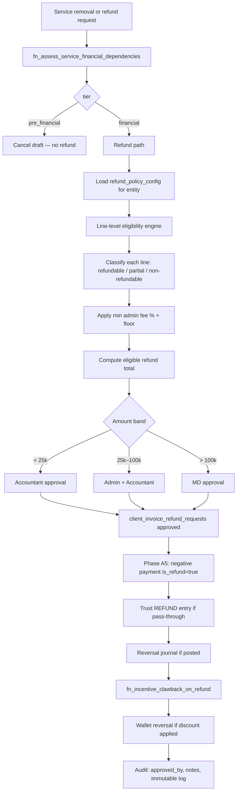

# Fee Master Architecture V1 (Phase P2 — Design Only)

| Field | Value |
|-------|-------|
| **Status** | DESIGN — no implementation, no migrations, no code |
| **Phase** | P2 (follows Payment Architecture V1 audit) |
| **Date** | June 2026 |
| **Governed by** | [`ACCOUNTING_HARDENING_ARCHITECTURE.md`](./ACCOUNTING_HARDENING_ARCHITECTURE.md) |
| **Prerequisite** | [`ACCOUNTING_A1_5_PREREQ_DEPLOY.md`](./ACCOUNTING_A1_5_PREREQ_DEPLOY.md) — bridge + trust tables must exist before financial flows activate |

---

## Table of contents

1. [Purpose & scope](#1-purpose--scope)
2. [Architectural principles](#2-architectural-principles)
3. [Fee master domains](#3-fee-master-domains)
4. [Reuse inventory](#4-reuse-inventory)
5. [Module ownership](#5-module-ownership)
6. [Conceptual data model](#6-conceptual-data-model)
7. [Screen flow diagrams](#7-screen-flow-diagrams)
8. [Fee ownership matrix](#8-fee-ownership-matrix)
9. [Reporting requirements](#9-reporting-requirements)
10. [Duplicate structures (current CRM)](#10-duplicate-structures-current-crm)
11. [Gaps & phase alignment](#11-gaps--phase-alignment)
12. [Related documents](#12-related-documents)

---

## 1. Purpose & scope

Future Link collects money on behalf of clients across four economic roles:

| Role | Examples |
|------|----------|
| **Future Link revenue** | Consultancy fee, coaching fee, margin |
| **Government** | IRCC visa fee, UKVI, SEVIS, embassy charges |
| **Institution** | Application fee, tuition deposit, GIC, residence deposit |
| **Third party** | IELTS, WES, courier, medical, insurance |

Today these amounts live in **fragmented stores** (Service Library fee items, picker variants, institution course staging, hardcoded TypeScript, collection categories). Invoices carry charges as **JSON line items** without a unified fee-master contract.

**Objective:** Define a single Fee Master Architecture that:

- Separates **rate masters** (what a fee costs) from **operational charges** (what was billed/collected/disbursement)
- Reuses existing tables, screens, and `accounting_collection_categories` wherever possible
- Aligns with approved accounting hardening (line-based refunds, trust subledger, immutability)
- Does **not** introduce parallel billing or payment systems

**Out of scope (P2):** Migrations, RPCs, UI code, refund engine implementation (Phase A4–A5).

---

## 2. Architectural principles

Derived from approved accounting architecture:

1. **CRM `client_invoices` is the source of truth** for student money — not `accounting_ar_invoices` (corporate only).
2. **Every billable fee line must map to a collection category** — unmapped lines block invoice send.
3. **Pass-through fees are trust liabilities**, not revenue — until disbursed or refunded per policy.
4. **Fee masters hold defaults; invoice lines hold actuals** — snapshots at issue time; masters may change later.
5. **No hard-delete of financial records** — archive, cancel drafts, reversal journals only.
6. **Refunds are line-based** (Phase A4+) — never invoice-total refunds.
7. **Discount wallets apply to Future Link revenue only** — not government/institution/third-party pass-through lines unless explicit policy exception.
8. **Three admin surfaces, one operational surface:**
   - Masters → Service Library / Institutions / Accounting settings
   - Operations → CRM **Payments** tab (`?tab=commercial`)
   - Disbursement → Accounting Trust + AP

---

## 3. Fee master domains

### 3.1 Government Fee Master

Government fees are **authority-mandated charges** collected on behalf of a government or immigration body. They are **non-refundable by default** (Phase A4 policy).

| Fee type | Collection category (reuse) | Default payee | Trust? | Primary master location |
|----------|----------------------------|---------------|--------|-------------------------|
| Visa fee (IRCC, UKVI, etc.) | `VISA_FEE` | GOVERNMENT | Yes | Service Library — per country/service |
| Embassy fee | `EMBASSY_FEE` | GOVERNMENT | Yes | Service Library |
| SEVIS | `SEVIS_FEE` | US Government | Yes | Service Library (USA services) |
| Biometrics | `BIOMETRIC_FEE` | VFS Global | Yes | Service Library |
| VFS service charge | `VFS_FEE` | VFS Global | Yes | Service Library |
| Government processing fee | `VISA_FEE` or `EMBASSY_FEE` (country-specific) | GOVERNMENT | Yes | Service Library |
| Police clearance (PCC) | `POLICE_CLEARANCE` | GOVERNMENT | Yes | Service Library / Allied |
| Country-specific surcharges | Map to nearest leaf category or `OTHER` + notes | GOVERNMENT | Yes | Service Library `fee_items` |

**Country dimension:** Every government fee row is keyed by `(library_id, country, effective_from)`. Canada, UK, USA, Australia, Schengen, Germany, NZ, etc. already have seed migrations and/or `feeBreakdown/*.ts` modules.

**Consolidation target (future):** One logical **Government Fee Master** view backed by `service_library_fee_items` (govt-labelled rows) + `service_library_picker_variants.govt_*` — with hardcoded TS as read-only fallback until migrated.

---

### 3.2 Institution Fee Master

Institution fees are **charges owed to universities, colleges, or pathway providers**. Treatment is predominantly `INSTITUTION_RELATED` or trust-held `THIRD_PARTY` with payee type INSTITUTION.

| Fee type | Collection category (reuse) | Default payee | Trust? | Primary master location |
|----------|----------------------------|---------------|--------|-------------------------|
| Application fee | `APPLICATION_FEE` | INSTITUTION | Yes | Institution module — route or program |
| Tuition (full / per year) | `TUITION` | INSTITUTION | Yes | Institution module — `upi_courses_staging` / `cf_courses` |
| University / seat deposit | `UNIVERSITY_DEPOSIT` | INSTITUTION | Yes | Institution module + service case |
| Residence / accommodation deposit | `ACCOMMODATION_DEPOSIT` | VENDOR (landlord) | Yes | Institution module or Service Library |
| GIC (Canada) | `GIC` | INSTITUTION (bank partner) | Yes | Service Library + institution context |
| Other institution charges | `OTHER` or new leaf under `THIRD_PARTY` | INSTITUTION | Yes | Institution agreements |

**Granularity:**

- **Program level:** `upi_courses_staging.tuition_fee`, `application_fee`, `currency`
- **Route level:** `upi_partnership_routes.application_fee`, waiver windows
- **Operational snapshot:** `client_institution_qualifications.tuition_fee`, `qualification_*_track`
- **Billing reference:** `client_service_cases.institution_required_deposit`, `institution_deposit_reference`

**Consolidation target (future):** Logical **Institution Fee Schedule** keyed to `upi_institution_id` + program/route — seeded from staging tables, not a parallel tuition catalog.

---

### 3.3 Third Party Fee Master

Third-party fees are **vendor or test-provider charges** where Future Link may collect, hold in trust, and remit. Default: **not refundable** (Phase A4).

| Fee type | Collection category (reuse) | Default payee | Trust? | Primary master location |
|----------|----------------------------|---------------|--------|-------------------------|
| IELTS | `IELTS` | IDP / British Council | Yes | Service Library (coaching/allied) or standalone |
| PTE | `PTE` | Pearson | Yes | Service Library |
| TOEFL | `TOEFL` | ETS | Yes | Service Library |
| Duolingo | `TEST_FEE` → new leaf `DUOLINGO` (future) | Duolingo | Yes | Service Library — **category gap today** |
| CELPIP | `TEST_FEE` → new leaf `CELPIP` (future) | Paragon | Yes | Service Library — **category gap today** |
| WES | `WES` | WES | Yes | Service Library / credential group |
| IQAS | `IQAS` | IQAS | Yes | Service Library |
| ICAS / CES / other credential | `CREDENTIAL_ASSESSMENT` children | VENDOR | Yes | Service Library |
| Courier | `COURIER` | VENDOR | Yes | Service Library / per-service default |
| Medical | `MEDICAL` | VENDOR | Yes | Service Library |
| Insurance | `INSURANCE` | INSURER | Yes | Service Library |
| Translation | `TRANSLATION` | VENDOR | Yes | Service Library |
| Document attestation | `DOCUMENT_ATTESTATION` | VENDOR | Yes | Service Library |

**Note:** Test fees share parent group `TEST_FEE` in collection categories. Duolingo and CELPIP need **new leaf categories** under `TEST_FEE` in a future accounting seed — do not create a separate taxonomy tree.

---

### 3.4 Future Link revenue (not a fee master — reference only)

| Fee type | Collection category | Treatment |
|----------|---------------------|-----------|
| Consultancy / service fee | `SERVICE_FEE` | REVENUE |
| Coaching fee | `COACHING_FEE` | REVENUE |

Sourced from `service_library_picker_variants.fee_inr/cad` (consultancy) — **not** government or third-party masters. Discount wallets and offers apply here.

---

## 4. Reuse inventory

### 4.1 Tables to reuse (do not duplicate)

| Table | Reuse for |
|-------|-----------|
| `accounting_collection_categories` | **Canonical fee taxonomy** — every fee type maps here |
| `accounting_collection_category_coa` | GL role mapping per category |
| `accounting_collection_category_vendors` | Default vendor per category/country |
| `service_library` | Service identity anchor |
| `service_library_fee_items` | Government + third-party **default amounts** (consolidate as primary rate store) |
| `service_library_picker_variants` | Package-level consultancy + govt fee overrides |
| `service_library_countries` | Country scope |
| `upi_institutions` | Institution identity |
| `upi_courses_staging` | Program fee staging/review |
| `cf_courses` | Published program tuition |
| `upi_partnership_routes` | Route application fee + waivers |
| `client_service_cases` | Billing cap, deposit ref, billing trigger |
| `client_invoices.line_items` (JSONB) | **Operational charge instances** |
| `client_invoice_payments` | Collections (`is_refund` for refunds) |
| `client_invoice_payment_allocations` | Line/category allocation |
| `accounting_crm_invoice_bridge` | REVENUE vs TRUST split for posting |
| `accounting_invoice_line_classifications` | Per-line classification mirror |
| `accounting_trust_accounts` / `accounting_trust_entries` | Trust held balances |
| `accounting_trust_disbursements` | Pay-out to government/institution/vendor |
| `accounting_ap_bills` / `accounting_ap_payments` | Vendor remittance |
| `client_institution_qualifications` | Application-time tuition snapshot |
| `qualification_deposit_track` / `qualification_tuition_track` | Application payment tracking |

### 4.2 Tables NOT to recreate

| Retired / wrong layer | Reason |
|-----------------------|--------|
| `service_catalogue` | Dropped — billing uses library composite codes |
| `accounting_ar_invoices` for students | Corporate AR only |
| New `external_charges` table | Charges are classified invoice lines |
| New `fee_master` monolith | Split by domain; spine = collection categories |
| Parallel payment tables | Full CRM payment stack exists |

### 4.3 Screens to reuse

| Screen | Route | Extend for fee masters |
|--------|-------|------------------------|
| **Service Library Admin** | `/service-library-admin` | Government + third-party default rates (Fees + Packages tabs) |
| **Service Library Academy** | `/service-library` | Counselor-facing fee breakdown display |
| **Institution Detail** | `/institutions/:id` | Institution fee schedules (programs, routes, deposits) |
| **Course Review** | `/institutions/review` | Staging tuition/application fee approval |
| **Partnership Routes** | Institution detail panel | Application fee + waivers |
| **Collection Categories** | `/accounting/settings/collection-categories` | Taxonomy admin, payee defaults, trust flags |
| **CRM Payments tab** | `/clients/:id?tab=commercial` | Multi-class invoice lines, collection path |
| **Accounting Trust** | `/accounting/trust` | Trust balances by category |
| **Trust Disbursement** | `/accounting/trust/disbursement` | Pay government/institution/vendor |
| **Accounting AP** | `/accounting/ap` | Vendor bills linked to categories |
| **Masters → Service Library** | `/masters?section=__service_library` | Service activation links to admin |
| **Lead / service picker** | Lead form, `ServicePickerRow` | Consultancy vs government columns |

### 4.4 Collection categories to reuse (seeded)

**Revenue group**

- `FUTURE_LINK_REVENUE` → `SERVICE_FEE`, `COACHING_FEE`

**Third party group (pass-through)**

- `TUITION`, `APPLICATION_FEE`, `UNIVERSITY_DEPOSIT`, `GIC`, `ACCOMMODATION_DEPOSIT`
- `VISA_FEE`, `EMBASSY_FEE`, `SEVIS_FEE`, `BIOMETRIC_FEE`, `VFS_FEE`, `POLICE_CLEARANCE`
- `TEST_FEE` → `IELTS`, `PTE`, `TOEFL`
- `CREDENTIAL_ASSESSMENT` → `WES`, `IQAS`
- `INSURANCE`, `MEDICAL`, `COURIER`, `TRANSLATION`, `DOCUMENT_ATTESTATION`
- `AIR_TICKET`, `AIRPORT_PICKUP`, `OTHER`

**Gaps to add (future seed only — not in P2):**

- `DUOLINGO`, `CELPIP` under `TEST_FEE`
- Optional country-specific government leaves if `OTHER` is overused

---

## 5. Module ownership

```
┌─────────────────────────────────────────────────────────────────────────┐
│                        FEE MASTER OWNERSHIP                              │
├──────────────────────┬──────────────────────────────────────────────────┤
│ Service Library      │ • Government fees (visa, biometrics, SEVIS, VFS) │
│                      │ • Consultancy fee defaults (REVENUE)             │
│                      │ • Third-party fees tied to a service (courier,     │
│                      │   translation bundled with visa)                 │
│                      │ • GIC defaults where service-scoped              │
│                      │ • Counselor display (fee breakdown, KPIs)        │
│                      │ • Lead-form package variants                     │
├──────────────────────┼──────────────────────────────────────────────────┤
│ Institution module   │ • Program tuition & application fees           │
│                      │ • Partnership route fees & waivers               │
│                      │ • University/residence deposits (institution-    │
│                      │   specific amounts)                              │
│                      │ • Application snapshots (qualification tracks)   │
│                      │ • NOT: commission receipts (separate domain)     │
├──────────────────────┼──────────────────────────────────────────────────┤
│ Accounting module    │ • Collection category taxonomy (all fee types)   │
│                      │ • COA mapping, trust buckets, vendor defaults    │
│                      │ • Trust subledger & disbursements                │
│                      │ • AP bills & vendor payments                     │
│                      │ • Refund policy config (A4)                      │
│                      │ • GL journals & fiscal controls                  │
├──────────────────────┼──────────────────────────────────────────────────┤
│ CRM Payments tab     │ • Operational billing (invoice lines)          │
│                      │ • Payment collection & verification              │
│                      │ • Receipts & client timeline                     │
│                      │ • Collection path recording (FLC/direct/advance) │
├──────────────────────┼──────────────────────────────────────────────────┤
│ Performance Hub      │ • Discount wallets & offers (REVENUE only)       │
│                      │ • Profitability reporting (Phase A6)             │
│                      │ • NOT: fee rate masters or pass-through billing  │
└──────────────────────┴──────────────────────────────────────────────────┘
```

---

## 6. Conceptual data model

**Design-only.** No migrations in P2. Defines logical entities for P3+ implementation.

### 6.1 Shared spine

Every fee master row (any domain) shares:

```
fee_master_row (logical)
├── id
├── domain                        GOVERNMENT | INSTITUTION | THIRD_PARTY
├── collection_category_id        → accounting_collection_categories.id  (required)
├── amount, currency
├── inr_display, cad_display        cached FX for UI
├── effective_from, effective_to
├── lifecycle_status              DRAFT | ACTIVE | ARCHIVED
├── source                          MANUAL | CRAWL | MIGRATION | AUTHORITY_URL
├── source_ref                      URL / gazette / agreement id
└── notes
```

### 6.2 Government fee master (logical extension)

```
government_fee_master
├── fee_master_row (shared)
├── library_id                      → service_library.id
├── country
├── variant_key                     → service_library_picker_variants (optional)
├── authority                       IRCC | UKVI | US_DOS | ...
└── fee_label                       display label
```

**Physical reuse:** Primary store = `service_library_fee_items` (govt labels) + `picker_variants.govt_*`. Deprecate hardcoded `feeBreakdown/*.ts` as authoritative source over time.

### 6.3 Institution fee master (logical extension)

```
institution_fee_schedule
├── fee_master_row (shared)
├── upi_institution_id
├── cf_course_id | staging_course_id   nullable
├── partnership_route_id               nullable
├── fee_type                           APPLICATION | TUITION | DEPOSIT | RESIDENCE | GIC | OTHER
├── per_unit                           ONE_TIME | YEAR | SEMESTER | PROGRAM
├── intake_season                      optional
└── waiver_rules                       jsonb ref to route waivers
```

**Physical reuse:** Seed from `upi_courses_staging`, `cf_courses`, `upi_partnership_routes`. Snapshot to `client_institution_qualifications` and `client_service_cases` at enrollment.

### 6.4 Third-party fee master (logical extension)

```
third_party_fee_master
├── fee_master_row (shared)
├── library_id                      optional — null = global rate (e.g. IELTS)
├── vendor_id                       → accounting_vendors (optional)
├── test_provider                   IELTS | PTE | WES | ...
└── country                         optional scope
```

**Physical reuse:** `service_library_fee_items` + collection category leaves. Global test fees may exist without a library_id (coaching add-on services).

### 6.5 Operational charge (invoice line contract)

Every billed fee becomes a line on `client_invoices.line_items`:

```
line_item (JSONB contract — extend in P3)
├── line_item_key                   stable uuid per line
├── description
├── amount, currency, quantity, total
├── collection_category_id          required before send
├── fee_master_ref                  { domain, id } optional back-pointer
├── billing_stage                   DEPOSIT | INSTALLMENT | BALANCE | FULL | TOP_UP
├── service_id, service_code, case_id
├── accounting_treatment            REVENUE | THIRD_PARTY | INSTITUTION_RELATED | REIMBURSEMENT
├── collection_path                 FLC_COLLECTS | CLIENT_DIRECT | FLC_ADVANCE
├── trust_required                  bool (from category)
├── refundable                      bool (default from category + refund_policy_config)
├── amount_collected                derived from allocations
├── amount_disbursed                derived from trust/AP
└── direct_paid_proof               optional — receipt ref when CLIENT_DIRECT
```

### 6.6 Collection path semantics

| Path | Meaning | Invoice | Trust | AP |
|------|---------|---------|-------|-----|
| `FLC_COLLECTS` | Client pays Future Link; FL remits | Full line billed | Receipt → trust credit | Disbursement → trust debit |
| `CLIENT_DIRECT` | Client pays authority/vendor directly | Line recorded at **₹0 billable** or informational; proof attached | No trust movement | Optional AP if FL never touched funds |
| `FLC_ADVANCE` | FL pays vendor before client reimburses | Reimbursable line or recoverable AR | May skip trust if expensed | AP payment + recoverable asset |

---

## 7. Screen flow diagrams

### A) Counselor creates service

Counselor adds a service to a client (lead conversion, edit services, or enrollment).



**Screens:** Client detail → Services; Lead form; Service Library academy → Enroll.  
**Masters read:** Service Library fees, institution program (if linked), collection category defaults (future wiring).

---

### B) Auto draft invoice generation

Triggered on service add or registration when auto-draft policy applies.



**Gap today:** Auto-draft RPC builds primarily **consultancy** lines; government/institution split lines and `collection_category_id` wiring are incomplete.

---

### C) Manual Create Invoice workflow

Accounts or counselor builds invoice from Payments tab.

```mermaid
flowchart TD
  A[ClientInvoicesPanel — Create Invoice] --> B[loadEligibleServiceRequests]
  B --> C[Show services with collection status]
  C --> D[Counselor selects service(s)]
  D --> E[arInvoiceWorkflow — billing intent check]
  E --> F{Intent}
  F -->|new_service / deposit| G[Propose line set from masters]
  F -->|top_up / installment| H[Cap check fn_validate_service_billing_cap]
  F -->|duplicate| I[Block or warn]

  G --> J[Line builder UI]
  H --> J
  J --> K[Counselor edits amounts / adds external charge lines]
  K --> L[Each line: category + collection_path]
  L --> M{categoryUnmapped?}
  M -->|Yes| N[Block Send — draft OK]
  M -->|No| O[Save draft or Issue]

  O --> P[Issue → status pending_payment]
  P --> Q[fn_take_invoice_snapshot]
  Q --> R[Invoice locked rules apply on payment]
```

**Screens:** `ClientInvoicesPanel`, `AccountingNewInvoicePage` (mirror).  
**Reuse:** `serviceBilling.ts` stages, `invoiceLinePricing.ts` math, wallet discount on revenue lines only.

---

### D) Client paid FLC (standard collection)

Client pays Future Link for invoice lines (consultancy + pass-through).



**Screens:** CRM Payments tab; `/accounting/ar/verification`; portal `/portal/payments`.

---

### E) Client paid directly

Client pays government, institution, or vendor without routing funds through FLC.



**Gap today:** No `collection_path` or direct-paid proof on lines — **P3 UI + line contract extension**.

---

### F) FLC paid on behalf of client

Future Link advances funds to vendor/government before client reimburses FLC.



**Screens:** Trust disbursement, AP bill detail, CRM invoice (reimbursement line).  
**Reuse:** `accounting_reimbursements` pattern for employee; extend metaphor for client recoverable.

---

### G) Trust accounting flow

End-to-end pass-through from collection to disbursement.



**Prerequisite:** Bridge + trust tables deployed per A1.5 prereq guide.

---

### H) Refund flow (future Phase A4–A5)

Design target — **not built today**.



**Reuse:** `client_invoice_refund_requests` table, `RemoveServiceDialog` entry point, trust refund helpers in `trustPosting.ts`.

---

## 8. Fee ownership matrix

| Fee | Owner entity | Accounting treatment | Collection category | Trust held? | Refundable default | Wallet/discount |
|-----|--------------|---------------------|---------------------|-------------|-------------------|-----------------|
| Consultancy fee | **Revenue** (FLC) | REVENUE | SERVICE_FEE | No | Partial (policy) | Yes |
| Coaching fee | **Revenue** (FLC) | REVENUE | COACHING_FEE | No | Partial | Yes |
| Visa fee | **Government** | THIRD_PARTY | VISA_FEE | Yes | No | No |
| Embassy fee | **Government** | THIRD_PARTY | EMBASSY_FEE | Yes | No | No |
| SEVIS | **Government** | THIRD_PARTY | SEVIS_FEE | Yes | No | No |
| Biometrics | **Government** (via VFS) | THIRD_PARTY | BIOMETRIC_FEE | Yes | No | No |
| VFS fee | **Third party** (VFS) | THIRD_PARTY | VFS_FEE | Yes | No | No |
| Govt processing | **Government** | THIRD_PARTY | VISA_FEE / EMBASSY_FEE | Yes | No | No |
| Application fee | **Institution** | THIRD_PARTY / INSTITUTION_RELATED | APPLICATION_FEE | Yes | No | No |
| Tuition | **Institution** | INSTITUTION_RELATED | TUITION | Yes | No | No |
| University deposit | **Institution** | THIRD_PARTY | UNIVERSITY_DEPOSIT | Yes | No | No |
| Residence deposit | **Institution** / landlord | THIRD_PARTY | ACCOMMODATION_DEPOSIT | Yes | No | No |
| GIC | **Institution** (bank) | THIRD_PARTY | GIC | Yes | No | No |
| IELTS / PTE / TOEFL | **Third party** | THIRD_PARTY | IELTS / PTE / TOEFL | Yes | No | No |
| Duolingo / CELPIP | **Third party** | THIRD_PARTY | TEST_FEE (new leaf) | Yes | No | No |
| WES / IQAS | **Third party** | THIRD_PARTY | WES / IQAS | Yes | No | No |
| Courier | **Third party** | THIRD_PARTY | COURIER | Yes | Partial | No |
| Medical | **Third party** | THIRD_PARTY | MEDICAL | Yes | No | No |
| PCC | **Government** | THIRD_PARTY | POLICE_CLEARANCE | Yes | No | No |
| Insurance | **Third party** | THIRD_PARTY | INSURANCE | Yes | No | No |
| Translation | **Third party** | THIRD_PARTY | TRANSLATION | Yes | Partial | No |
| FL advance for client | **Reimbursable** | REIMBURSEMENT / RECOVERABLE | REC_CAT_DEFAULT | No | N/A | No |
| Employee expense | **Reimbursable** | REIMBURSEMENT | accounting_reimbursements | No | N/A | No |

**Legend**

- **Revenue** — recognized as Future Link income after discounts
- **Government** — remitted to authority; never revenue
- **Institution** — remitted to university/college/pathway
- **Third party** — remitted to vendor/test provider
- **Trust held** — client funds in liability subledger until disbursement
- **Reimbursable** — FL outlaid cash awaiting client repayment

---

## 9. Reporting requirements

All reports must respect **service-scoped traceability** (line → `case_id` → service) per A1 architecture. Refunds remain visible historically (Phase A6).

### 9.1 Client / counselor views (CRM Payments tab)

| Report / KPI | Definition | Source |
|--------------|------------|--------|
| **Outstanding** | Issued invoice balance − verified payments | `client_invoices`, `fn_recompute_invoice_totals` |
| **Paid** | Verified payments − refunds | `client_invoice_payments` |
| **Direct-paid by client** | Lines with `collection_path=CLIENT_DIRECT` + proof | `line_items`, billing events |
| **Paid by FLC (advance)** | Disbursement/AP before client reimbursement cleared | trust + AP + recoverable |
| **Reimbursable outstanding** | FL advance not yet recovered from client | recoverable classification |
| **Trust balances** | Held pass-through by category | `accounting_trust_accounts` |
| **Institution deposits** | Deposit lines + `institution_required_deposit` on case | lines + `client_service_cases` |

### 9.2 Accounting views

| Report | Scope |
|--------|-------|
| Trust balance by client + category | Trust page, student ledger |
| Trust pending disbursement | Disbursement queue |
| AR aging (student) | CRM invoices — not corporate AR |
| Payment purpose | `/accounting/reports/payment-purpose` — extend by collection category |
| AP outstanding by vendor/category | AP module |
| Revenue vs pass-through split | Bridge + line classifications |

### 9.3 Performance Hub (Phase A6)

| Metric | Notes |
|--------|-------|
| Gross revenue | REVENUE lines only |
| Refund amount | Line-based refunds |
| Net revenue | Gross − refunds − wallet discounts |
| Outstanding balance | Client AR |
| Pass-through volume | Informational — not revenue |

### 9.4 Institution / application views

| Metric | Source |
|--------|--------|
| Tuition quoted vs paid | `qualification_tuition_track` |
| Deposit required vs paid | `qualification_deposit_track` |
| Application fee status | institution fee schedule + invoice lines |

---

## 10. Duplicate structures (current CRM)

Every overlapping store that P3 consolidation must address. **Do not add new duplicates.**

| # | Duplicate | Locations | Risk | P3 action |
|---|-----------|-----------|------|-----------|
| D1 | **Government fee amounts** | `service_library_fee_items`; `picker_variants.govt_*`; `academy_metadata.feeBreakdown`; hardcoded `feeBreakdown/*.ts` | Rate drift, wrong invoice defaults | Single write path via Service Library Admin; TS → fallback read only |
| D2 | **Consultancy fee amounts** | `picker_variants.fee_inr/cad`; `fee_items` (consultancy labels); `consultancyFees.ts` | Same as D1 | Same consolidation |
| D3 | **Institution tuition** | `upi_courses_staging`; `cf_courses`; `client_institution_qualifications`; `upi_commission_students.tuition_*`; `qualification_tuition_track` | Conflicting quotes | Schedule master → snapshot on application; commission reads snapshot |
| D4 | **Application fee** | `upi_courses_staging.application_fee`; `upi_partnership_routes.application_fee` | Route vs program conflict | Route overrides program; explicit precedence rules |
| D5 | **Service billing SKU** | Retired `service_catalogue` vs `service_library` composite codes | Legacy RPC references | Already retired — guard against resurrection |
| D6 | **Student vs corporate invoice** | `client_invoices` vs `accounting_ar_invoices` | Double AR | Corporate only in accounting AR |
| D7 | **Commission vs client pass-through** | `upi_commission_receipts` vs `client_invoice_payments` | Conflated reporting | Separate domains permanently |
| D8 | **Two wallet systems** | `discount_wallets` (counselor) vs `credit_wallet` (client points) | Wrong discount target | Document boundary; never merge |
| D9 | **MBBS costs** | Service Library `mbbs` metadata vs UPI institution courses | Dual institution path | MBBS stays in Service Library; UPI for standard admissions |
| D10 | **Collection category vs line classification** | Category on line JSON vs `accounting_invoice_line_classifications` | Posting mismatch | Single source: category drives classification |
| D11 | **Refund request vs negative payment** | `client_invoice_refund_requests` vs `is_refund` on payments | Two refund paths | A4–A5: requests approve → single negative payment |
| D12 | **HTML cost summary** | `service_library.cost_summary_html` vs structured fees | Display-only divergence | HTML references structured master; not authoritative |
| D13 | **FX display** | `govt_fee_inr/cad` columns vs `convertGovtFee()` runtime | Stale FX | Snapshot FX at invoice issue |
| D14 | **Test fee grouping** | IELTS/PTE/TOEFL categories vs Duolingo/CELPIP uncategorized | Missing trust bucket | Add category leaves |
| D15 | **Institution deposit on case vs invoice** | `client_service_cases.institution_required_deposit` vs deposit line on invoice | Amount mismatch | Case = reference; invoice line = billable authority |

---

## 11. Gaps & phase alignment

| Phase | Fee master scope | Dependency |
|-------|------------------|------------|
| **A1.5** (ready) | Service removal + draft cleanup | Bridge + trust tables deployed |
| **P3** (next build) | Wire `collection_category_id`; line contract; collection_path; consolidate govt fee store | A1.5 UAT pass |
| **A2** | Immutability on posted lines/payments | A1.5 |
| **A3** | Transfer financials between services | A2 |
| **A4** | Refund policy + line eligibility | A3 |
| **A5** | Refund processing + trust reversal | A4 |
| **A6** | Net revenue reporting | A5 |
| **P4** | Institution fee schedule UI | P3 category wiring |
| **P5** | Direct-paid + FL-advance flows | Trust + AP active |

---

## 12. Related documents

| Document | Role |
|----------|------|
| [`ACCOUNTING_HARDENING_ARCHITECTURE.md`](./ACCOUNTING_HARDENING_ARCHITECTURE.md) | Immutability, refunds, dependency tiers |
| [`ACCOUNTING_A1_5_PREREQ_DEPLOY.md`](./ACCOUNTING_A1_5_PREREQ_DEPLOY.md) | Bridge/trust deployment gate |
| [`docs/system-map/flows/invoices-payments-receipts.md`](../system-map/flows/invoices-payments-receipts.md) | Payment cascade (critical) |
| [`docs/guides/SERVICE_MANAGEMENT_AND_DELETION_RULES.md`](./SERVICE_MANAGEMENT_AND_DELETION_RULES.md) | Service archive rules |
| [`docs/guides/offers-discounts-wallet-ai-scope-v2.md`](./offers-discounts-wallet-ai-scope-v2.md) | Wallet/discount boundaries |
| Payment Architecture V1 audit (Phase P1 chat) | Current-state inventory |

---

## Sign-off checklist (design review)

- [ ] All fee types in §3 map to existing or proposed collection category leaves
- [ ] No new payment/invoice tables proposed
- [ ] Service Library retains government + bundled third-party masters
- [ ] Institution module retains program/route/deposit masters
- [ ] Accounting module retains taxonomy + trust + AP
- [ ] CRM Payments tab remains sole operational billing surface
- [ ] Duplicate structures in §10 acknowledged with consolidation plan
- [ ] Refund flow deferred to A4–A5 with line-based design
- [ ] A1.5 bridge/trust prerequisite understood before trust flows

**End of document — design only, no implementation.**
