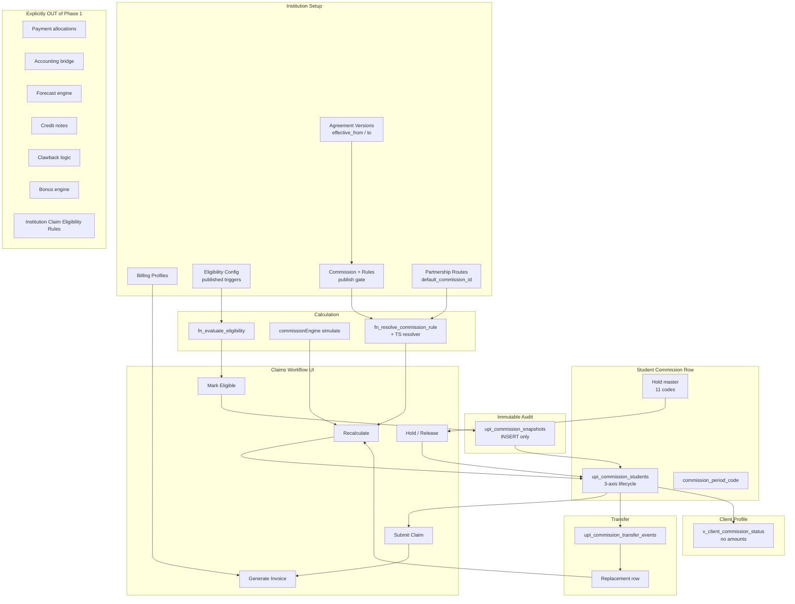

# Phase 1 Commission — UAT Readiness Pack

**Status:** Workflows complete — UAT may begin after Lovable Publish + migration approval  
**Audience:** Balveer (UAT), Commission admin, Finance

---

## A. Updated Architecture Map

### UI entry points

| Workflow | Location |
|----------|----------|
| Billing profiles | Institution → **Billing** tab |
| Eligibility config | Institution → **Eligibility** tab |
| Agreement version dating | Institution → **Agreements** → Version history |
| Publish commission rules | Institution → **Commissions** → Publish |
| Route → commission link | Institution → Overview → Partnership routes → Edit route |
| Recalculate / Mark eligible / Hold / Transfer | Institution → **Claims** → student row actions |
| Counselor status | Client → **Payments** tab → Institution commission status |
| Invoice / Submit claim | Institution → **Claims** → cycle actions |

---

## B. UAT Readiness Assessment

| Area | Ready | Notes |
|------|-------|-------|
| Mark eligible → snapshot | ✅ | `fn_mark_student_eligible` + green check in Claims |
| Hold / deferral / release | ✅ | 11 hold reasons; blocks claim while active |
| Transfer initiate → resolve | ✅ | Outcomes: unchanged, amended, cancelled, replaced |
| Replacement + new snapshot | ✅ | Manual recalc + mark eligible on replacement row |
| Route default commission | ✅ | Partnership route editor |
| Counselor status view | ✅ | Client Payments tab; no amounts |
| Agreement version effective dating | ✅ | Version history dialog |
| Claim submit → invoice | ✅ | Uses `isReadyForClaim` (eligible + ready + not on hold) |
| Immutable snapshots | ✅ | DB trigger blocks UPDATE/DELETE |
| Payment posting / allocations | ⛔ Phase 2 | Mark invoice paid only |
| Institution claim eligibility rules | ⛔ Backlog | `docs/backlog/INSTITUTION_CLAIM_ELIGIBILITY_RULES.md` |

**Prerequisites before UAT**

1. Lovable Publish — migrations through `20260723120300`
2. Commission admin role for institution confidential tabs
3. At least one institution with: active commission (published), eligibility config (published), claim cycle, student rows with tuition

**Known limitations (acceptable Phase 1)**

- Invoice numbers still `FLC-YYYY-AUTO-*`
- CRM client ↔ commission student link manual (`client_id` on student row)
- Custom eligibility trigger returns not implemented
- Transfer fees remain in CRM AR (separate workflow)

---

## C. Balveer UAT Walkthrough

### Path 1 — Full lifecycle (no transfer)

1. **Setup (once per institution)**  
   - Open institution → **Billing** → create default billing profile (CAD).  
   - **Eligibility** → create config, trigger **Deposit paid**, **Publish**.  
   - **Agreements** → Version history → set **effective from** on published version → Save.  
   - **Commissions** → resolve any rule conflicts → **Publish** active commission.  
   - **Overview** → Partnership route → set **Default commission** → Save.

2. **Student in Claims**  
   - Institution → **Claims** → open cycle with pending student.  
   - Ensure student has **tuition amount** and **tuition paid date** (or paid amount).  
   - Click **Calculator** → recalculate (verify amount + route resolver).  
   - Click **green check** → Mark eligible → confirm eligibility date → snapshot created.  
   - Verify badges: `Elig: eligible`, `Claim: ready`, `Snapshotted`.

3. **Hold test**  
   - Click **Pause** → select hold reason (e.g. document_pending) → optional expected claim date → Apply.  
   - Verify student **not** in Submit Claim eligible count.  
   - Click **Play** → Release hold → claim returns to ready.

4. **Claim & invoice**  
   - **Submit Claim** on cycle → confirm student list → Confirm submit (`claim_status: submitted`).  
   - **Generate Invoice** → view invoice → Download PDF optional.  
   - **Mark as Paid** on invoice (Phase 1 payment flag only).

5. **Counselor view**  
   - Open linked **Client** → **Payments** tab.  
   - Confirm **Institution commission status** shows eligibility/claim/payment/hold — **no dollar amounts**.

### Path 2 — Transfer → replace → new snapshot

1. On an eligible (or pending) student → **Transfer** icon → optional destination route → Initiate.  
2. Verify **transfer_under_review** hold and amber transfer resolve button.  
3. Click resolve → outcome **Replaced** → select replacement claim cycle + route → Resolve.  
4. Find **new student row** in target cycle (pending).  
5. **Recalculate** → **Mark eligible** → new immutable snapshot on replacement row.  
6. Original row should show cancelled/rejected lifecycle.

### Regression checks

- Snapshot row cannot be edited in DB (immutability).  
- Students on hold excluded from invoice generation.  
- Route with different `default_commission_id` produces different recalc vs institution default.

---

## D. Expected End-to-End Test Scenario

**Institution:** Any partner with active claim cycle  
**Student:** Priya Test — PG Diploma, Fall 2026, tuition CAD 18,000, deposit paid 2026-01-15

| Step | Action | Expected result |
|------|--------|-----------------|
| 1 | Publish eligibility config (deposit) | Config status = published |
| 2 | Link route → Commission 2026 | Route shows linked commission name |
| 3 | Recalculate student | `expected_amount` populated; `matched_rule_id` set |
| 4 | Mark eligible | `eligibility_status=eligible`, `claim_status=ready`, snapshot UUID linked |
| 5 | Query snapshot table | Row exists; UPDATE fails (immutable) |
| 6 | Apply hold `document_pending` | `hold_status=active`, excluded from Submit Claim |
| 7 | Release hold | `claim_status=ready` again |
| 8 | Submit claim | `claim_status=submitted`, `submitted_by_agency_date` set |
| 9 | Generate invoice | Draft invoice + line items; students linked |
| 10 | Client profile Payments tab | Status chips visible; no amounts |
| 11 | Initiate transfer | Open transfer event + hold |
| 12 | Resolve replaced | New student row; old cancelled |
| 13 | Recalc + mark eligible on new row | Second snapshot UUID, distinct from first |

**Pass criteria:** Steps 1–10 completable entirely in UI with no SQL. Steps 11–13 prove transfer path without mutating original snapshot.

---

*Generated at Phase 1 workflow completion. Do not start formal UAT sign-off until migrations are live in Lovable.*
