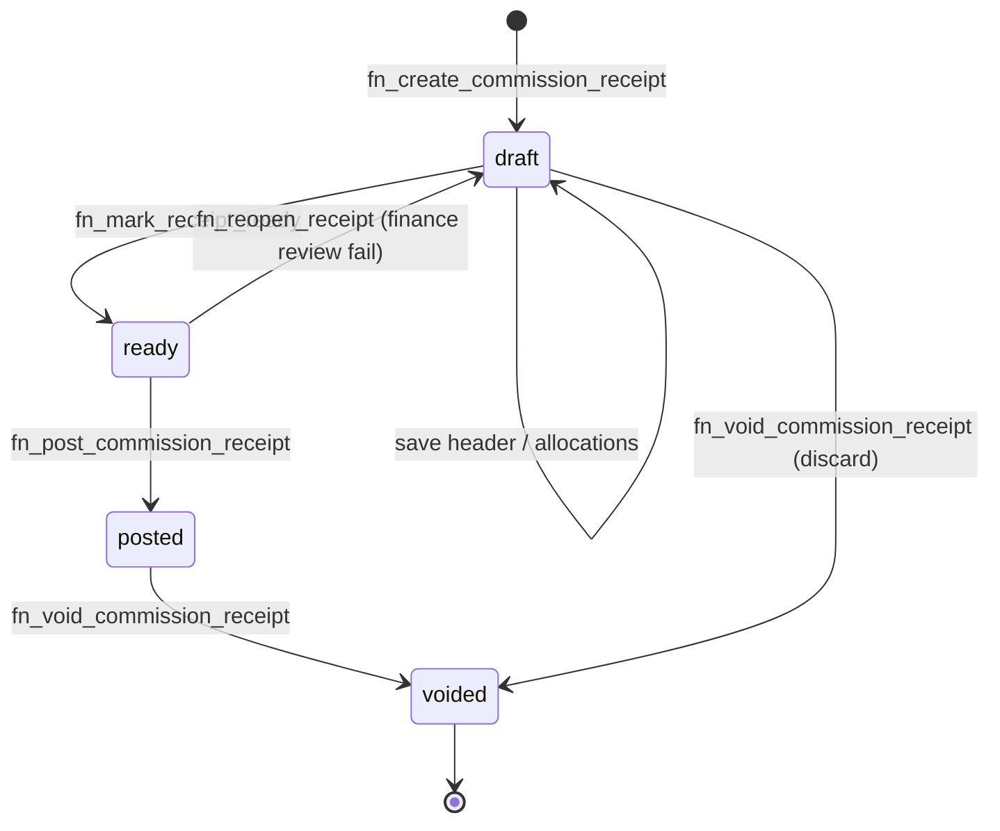

# Phase 2A — Detailed Implementation Design

**Receipt Posting + Student Allocation**

**Status:** **Approved — development in progress (Phase 2A)**  
**Scope:** 2A only. Do not implement 2B, 2C, 2D, or 2E.  
**Approved decisions:** D1–D5 yes, with amendments below.

| Amendment | Design response |
|-----------|-----------------|
| Cross-currency | **Do not block** receipt creation/storage. Block ready/post until `fx_review_status = approved`. |
| Attachments | `upi_commission_receipt_attachments` — types: `payment_advice`, `remittance`, `wire_confirmation`, `supporting`. Bucket `upi-commission-receipts`. |
| Payer identity | `payer_type`, `payer_id`, `payer_name_snapshot` on every receipt (+ legacy `institution_id`/`aggregator_id`, `context_institution_id`). |
| Posted immutability | UAT **2A-20** — posted receipts not editable; void and recreate only. |
| Receipt lifecycle | `draft` → `ready` → `posted` → `voided` |
| Unallocated balance | Allowed in **draft** only; **posted** must fully allocate `receipt_amount` |
| Short-paid | Supported — cash &lt; invoice expected; `partially_paid` + outstanding |
| Currency fields | `receipt_currency`, `receipt_amount`, `exchange_rate`, `base_amount` |
| Draft persistence UAT | Case **2A-14** — save, exit, resume, post |
| Snapshots | Immutable — no UPDATE/DELETE; RPC guards |
| Accounting | **No journals in 2A** — reserved for 2C |

---

## 1. Receipt lifecycle state machine



### 1.1 State definitions

| Status | Editable | Ledger impact | Unallocated on receipt |
|--------|----------|---------------|------------------------|
| **draft** | Yes — header, invoice allocs, student allocs | None | **Allowed** — `receipt_amount − Σ invoice_alloc` may be &gt; 0 |
| **ready** | No — read-only until reopened | None | **Must be 0** — all cash assigned to invoices |
| **posted** | **Immutable** | Updates invoice/student `amount_received`, statuses | **Must be 0** (frozen at post) |
| **voided** | Immutable | Reverses posted ledger deltas (posted only) | N/A |

### 1.2 Transitions — validation rules

#### `draft` → `ready` (`fn_mark_receipt_ready`)

| Rule | Validation |
|------|------------|
| R-READY-1 | `receipt_amount > 0` |
| R-READY-2 | Payer identity complete (`institution_id` or `aggregator_id`) |
| R-READY-3 | `Σ invoice_allocations = receipt_amount` (full cash allocation) |
| R-READY-4 | For each invoice row: `Σ student_allocations = invoice_allocation.amount` |
| R-READY-5 | Each student alloc ≤ student open balance (allows short-pay — see §4) |
| R-READY-6 | Each student `snapshot_id` on alloc matches current `commission_snapshot_id` OR null with warning if no snapshot |
| R-READY-7 | Receipt status = `draft` |

**Note:** R-READY-3 requires full allocation of **cash received**, not full settlement of invoice total. Short-pay is valid.

#### `ready` → `posted` (`fn_post_commission_receipt`)

| Rule | Validation |
|------|------------|
| R-POST-1 | Re-run all R-READY-* checks |
| R-POST-2 | Status = `ready` |
| R-POST-3 | Actor: commission admin OR accounting member |
| R-POST-4 | **No** `accounting_journal_id` write (2C) |

**Side effects on post:**

1. Increment `upi_commission_invoices.amount_received` by each invoice allocation amount.  
2. Recompute invoice `amount_outstanding` and `status` (`partially_paid` / `paid`).  
3. Increment `upi_commission_students.amount_received` by each student allocation.  
4. Recompute student `amount_outstanding`, `payment_status`, `remittance_reference_number` (when fully paid).  
5. Set receipt `status = posted`, `posted_at`, `posted_by`.  
6. Sync legacy invoice columns `payment_received_amount`, `payment_received_date` (backward compat).  
7. **Never** UPDATE `upi_commission_snapshots`.

#### `ready` → `draft` (`fn_reopen_receipt`)

- Finance sends receipt back for correction.  
- Status = `ready` only.  
- No ledger changes.

#### `posted` → `voided` (`fn_void_commission_receipt`)

- Full reversal of post side effects.  
- Allocations remain as audit trail; receipt marked voided.  
- Optional: void reason required in `metadata.void_reason`.

#### `draft` → `voided`

- Discard abandoned draft (no ledger impact).

---

## 2. Database design (detailed)

### 2.1 `upi_commission_receipts`

```text
id                      uuid PK DEFAULT gen_random_uuid()
receipt_number          text UNIQUE NOT NULL          -- CR-2026-00042
status                  text NOT NULL DEFAULT 'draft'
                          CHECK (status IN ('draft','ready','posted','voided'))

-- Payer
payer_type              text NOT NULL                  -- institution | aggregator
institution_id          uuid FK upi_institutions NULL
aggregator_id           uuid FK upi_aggregators NULL
remittance_batch_id     uuid FK upi_commission_remittance_batches NULL

-- Remittance tracking
remittance_reference    text                           -- institution payment advice
bank_reference          text                           -- FLC bank deposit id

-- Dates
receipt_date            date NOT NULL
posting_date            date                           -- set on post

-- Currency architecture (approved naming)
receipt_currency        text NOT NULL DEFAULT 'CAD'    -- currency cash received in
receipt_amount          numeric(14,2) NOT NULL         -- gross cash in receipt_currency
exchange_rate           numeric(12,6) NOT NULL DEFAULT 1
base_currency           text NOT NULL DEFAULT 'CAD'    -- firm reporting currency
base_amount             numeric(14,2) GENERATED ALWAYS AS (round(receipt_amount * exchange_rate, 2)) STORED

-- Derived (maintained by trigger in draft/ready; frozen at post)
amount_allocated        numeric(14,2) NOT NULL DEFAULT 0   -- Σ invoice allocs
unallocated_amount      numeric(14,2) NOT NULL DEFAULT 0   -- receipt_amount − amount_allocated

payment_method          text
notes                   text
metadata                jsonb NOT NULL DEFAULT '{}'

-- Audit
created_by              uuid
ready_at                timestamptz
ready_by                uuid
posted_by               uuid
posted_at               timestamptz
voided_by               uuid
voided_at               timestamptz
created_at              timestamptz NOT NULL DEFAULT now()
updated_at              timestamptz NOT NULL DEFAULT now()

-- Phase 2C placeholder — NEVER written in 2A
accounting_journal_id   uuid NULL
```

**Constraints**

```sql
CHECK (receipt_amount > 0)
CHECK (exchange_rate > 0)
CHECK (unallocated_amount >= 0)
CHECK (amount_allocated >= 0)
CHECK (amount_allocated <= receipt_amount)
CHECK (
  (payer_type = 'institution' AND institution_id IS NOT NULL AND aggregator_id IS NULL)
  OR (payer_type = 'aggregator' AND aggregator_id IS NOT NULL)
)
-- Posted/ready: unallocated must be 0 (enforced in RPC + constraint trigger)
```

**Status vs unallocated**

| status | unallocated_amount |
|--------|-------------------|
| draft | may be &gt; 0 |
| ready | must be 0 |
| posted | must be 0 |
| voided | any |

---

### 2.2 `upi_commission_receipt_invoice_allocations`

```text
id                  uuid PK
receipt_id          uuid NOT NULL FK → receipts ON DELETE CASCADE
invoice_id          uuid NOT NULL FK → upi_commission_invoices
amount_allocated    numeric(14,2) NOT NULL   -- in receipt_currency
currency            text NOT NULL            -- = receipt.receipt_currency
allocated_at        timestamptz DEFAULT now()
allocated_by        uuid
UNIQUE (receipt_id, invoice_id)
CHECK (amount_allocated > 0)
```

**Editable when:** receipt.status IN (`draft` only).

---

### 2.3 `upi_commission_receipt_student_allocations`

```text
id                      uuid PK
receipt_id              uuid NOT NULL FK
invoice_allocation_id   uuid NOT NULL FK → invoice_allocations
student_commission_id   uuid NOT NULL FK → upi_commission_students
invoice_line_item_id    uuid FK → upi_invoice_line_items NULL
snapshot_id             uuid FK → upi_commission_snapshots NULL  -- audit pointer only
amount_allocated        numeric(14,2) NOT NULL
currency                text NOT NULL
allocation_method       text DEFAULT 'manual'
                          CHECK (allocation_method IN ('manual','pro_rata','fifo','full_line'))
allocated_at            timestamptz DEFAULT now()
allocated_by            uuid
CHECK (amount_allocated > 0)
```

**Post-time snapshot guard:**

```sql
-- In fn_post_commission_receipt:
IF snapshot_id IS NOT NULL AND snapshot_id != (
  SELECT commission_snapshot_id FROM upi_commission_students WHERE id = student_commission_id
) THEN RAISE EXCEPTION 'snapshot mismatch';
```

---

### 2.4 `upi_commission_remittance_batches`

(Unchanged from plan — D4 approved.)

```text
id, batch_reference UNIQUE, payer_type, institution_id, aggregator_id,
total_amount, currency, received_date, status (open|reconciled|disputed), notes
```

---

### 2.5 Extensions — existing tables

#### `upi_commission_invoices`

| Column | Type | Maintenance |
|--------|------|-------------|
| `amount_received` | numeric(14,2) DEFAULT 0 | += posted invoice allocations |
| `amount_outstanding` | numeric(14,2) | `total_amount − amount_received` |
| `last_receipt_id` | uuid FK | last post touching invoice |
| `short_paid` | boolean DEFAULT false | true when outstanding &gt; 0 after post |

**Status derivation (after any posted receipt):**

```text
amount_received = 0        → prior status unchanged (sent/submitted/approved)
0 < received < total       → partially_paid
received >= total          → paid
```

#### `upi_commission_students`

| Column | Type | Maintenance |
|--------|------|-------------|
| `amount_received` | numeric(14,2) DEFAULT 0 | cumulative posted student allocs |
| `amount_outstanding` | numeric(14,2) | `expected − received` |
| `last_receipt_id` | uuid FK | |
| `remittance_reference_number` | text | set when `amount_outstanding = 0` from receipt.remittance_reference |

**Expected amount helper (SQL function):**

```sql
fn_student_commission_expected(p_student_id uuid) RETURNS numeric AS $$
  SELECT COALESCE(amended_expected_amount, expected_amount, commission_amount, 0)
  FROM upi_commission_students WHERE id = p_student_id;
$$;
```

**payment_status:**

```text
amount_received = 0                              → unpaid
0 < received < expected                        → partially_paid
received >= expected                             → paid
```

#### `upi_invoice_line_items`

| Column | Purpose |
|--------|---------|
| `amount_received` | optional line-level cumulative |
| `line_outstanding` | `line_amount − amount_received` |

---

### 2.6 Snapshot immutability (unchanged from Phase 1 + 2A guards)

| Layer | Mechanism |
|-------|-----------|
| DB | Existing trigger `block_commission_snapshot_mutation` on UPDATE/DELETE |
| RPC | Post rejects snapshot_id mismatch |
| App | No snapshot edit UI in receipt flow |
| Allocation | `snapshot_id` copied at alloc save time; never written back to snapshot |

---

### 2.7 Views (2A)

| View | Definition summary |
|------|-------------------|
| `v_commission_receipt_open_items` | Invoices where `amount_outstanding > 0` |
| `v_commission_student_receipt_ledger` | student_id, expected, received, outstanding, payment_status |
| `v_commission_remittance_reconciliation` | receipt ↔ invoice ↔ student sums; flags mismatch |
| `v_commission_receipts_in_progress` | status IN (draft, ready) for finance queue |

---

### 2.8 RLS & permissions

| Role | draft/ready edit | post | void posted | read |
|------|------------------|------|-------------|------|
| Commission admin | yes | yes | yes | yes |
| Accounting member | yes | yes | yes | yes |
| Counselor | no | no | no | status views only (no amounts) |

Policy: `can_view_upi_confidential(auth.uid())` on all new tables.

---

## 3. Receipt allocation architecture

### 3.1 Layer model (amended)

```text
REMITTANCE BATCH (optional)
    └── RECEIPT [receipt_amount in receipt_currency]
            ├── amount_allocated = Σ invoice allocs
            ├── unallocated_amount (draft only may be > 0)
            │
            ├── INVOICE ALLOCATION (assign all cash in ready/posted)
            │       └── may be < invoice.total_amount  ← SHORT-PAY
            │
            └── STUDENT ALLOCATION (assign all invoice slice)
                    └── may be < student.expected       ← SHORT-PAY
                            └── snapshot_id (read-only pointer)
                                    │
                                    ▼
                            POST → invoice/student ledger
                            (snapshots untouched)
```

### 3.2 Two different “partial” concepts

| Concept | Meaning | Example | Receipt unallocated | Invoice outstanding |
|---------|---------|---------|---------------------|---------------------|
| **Draft partial** | Finance still assigning cash | Receipt 11,000; only 4,600 allocated so far | 6,400 | unchanged |
| **Short-paid** | Institution paid less than billed | Invoice 3,500; receipt 3,200 | 0 at post | 300 |
| **Partial settle over time** | Multiple receipts on one invoice | Receipt1 2,000 + Receipt2 2,600 on 4,600 | 0 each post | 0 after second |

### 3.3 Allocation invariants

| ID | Invariant | When enforced |
|----|-----------|---------------|
| A1 | `Σ invoice_alloc ≤ receipt_amount` | draft save |
| A2 | `Σ invoice_alloc = receipt_amount` | ready + post |
| A3 | `Σ student_alloc (per invoice slice) = invoice_alloc.amount` | ready + post |
| A4 | `Σ student_alloc (lifetime) ≤ student.expected` | ready + post |
| A5 | Posted receipt rows immutable | post onward |
| A6 | Snapshots never updated | always |

**Short-pay:** A4 uses `≤` not `=`. Invoice can remain `partially_paid` with outstanding.

---

## 4. Short-paid scenario (detailed)

**Example:** Centennial / Priya — invoice **CAD 3,500**, institution remits **CAD 3,200**.

### 4.1 Setup (post Phase 1)

| Entity | Value |
|--------|-------|
| Invoice `total_amount` | 3,500 |
| Student `expected_amount` | 3,500 |
| Snapshot `total_amount` | 3,500 (immutable) |

### 4.2 Receipt (draft)

| Field | Value |
|-------|-------|
| `receipt_amount` | 3,200 |
| `receipt_currency` | CAD |
| `exchange_rate` | 1 |
| `base_amount` | 3,200 |
| `remittance_reference` | CC-EFT-88421-SHORT |

### 4.3 Allocations

| Layer | Amount |
|-------|--------|
| Invoice allocation | 3,200 (all cash → this invoice) |
| Student allocation (Priya) | 3,200 |
| Receipt `unallocated_amount` | 0 |

### 4.4 After post

| Entity | amount_received | outstanding | status |
|--------|-----------------|-------------|--------|
| Invoice | 3,200 | **300** | **partially_paid** |
| Student | 3,200 | **300** | **partially_paid** |
| Snapshot | 3,500 (unchanged) | — | immutable |
| Receipt | posted | unallocated 0 | posted |

### 4.5 Follow-up receipt (optional UAT 2A-15)

Second receipt CAD 300 → full settle → invoice/student `paid`, `remittance_reference_number` set.

### 4.6 UI copy

- Invoice banner: **“Short-paid — CAD 300 outstanding”**  
- Student row: **Received CAD 3,200 of CAD 3,500 expected**  
- Do **not** show unallocated on receipt (cash fully assigned)

---

## 5. Currency architecture

### 5.1 Field usage

| Field | Semantics |
|-------|-----------|
| `receipt_currency` | Currency institution/aggregator sent |
| `receipt_amount` | Gross amount in that currency |
| `exchange_rate` | Multiply to convert receipt → base (1.0 when same) |
| `base_amount` | Stored generated column for reporting |

### 5.2 Allocation currency rule (2A)

- All allocation rows use `currency = receipt.receipt_currency`.  
- Invoice/student `amount_received` accumulated in **invoice currency** (Phase 1 `invoice_currency` on invoice / student).  
- If receipt_currency ≠ invoice_currency: **block post in 2A** with message “FX receipt — deferred to 2C” OR require manual rate entry + warning ( **design choice: block cross-currency post in 2A** to avoid silent FX errors).

### 5.3 Example — USD receipt, CAD invoice (blocked in 2A)

| receipt_currency | USD |
| receipt_amount | 2,500 |
| invoice_currency | CAD |
| 2A behaviour | Save draft OK; **cannot mark ready** until currencies match |

*(FX conversion posting remains Phase 2C.)*

---

## 6. RPC catalogue (2A)

| RPC | Input | Output | Notes |
|-----|-------|--------|-------|
| `fn_create_commission_receipt` | payer, dates, receipt_amount, receipt_currency, exchange_rate, refs | receipt_id | status=draft |
| `fn_update_commission_receipt` | receipt_id, fields | void | draft only |
| `fn_upsert_receipt_invoice_allocations` | receipt_id, jsonb[] | void | draft only; refreshes unallocated |
| `fn_upsert_receipt_student_allocations` | receipt_id, jsonb[] | void | draft only |
| `fn_auto_allocate_receipt_pro_rata` | receipt_id, invoice_allocation_id | jsonb splits | draft only |
| `fn_mark_receipt_ready` | receipt_id | void | draft→ready |
| `fn_reopen_receipt` | receipt_id | void | ready→draft |
| `fn_post_commission_receipt` | receipt_id | void | ready→posted; ledger |
| `fn_void_commission_receipt` | receipt_id, reason | void | posted→voided OR draft discard |
| `fn_receipt_summary` | receipt_id | jsonb | UI hydrate — totals, warnings |
| `fn_student_open_balance` | student_id | numeric | helper |

**Explicitly excluded from 2A:** any RPC writing `accounting_journal_id` or calling accounting post functions.

---

## 7. UI design (2A)

### 7.1 Navigation

| Location | New / changed |
|----------|---------------|
| Institution → **Claims** | New sub-tab **Receipts** |
| Invoice section | Replace **Mark as Paid** → **Record receipt** (opens wizard pre-filled) |
| Global Commissions page (optional 2A.1) | Receipt queue across institutions |

### 7.2 Receipt wizard (multi-step, resumable)

| Step | Title | Draft save | Fields / actions |
|------|-------|------------|------------------|
| 1 | Remittance | yes | payer, receipt_amount, receipt_currency, exchange_rate, dates, refs, batch |
| 2 | Invoice split | yes | pick invoices, amounts; show unallocated bar |
| 3 | Student split | yes | per invoice slice; pro-rata button; snapshot id display |
| 4 | Review | — | totals, short-pay warnings, Mark ready |
| — | Ready queue | — | Post button (commission admin / accounting) |

**Draft persistence (UAT 2A-14):**

- Auto-save on step change + explicit **Save draft**  
- User exits → receipt remains `status=draft`  
- Return via Receipts list → **Continue** restores wizard at last step  
- `metadata.wizard_step` stores progress  

### 7.3 Status badges

| status | Badge |
|--------|-------|
| draft | Draft (amber) |
| ready | Ready to post (blue) |
| posted | Posted (green) |
| voided | Voided (gray) |

### 7.4 TypeScript modules (implementation map — not built yet)

| File | Responsibility |
|------|----------------|
| `src/institutions/lib/commissionReceiptRules.ts` | Validation helpers, short-pay detection |
| `src/institutions/components/CommissionReceiptsPanel.tsx` | List + filters |
| `src/institutions/components/CommissionReceiptWizard.tsx` | Multi-step form |
| `src/institutions/repositories/receiptsRepo.ts` | RPC wrappers |
| `src/institutions/lib/commissionReceiptRules.test.ts` | Unit tests for invariants |

---

## 8. Migration plan (3 files)

| Migration | Contents |
|-----------|----------|
| `20260801120000_commission_receipts_schema.sql` | Tables, column extensions, indexes, RLS, views, unallocated trigger |
| `20260801120100_commission_receipt_rpcs.sql` | All RPCs, post/void ledger logic, snapshot guards |
| `20260801120200_commission_receipt_legacy_sync.sql` | Deprecate direct Mark-as-Paid path; sync `payment_received_*` from posted receipts |

**No migration touches:** accounting journals, claim eligibility, aggregator consolidated invoice, CRM bridge.

---

## 9. UAT plan (updated)

**Prerequisite:** Phase 1 UAT signed off.

### 9.1 Core cases (from prior plan + amendments)

| # | Case | Key assertion |
|---|------|---------------|
| 2A-1 | Full receipt 3,500 | paid |
| 2A-2 | Aggregator 11,000 / 3 invoices / 5 students | Σ reconcile |
| 2A-3 | Partial invoice over time | partially_paid → paid |
| 2A-4 | Partial student two receipts | cumulative |
| 2A-5 | Pro-rata | ratio ±0.01 |
| 2A-6 | Multi-period Li Wei | two posts |
| 2A-7 | Remittance search | find by ref |
| 2A-8 | Posted immutability | edit blocked |
| 2A-9 | Void posted | balances reversed |
| 2A-10 | Over-allocate block | post rejected |
| 2A-11 | Snapshot integrity | byte-identical after post |
| 2A-12 | Counselor view | no amounts |
| 2A-13 | Legacy sync | payment_received_* updated |

### 9.2 New required cases

| # | Case | Steps | Expected |
|---|------|-------|----------|
| **2A-14** | **Draft save / resume** | Create receipt → enter step 2 partial alloc → **Save draft** → exit Claims → return → **Continue** → complete → ready → post | Same receipt_id; draft data intact; posts successfully |
| **2A-15** | **Short-paid** | Invoice 3,500 · receipt 3,200 · alloc 3,200 · post | Invoice & student **partially_paid**; outstanding **300**; receipt unallocated **0** |
| **2A-16** | **Lifecycle** | draft (unallocated OK) → ready (unallocated 0) → post → void | State transitions enforced |
| **2A-17** | **Ready blocked** | draft with unallocated &gt; 0 → Mark ready | Error: must fully allocate cash |
| **2A-18** | **Currency** | receipt_currency=USD, invoice CAD → mark ready | Blocked in 2A |
| **2A-19** | **No journal** | Post receipt | `accounting_journal_id` remains NULL |

### 9.3 Sign-off criteria

| Pass | Fail |
|------|------|
| 2A-1 through 2A-19 pass | Any ledger/snapshot mismatch |
| Short-pay outstanding correct | Treating short-pay as receipt unallocated |
| Draft resume without data loss | SQL needed for routine receipt |
| No accounting journal created | Journal id populated in 2A |

---

## 10. Aggregator scenarios (2A data layer only — no 2B UI)

2A supports **one receipt → many invoice allocations**. Phase 2B adds consolidated invoice **generation** UI.

| Scenario | Receipt | Invoice allocs | 2A pass |
|----------|---------|----------------|---------|
| ApplyBoard full | 11,000 | 4600 + 4400 + 2000 | All students paid |
| ApplyBoard partial wire | 6,600 | partial on Humber | partially_paid until second receipt |
| Short-pay on one institution slice | Seneca 4,000 on 4,600 invoice | 600 outstanding | partially_paid |

---

## 11. Implementation sequence (post design approval)

| Sprint slice | Deliverable |
|--------------|-------------|
| **S1** | Migrations schema + RLS + views |
| **S2** | RPCs + unit tests (SQL/pgTAP or integration) |
| **S3** | Receipts list + wizard steps 1–3 |
| **S4** | Ready queue + post/void + replace Mark as Paid |
| **S5** | UAT 2A-1–2A-19 + docs update |

**Estimate:** 10–13 dev days (unchanged).

---

## 12. Out of scope (explicit)

| Item | Phase |
|------|-------|
| Aggregator consolidated **invoice** UI | 2B |
| Accounting journal / GL post | 2C |
| Institution claim eligibility rules | 2D |
| CRM auto-link | 2E |
| Cross-currency receipt post | 2C |
| Bonus / forecast / analytics | 3 |

---

## 13. Approval checklist

| # | Item | Approved? |
|---|------|-----------|
| 1 | Lifecycle draft → ready → posted → voided | ☐ |
| 2 | Draft unallocated OK; posted fully allocated | ☐ |
| 3 | Short-paid partially_paid + outstanding | ☐ |
| 4 | receipt_currency / receipt_amount / exchange_rate / base_amount | ☐ |
| 5 | UAT 2A-14 draft resume | ☐ |
| 6 | Snapshot immutability guards | ☐ |
| 7 | No accounting journals in 2A | ☐ |
| 8 | Block cross-currency post in 2A | ☐ |

---

*Detailed design complete. Awaiting final approval before migrations or application code.*
