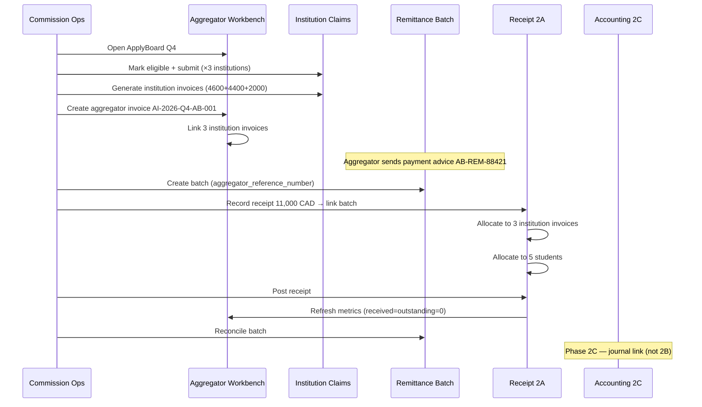
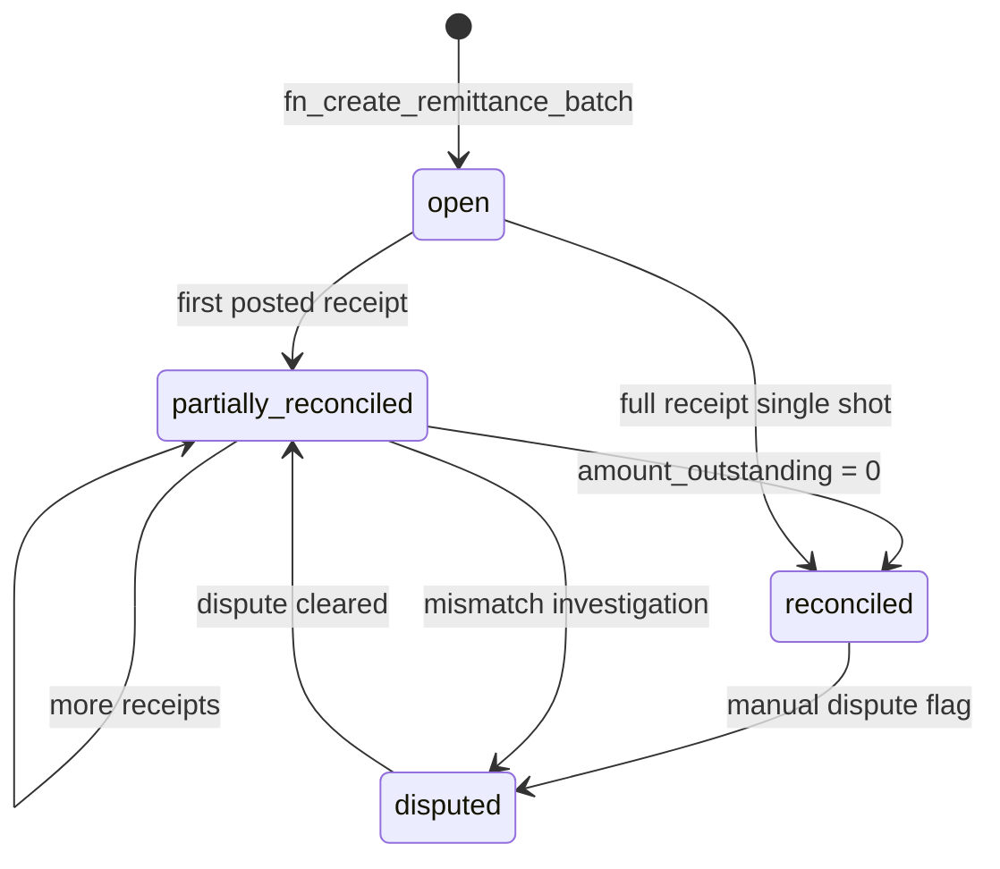

# Phase 2B — Aggregator Billing & Reconciliation Design

**Status:** **Approved — shipped in development (Phase 2B)**  
**Scope:** 2B only. Do not implement 2C (accounting journals), 2D (claim eligibility rules), or 2E (CRM auto-link).  
**Prerequisite:** Phase 2A receipt posting + student allocation published and UAT-passed.  
**Approved Phase 2 order:** 2A ✅ → **2B** → 2C → 2D → 2E

---

## Executive summary

Future Link’s aggregator reality (ApplyBoard, Navitas, etc.) is **not** “one institution, one invoice, one wire.” It is:

- **One business remittance** from the aggregator covering students at **many institutions**
- **Many institution-level commission invoices** (Phase 1 generates per institution Claims tab)
- **One or more receipts** posted against those invoices via Phase 2A allocation
- **Partial wires** that may not match any single institution invoice total
- **External reference numbers** on aggregator payment advice that finance searches by daily

Phase 2B introduces an **Aggregator Workbench** — a cross-institution finance surface — and elevates **Remittance Batch** from a lightweight 2A table to a **first-class reconciliation object**. The Phase 2A receipt → invoice → student allocation chain is **reused unchanged**; 2B adds aggregator invoice grouping, batch lifecycle, metrics rollups, and UX.

---

## Future Link aggregator realities (design inputs)

| Reality | Implication for 2B |
|---------|-------------------|
| ApplyBoard sends **one wire** for Q4 batch across Seneca + Humber + GBC | Remittance batch groups wire; one or more receipts link to batch |
| FLC still invoices **each institution** (institution is counterparty on invoice PDF) | Institution invoices remain; new **aggregator invoice** is a **consolidated billing document** linking child invoices |
| Aggregator payment advice uses **their reference** (e.g. `AB-REM-2026-Q4-88421`) | `aggregator_reference_number` on batch + receipt |
| Finance reconciles **wire amount ≠ sum of institution invoices** (fees, timing, short-pay) | Partial remittance reconciliation at batch + receipt level |
| Same students already have `aggregator_id`, `partnership_route_id`, `channel_type=indirect` | Workbench filters by aggregator; no duplicate student rows |
| Counselors must **not** see confidential amounts on aggregator totals | Workbench is commission-admin / accounting only (same as 2A) |
| Phase 1 UAT Scenario 2 (ApplyBoard 11,000 CAD / 5 students / 3 institutions) | Primary UAT anchor |

---

## A. Data model

### A.1 Design principles

1. **Reuse 2A allocation tables** — `upi_commission_receipts`, `upi_commission_receipt_invoice_allocations`, `upi_commission_receipt_student_allocations` unchanged in behaviour.
2. **Institution invoices remain source of truth** for institution-level `invoiced` amounts and line items.
3. **Aggregator invoice** is a **header + link table** — not a replacement for institution invoices.
4. **Remittance batch** owns the **external wire narrative**; receipts are **allocations of batch cash**.
5. **Metrics** (`expected`, `invoiced`, `received`, `outstanding`) are **computed views/RPCs**, not duplicated ledger columns except where 2A already maintains `amount_received` / `amount_outstanding`.

### A.2 Extend `upi_aggregators`

| Column | Type | Notes |
|--------|------|-------|
| `default_billing_profile_id` | uuid FK → `upi_billing_profiles` nullable | Aggregator remittance instructions |
| `remittance_format` | text nullable | e.g. `applyboard_csv`, `navitas_portal`, `manual` — UI hint only in 2B |
| `metadata` | jsonb | Extensibility |

*No change to master list UI scope beyond optional billing profile link.*

### A.3 Extend `upi_commission_remittance_batches` (first-class)

**Current 2A columns retained.** Add:

| Column | Type | Notes |
|--------|------|-------|
| `aggregator_reference_number` | text nullable | **External aggregator ref** (payment advice primary key) |
| `commission_period_code` | text FK → `upi_commission_periods` nullable | e.g. `Q4-2026` |
| `amount_expected` | numeric(14,2) nullable | Finance-entered or computed from linked invoices |
| `amount_received` | numeric(14,2) NOT NULL DEFAULT 0 | Sum of **posted** receipts in batch |
| `amount_outstanding` | numeric(14,2) GENERATED or maintained | `amount_expected − amount_received` |
| `receipt_count` | int NOT NULL DEFAULT 0 | Denormalized for list UI |
| `status` | text | **Extend enum:** `open` → `partially_reconciled` → `reconciled` → `disputed` → `closed` |
| `reconciled_at` | timestamptz nullable | When batch fully matched |
| `reconciled_by` | uuid nullable | |
| `created_by` | uuid nullable | |

**Constraints & indexes**

- `UNIQUE (aggregator_id, aggregator_reference_number)` WHERE `aggregator_reference_number IS NOT NULL` — soft uniqueness; disputed duplicates allowed via `status=disputed` override flag in metadata.
- Index: `(aggregator_id, received_date DESC)`, `(aggregator_reference_number)`.

**Batch invariants (enforced by RPC)**

| ID | Rule |
|----|------|
| B-1 | `payer_type = aggregator` ⇒ `aggregator_id NOT NULL` |
| B-2 | Sum of **posted** receipt amounts linked to batch ≤ `amount_expected + tolerance` (tolerance configurable in metadata, default 0) |
| B-3 | Batch `amount_received` = Σ posted receipts where `remittance_batch_id = batch.id` |
| B-4 | Status `reconciled` only when `amount_outstanding = 0` AND all linked receipts `posted` |
| B-5 | Status `partially_reconciled` when `0 < amount_received < amount_expected` |

### A.4 New: `upi_commission_aggregator_invoices`

Consolidated billing header — **one aggregator invoice → many institution invoices**.

| Column | Type | Notes |
|--------|------|-------|
| `id` | uuid PK | |
| `aggregator_invoice_number` | text UNIQUE | e.g. `AI-2026-Q4-AB-001` |
| `aggregator_id` | uuid FK → `upi_aggregators` NOT NULL | |
| `aggregator_reference_number` | text nullable | Aggregator-side claim/invoice ref when they bill FLC (inverse direction) |
| `commission_period_code` | text FK nullable | |
| `claim_cycle_id` | uuid FK → `upi_claim_cycles` nullable | Optional link to aggregator-scoped cycle |
| `invoice_date` | date NOT NULL | |
| `due_date` | date nullable | |
| `currency` | text NOT NULL DEFAULT 'CAD' | |
| `subtotal` | numeric(14,2) NOT NULL DEFAULT 0 | Sum of child institution invoices |
| `total_amount` | numeric(14,2) NOT NULL DEFAULT 0 | |
| `amount_invoiced` | numeric(14,2) NOT NULL DEFAULT 0 | Same as total at creation; maintained |
| `amount_received` | numeric(14,2) NOT NULL DEFAULT 0 | Rolled up from children |
| `amount_outstanding` | numeric(14,2) NOT NULL DEFAULT 0 | |
| `status` | text | `draft` \| `submitted` \| `approved` \| `partially_paid` \| `paid` \| `disputed` \| `cancelled` |
| `billing_profile_id` | uuid FK nullable | Aggregator billing profile |
| `notes` | text | |
| `metadata` | jsonb | `{ "institution_count", "student_count" }` |
| `created_by` | uuid | |
| `created_at` / `updated_at` | timestamptz | |

### A.5 New: `upi_commission_aggregator_invoice_lines`

Links aggregator invoice → institution commission invoices (not student rows — institution invoice is the grain).

| Column | Type | Notes |
|--------|------|-------|
| `id` | uuid PK | |
| `aggregator_invoice_id` | uuid FK → aggregator_invoices ON DELETE CASCADE | |
| `institution_id` | uuid FK → `upi_institutions` NOT NULL | Denormalized for reporting |
| `institution_invoice_id` | uuid FK → `upi_commission_invoices` NOT NULL | |
| `line_amount` | numeric(14,2) NOT NULL | Snapshot of institution invoice total at link time |
| `amount_received` | numeric(14,2) NOT NULL DEFAULT 0 | Synced from institution invoice |
| `amount_outstanding` | numeric(14,2) NOT NULL DEFAULT 0 | |
| `sort_order` | int DEFAULT 0 | PDF / display order |

**Constraints**

- `UNIQUE (aggregator_invoice_id, institution_invoice_id)`
- Institution invoice may appear on **at most one** open aggregator invoice (RPC guard)

### A.6 Extend `upi_commission_invoices` (institution level)

| Column | Type | Notes |
|--------|------|-------|
| `aggregator_id` | uuid FK nullable | Set when invoice is indirect / aggregator route |
| `aggregator_invoice_id` | uuid FK nullable | Parent consolidated invoice |
| `amount_invoiced` | numeric(14,2) GENERATED | Alias clarity: = `total_amount` (view may expose) |

*Existing `amount_received`, `amount_outstanding`, `short_paid` from 2A remain authoritative at institution invoice level.*

### A.7 Extend `upi_commission_receipts` (reuse 2A)

| Column | Type | Notes |
|--------|------|-------|
| `aggregator_reference_number` | text nullable | Copy/search key from batch or payment advice |
| `remittance_batch_id` | uuid FK | **Required for aggregator payer** in 2B (nullable for institution-only receipts) |

**No change** to invoice/student allocation tables or post/void RPC semantics.

### A.8 Extend `upi_claim_cycles`

| Column | Type | Notes |
|--------|------|-------|
| `aggregator_scope` | boolean DEFAULT false | True = cross-institution aggregator cycle |
| `cycle_label` | text nullable | e.g. `Q4 2026-ApplyBoard` (display) |

*Phase 1 already has `aggregator_id`, `payer_type` on claim_cycles.*

### A.9 Metrics model — Expected / Invoiced / Received / Outstanding

Four-axis rollup at **three grains**. All **read-only** (views + refresh RPCs on post/void).

#### Student grain (existing + view)

Source: `upi_commission_students`

| Metric | Source |
|--------|--------|
| **Expected** | `fn_student_commission_expected(id)` |
| **Invoiced** | Sum of line items on linked `invoice_id` OR `expected` if on approved invoice |
| **Received** | `amount_received` (2A) |
| **Outstanding** | `amount_outstanding` OR `expected − received` |

#### Institution grain (per aggregator context)

View: `v_commission_institution_metrics_agg`

| Dimension | Filter |
|-----------|--------|
| `aggregator_id` | Required |
| `institution_id` | Required |
| `commission_period_code` | Optional |

Rollup: SUM student metrics for students where `ucs.aggregator_id = :agg AND ucs.institution_id = :inst`.

#### Aggregator grain

View: `v_commission_aggregator_metrics`

| Metric | Computation |
|--------|-------------|
| **Expected** | Σ student expected where `aggregator_id = X` and eligibility in (`eligible`, …) |
| **Invoiced** | Σ institution invoice `total_amount` linked to aggregator OR Σ student on invoiced rows |
| **Received** | Σ student `amount_received` OR Σ batch/receipt posted amounts |
| **Outstanding** | Expected − Received (commission owed) OR Invoiced − Received (collection gap) |

**UI displays both:**

- **Commission outstanding** = Expected − Received (operational)
- **Invoice collection gap** = Invoiced − Received (billing)

#### Remittance batch grain

| Metric | Computation |
|--------|-------------|
| **Expected** | `batch.amount_expected` (from linked invoices or manual) |
| **Received** | Σ posted receipts in batch |
| **Outstanding** | Expected − Received |
| **Allocated to invoices** | Σ receipt invoice allocations for receipts in batch |
| **Unallocated cash** | Received − allocated (should be 0 at post per 2A receipt rules) |

### A.10 Entity relationship (conceptual)

```
upi_aggregators
    │
    ├── upi_commission_aggregator_invoices (1 : many)
    │         └── upi_commission_aggregator_invoice_lines → upi_commission_invoices (institution)
    │                                      └── institution → upi_commission_students
    │
    ├── upi_commission_remittance_batches (1 : many)
    │         └── upi_commission_receipts (2A, many)
    │                   ├── receipt_invoice_allocations → institution invoices
    │                   └── receipt_student_allocations → students
    │
    └── upi_claim_cycles (aggregator-scoped)
```

### A.11 RPCs (new — names only, no implementation)

| RPC | Purpose |
|-----|---------|
| `fn_create_aggregator_invoice` | Header + link institution invoices |
| `fn_add_invoices_to_aggregator_invoice` | Add/remove lines while draft |
| `fn_submit_aggregator_invoice` | Status → submitted |
| `fn_create_remittance_batch` | Batch with `aggregator_reference_number` |
| `fn_link_receipts_to_batch` | Associate draft/posted receipts |
| `fn_refresh_batch_totals` | Recompute received/outstanding |
| `fn_refresh_aggregator_invoice_totals` | Roll up from institution invoices |
| `fn_refresh_aggregator_metrics` | Materialized or on-demand refresh helper |
| `fn_reconcile_remittance_batch` | Mark reconciled when rules pass |
| `fn_get_aggregator_workbench_summary` | KPI payload for workbench landing |

**Reuse unchanged:** all 2A receipt RPCs (`fn_create_commission_receipt`, `fn_post_commission_receipt`, etc.)

### A.12 RLS

Same confidential tier as 2A:

- `can_view_upi_confidential` OR `is_commission_admin` OR `is_accounting_user`
- Counselor-safe views unchanged (`v_commission_counselor_*` from Phase 1)

---

## B. UI architecture

### B.1 Navigation

New top-level route under Institutions module:

```
/institutions/aggregators/:aggregatorId/workbench
```

Entry points:

- **Masters → Aggregators** → “Open Workbench” per row
- **Institution → Claims** (indirect route) → link “View in Aggregator Workbench”
- **Receipts** (2A) → when payer is aggregator, deep-link to batch

Institution-scoped **Receipts** and **Claims** tabs **remain** for direct partnerships and per-institution editing. Aggregator Workbench is the **cross-institution finance lens**.

### B.2 Aggregator Workbench layout

```
┌─────────────────────────────────────────────────────────────────┐
│  ApplyBoard (AGG-AB)                    Q4 2026 ▼   [+ Batch] │
│  Expected 11,000 │ Invoiced 11,000 │ Received 6,600 │ Out 4,400│
├──────────┬──────────┬──────────┬──────────┬──────────────────────┤
│ Claims   │ Invoices │ Receipts │ Batches  │ Outstanding          │
└──────────┴──────────┴──────────┴──────────┴──────────────────────┘
```

**Global header (persistent)**

- Aggregator name + short code
- Period filter (`commission_period_code`)
- KPI bar: Expected | Invoiced | Received | Outstanding (aggregator grain)
- Primary actions: **New remittance batch**, **New aggregator invoice**, **Record receipt** (opens 2A wizard with aggregator payer preset)

### B.3 Tab: Claims

Cross-institution eligible students grid.

| Column | Notes |
|--------|-------|
| Institution | Seneca, Humber, … |
| Student | Name |
| Program / intake | |
| Expected | |
| Eligibility / claim / payment status | Phase 1 badges |
| Invoice | Link if invoiced |
| Route | Indirect · ApplyBoard |

**Actions:** Mark eligible, hold, submit claim (per institution group or bulk where same cycle). Reuses `CommissionLifecycleDialog` patterns.

**Filter:** `aggregator_id`, period, institution, claim_status.

### B.4 Tab: Invoices

Two-tier display:

**Tier 1 — Aggregator invoices (consolidated)**

| Column | Notes |
|--------|-------|
| AI number | `aggregator_invoice_number` |
| Period | |
| Institutions | Count (3) |
| Total | |
| Received / Outstanding | |
| Status | |

Actions: Create from selected institution invoices, view PDF (future), link to batches.

**Tier 2 — Institution invoices (children)**

Expandable under each aggregator invoice OR flat list with `Parent AI-…` column.

| Column | Notes |
|--------|-------|
| Institution | |
| Invoice # | |
| Students | |
| Total | |
| Received / Outstanding | |
| Status | |

**Action:** Generate institution invoice (calls existing Claims flow) if missing.

**Key UX:** “Create aggregator invoice from open institution invoices” wizard — select 3 institution drafts → one AI header.

### B.5 Tab: Receipts

Reuse **`CommissionReceiptsPanel`** + **`CommissionReceiptWizard`** with:

- `payer_type = aggregator`
- `payer_id = aggregatorId`
- `remittance_batch_id` required before post
- Multi-invoice allocation across institutions (already in 2A)
- `aggregator_reference_number` field on header step

List filtered: `aggregator_id = X` OR receipts linked to batches for X.

### B.6 Tab: Remittance Batches (first-class)

Primary reconciliation surface.

| Column | Notes |
|--------|-------|
| Batch ref | Internal `batch_reference` |
| Aggregator ref | **`aggregator_reference_number`** |
| Received date | |
| Expected | |
| Received | |
| Outstanding | |
| Receipts | Count |
| Status | open / partially_reconciled / reconciled |

**Batch detail drawer/page**

- Header fields + notes
- Linked receipts (with post/void status)
- Invoice allocation matrix (receipt × institution invoice)
- Student allocation summary (read-only drill-down)
- Attachments (reuse 2A attachment types on receipts; batch-level attachment optional stretch — **defer** to 2B.1 if needed)
- **Reconcile** button when rules pass

### B.7 Tab: Outstanding Commissions

Operational collections view.

**Sections:**

1. **By institution** — table with Expected / Invoiced / Received / Outstanding per institution
2. **By student** — open balances where `payment_status != paid`
3. **Open batches** — batches with outstanding > 0
4. **Open institution invoices** — from `v_commission_receipt_open_items` filtered by aggregator

**Actions:** Jump to record receipt, jump to batch, jump to student allocation in wizard.

### B.8 Component reuse map

| 2B surface | Reused from |
|------------|-------------|
| Receipt wizard | `CommissionReceiptWizard` (extend props) |
| Receipt list | `CommissionReceiptsPanel` |
| Lifecycle actions | `CommissionLifecycleDialog`, `ClaimsPanel` logic |
| Route badges | `PartnershipChannelBadges` |
| Export | `claimsExport` patterns |

---

## C. Aggregator reconciliation workflow

### C.1 End-to-end lifecycle (ApplyBoard Q4 example)



### C.2 Partial remittance reconciliation

**Scenario:** Wire **6,600** against **11,000** invoiced (Phase 1 UAT extension).

| Step | Action |
|------|--------|
| 1 | Create batch: `amount_expected = 11,000`, `aggregator_reference_number = AB-WIRE-PARTIAL-001` |
| 2 | Create receipt **6,600** linked to batch |
| 3 | Allocate: Seneca 4,600 + Humber 2,000 (partial) — 2A short-pay rules |
| 4 | Student alloc: match invoice slices |
| 5 | Post receipt → institution invoices `partially_paid`, students partial |
| 6 | Batch status → **`partially_reconciled`**, outstanding **4,400** |
| 7 | Second receipt **4,400** → same batch → allocate Humber remainder + GBC 2,000 |
| 8 | Post → batch **`reconciled`** |

**Rules**

- Multiple receipts per batch allowed (all must link via `remittance_batch_id`)
- Batch `amount_expected` may be set manually or computed from linked aggregator invoice
- Partial reconciliation is **normal** — not an error state
- Receipt-level unallocated must still be **0 at post** (2A rule); partiality is at invoice/student/batch level

### C.3 One aggregator invoice → many institutions

| Step | Action |
|------|--------|
| 1 | Ensure institution invoices exist (draft or submitted) |
| 2 | Create `upi_commission_aggregator_invoice` |
| 3 | Add lines: one per institution invoice |
| 4 | Submit aggregator invoice (status tracking; PDF optional 2B stretch) |
| 5 | Institution invoices get `aggregator_invoice_id` FK |

**Does not replace** institution invoice PDFs for institution records — aggregator invoice is FLC internal + aggregator correspondence.

### C.4 One remittance → many invoices / many students

Already supported by 2A allocation RPCs. 2B adds:

- **Batch context** — finance sees all receipts/invoices under one wire narrative
- **Aggregator reference** search — find batch by `aggregator_reference_number`
- **Workbench matrix** — receipt rows × institution columns × student drill-down

### C.5 Reconciliation status machine (batch)



### C.6 What 2B does NOT do

| Item | Phase |
|------|-------|
| GL journal on receipt post | 2C |
| Block claim submit on institution rules | 2D |
| Auto-link CRM client | 2E |
| FX accounting conversion | 2C |
| Aggregator portal API integration | Phase 3 |

---

## D. UAT plan

**Prerequisite:** Phase 2A UAT passed; Phase 1 Scenario 2 data (ApplyBoard) available.

### D.1 Test data index

| ID | Entity |
|----|--------|
| AGG-AB | ApplyBoard |
| INST-SEC / INST-HUM / INST-GBC | Seneca, Humber, George Brown |
| S2-A … S2-E | Five students (Phase 1 UAT table) |
| AI-Q4-AB-001 | Aggregator invoice |
| BATCH-AB-Q4-001 | Remittance batch |
| AB-REM-2026-Q4-88421 | `aggregator_reference_number` |

### D.2 Scenarios

| ID | Scenario | Pass criteria |
|----|----------|---------------|
| **2B-1** | Open Aggregator Workbench for ApplyBoard | KPI bar loads; 5 tabs visible; confidential gate enforced |
| **2B-2** | Claims tab shows 5 students across 3 institutions | Filter by aggregator; lifecycle badges correct |
| **2B-3** | Create aggregator invoice from 3 institution invoices | AI total = 11,000; 3 lines linked; institution FK set |
| **2B-4** | Institution metrics rollup | Seneca expected 4,600; Humber 4,400; GBC 2,000 |
| **2B-5** | Aggregator metrics rollup | Expected = Invoiced = 11,000 before receipt |
| **2B-6** | Create remittance batch with `aggregator_reference_number` | Batch `open`; searchable by external ref |
| **2B-7** | Full wire — one receipt 11,000 | Post via 2A wizard; 3 invoice + 5 student allocs; batch reconciled |
| **2B-8** | Partial remittance — receipt 6,600 | Batch `partially_reconciled`; Seneca paid; Humber partial; GBC unpaid |
| **2B-9** | Second receipt 4,400 completes batch | Batch `reconciled`; all students `paid` |
| **2B-10** | One remittance → many students verified | Student ledger matches receipt allocations |
| **2B-11** | Search batch by aggregator reference | Find BATCH by `AB-REM-2026-Q4-88421` |
| **2B-12** | Outstanding tab | Shows 4,400 gap after partial; clears after 2B-9 |
| **2B-13** | Receipt requires batch link (aggregator payer) | Cannot post aggregator receipt without batch |
| **2B-14** | Void posted receipt updates batch totals | Batch returns to partially_reconciled / open |
| **2B-15** | Institution Claims tab still works | Direct institution flows unaffected |
| **2B-16** | No accounting journal created | `accounting_journal_id` NULL on receipts |
| **2B-17** | Aggregator invoice cannot double-link institution invoice | Second AI rejected for same open institution invoice |

### D.3 Pass / fail gates

| Pass | Fail |
|------|------|
| 2B-1 through 2B-17 | Any student received ≠ allocation sum |
| Partial batch math correct | Batch reconciled with outstanding > 0 |
| 2A post/void unchanged | Custom allocation RPC fork |
| Institution + aggregator views reconcile | Double-counted metrics |

---

## E. Migration list

**Do not implement until design approved.** Proposed filenames in dependency order:

| # | Migration file | Contents |
|---|----------------|----------|
| 1 | `20260815120000_commission_aggregator_invoices.sql` | `upi_commission_aggregator_invoices`, `upi_commission_aggregator_invoice_lines`; extend `upi_commission_invoices` with `aggregator_id`, `aggregator_invoice_id`; indexes; RLS |
| 2 | `20260815120100_commission_remittance_batch_first_class.sql` | Extend `upi_commission_remittance_batches` (aggregator_reference_number, amount_expected/received/outstanding, status enum, receipt_count); extend `upi_commission_receipts` with `aggregator_reference_number`; batch refresh functions |
| 3 | `20260815120200_commission_aggregator_metrics_views.sql` | `v_commission_aggregator_metrics`, `v_commission_institution_metrics_agg`, `v_commission_batch_reconciliation`; student metrics view refresh if needed |
| 4 | `20260815120300_commission_aggregator_rpcs.sql` | Aggregator invoice CRUD; batch create/link/reconcile; `fn_get_aggregator_workbench_summary`; total refresh hooks on 2A post/void (extend existing RPCs via `PERFORM fn_refresh_batch_totals`) |
| 5 | `20260815120400_commission_claim_cycles_aggregator_scope.sql` | `aggregator_scope`, `cycle_label` on claim_cycles; backfill optional |

**No migration in 2B for:** accounting journals, claim eligibility, CRM link, storage buckets (2A attachments reused).

### E.1 RPC touch points on existing 2A post/void

| Existing RPC | 2B addition |
|--------------|-------------|
| `fn_post_commission_receipt` | `PERFORM fn_refresh_batch_totals(remittance_batch_id)`; `PERFORM fn_refresh_aggregator_invoice_totals` for affected institution invoices |
| `fn_void_commission_receipt` | Same refresh |

---

## F. Implementation sequence (post approval)

| Slice | Deliverable | Est. |
|-------|-------------|------|
| S1 | Migrations 1–2 (schema) | 2 d |
| S2 | Migrations 3–4 (views + RPCs) | 3 d |
| S3 | Workbench shell + KPI header | 2 d |
| S4 | Batches tab + reconciliation | 2 d |
| S5 | Invoices tab (aggregator invoice wizard) | 2 d |
| S6 | Claims + Outstanding tabs | 2 d |
| S7 | Receipt tab integration (aggregator payer) | 1 d |
| S8 | UAT 2B-1–2B-17 + doc | 2 d |

**Total estimate:** 14–16 dev days.

---

## G. Approval checklist

| # | Decision | Recommendation |
|---|----------|----------------|
| G1 | Aggregator invoice PDF in 2B? | **Defer** — link + totals only; PDF stretch if time |
| G2 | Batch required for all aggregator receipts? | **Yes** — enforces reconciliation discipline |
| G3 | Allow institution invoice on multiple aggregator invoices? | **No** — one open AI link at a time |
| G4 | `amount_expected` on batch manual vs auto? | **Both** — auto from AI total, manual override with audit note |
| G5 | Cross-institution claim cycle in 2B? | **Optional** — use `aggregator_scope` flag; can still use per-institution cycles in UAT |

---

## H. Explicit out of scope (2B)

| Item | Phase |
|------|-------|
| Accounting journal / GL post | 2C |
| Institution claim eligibility rules | 2D |
| CRM auto-link | 2E |
| Bonus / forecast / analytics | 3 |
| Aggregator API / portal sync | 3 |
| FX accounting conversion | 2C |

---

*Design version 1.0 — awaiting product approval before development.*
