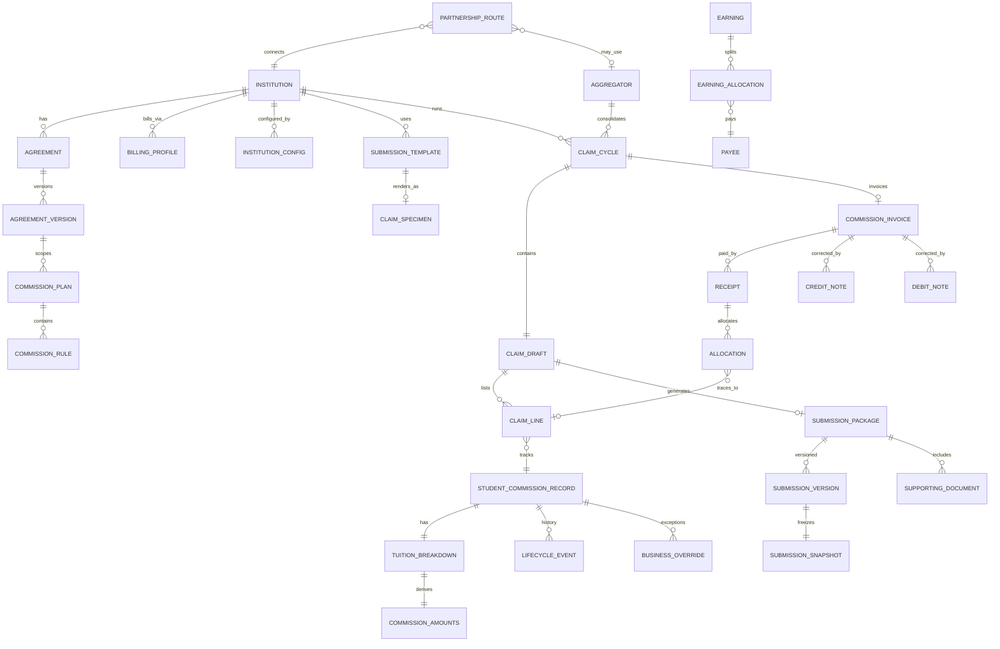

# Commission Business Requirements Addendum V1.1

**Document type:** Frozen business requirements (Business SSOT)  
**Version:** 1.1  
**Date:** 30 June 2026  
**Status:** **FROZEN** — approved; changes require ERP RFC  
**Supersedes:** [V1.0](./COMMISSION_BUSINESS_REQUIREMENTS_ADDENDUM_V1.md)
**Parent validation:** [Commission Business Domain Validation Report](./COMMISSION_BUSINESS_DOMAIN_VALIDATION_REPORT.md) (approved)  
**Governance:** Upon approval, these requirements are frozen. Changes require ERP Change Request (RFC).  
**Scope boundary:** Direct Institution Partner operations (Phase 1 focus). Aggregator, B2B Partner, and Referral flows are **documented as future requirements** — not in current implementation scope.  
**Principle:** REUSE → EXTEND → CREATE. This document specifies **what** Future Link requires; it does not redesign existing architecture.

---

## Document Purpose

This addendum stabilizes business requirements discovered during the Business Domain Validation (June 2026). It captures operational workflows, business rules, and configuration needs that the current Commission Module must support — reflecting **Future Link's actual operations**, not a generic commission system.

**This document does not:**

- Redesign completed Phases 1–2B architecture  
- Specify database schema, migrations, or UI implementation (see Implementation Bible V2)  
- Modify the frozen ERP Bible archive (ERP Part 6 update follows V2 approval)

**Status:** Merged into [Implementation Bible V2](./Commission_Module_Implementation_Bible_V2.md). Phase 3 resumes only after Bible V2 is approved.

---

## Table of Contents

1. [Business Rules](#1-business-rules)  
2. [Operational Scenarios](#2-operational-scenarios)  
3. [Configuration Requirements](#3-configuration-requirements)  
4. [Override Framework](#4-override-framework)  
5. [Revenue Flow](#5-revenue-flow)  
6. [Automation Requirements](#6-automation-requirements)  
7. [Priority & Phasing Guidance](#7-priority--phasing-guidance)  
9. [Commission Business Domain Model (Business SSOT)](#9-commission-business-domain-model-business-ssot)  
10. [ERP Commission Glossary](#10-erp-commission-glossary)  
8. [Document Control](#8-document-control)

---

## 1. Business Rules

Business rules are binding constraints. They apply regardless of implementation phase unless explicitly marked **Future Extension**.

### 1.1 Universal Principles

| ID | Rule | Priority |
|----|------|----------|
| BR-U01 | **Nothing hard-coded by institution.** Agency identity, export formats, academic terminology, tax rules, submission channels, and claim requirements must be configurable per institution (or per legal entity / partnership route where applicable). | P0 |
| BR-U02 | **Tuition ≠ Commission Base.** The ERP must never assume published tuition, gross tuition, or net tuition paid equals the commissionable base. Commission calculation must use an explicit **Commissionable Tuition** or **Institution Approved Commission Base** field. | P0 |
| BR-U03 | **History is never overwritten.** Financial and lifecycle changes must be append-only: original values preserved; corrections recorded as new events, overrides, adjustments, or snapshots — never silent edits to submitted or posted records. | P0 |
| BR-U04 | **Submission snapshot immutability.** Once a claim submission package is finalized and submitted to an institution, the financial verification snapshot must not change. Corrections require a new submission version or an governed adjustment workflow. | P0 |
| BR-U05 | **Billing does not own claim generation.** Billing profiles store commercial identity and payment instructions only. Claim cycles, student inclusion, invoice generation, and submission are commission-domain responsibilities. | P0 |
| BR-U06 | **One claim ≠ one institution (aggregator model).** The system must not assume every claim maps to a single institution. Aggregator-scoped claims may span multiple institutions, countries, and students under one submission, invoice, and receipt with allocation back to each student. | P1 |
| BR-U07 | **Direct Partner first.** Current implementation scope remains Direct Institution Partners. Aggregator, B2B Partner, and Referral revenue flows are specified here for architectural alignment but marked **Future Extension** until explicitly scheduled. | Scope |

### 1.2 Institution & Commercial Rules

| ID | Rule | Priority |
|----|------|----------|
| BR-I01 | Every institution must be independently configurable for: claim requirements, submission requirements, invoice requirements, tax requirements, billing requirements, portal requirements, and email requirements. | P0 |
| BR-I02 | Commercial terms (commission rates, bonuses, effective dates) resolve through scoped rules: country, institution, campus, program, level, intake, agreement version, and effective date. | P0 |
| BR-I03 | Rule precedence must be deterministic when multiple rules match; more specific scope wins over broader scope unless institution configuration defines otherwise. | P0 |
| BR-I04 | Agreement versions are effective-dated. Commission calculations for a student must use the rule/agreement version effective on the **earning date** (or institution-defined trigger date). | P0 |
| BR-I05 | Historical commercial terms must be preserved. Point-in-time reconstruction of rates and bases must be possible for audit and dispute resolution. | P1 |
| BR-I06 | Fee overrides and commission overrides on the matrix must not alter historical published rules; overrides apply to specific students or claims with audit trail (see Override Framework). | P0 |

### 1.3 Academic Structure Rules

| ID | Rule | Priority |
|----|------|----------|
| BR-A01 | Academic period terminology is institution-specific. The system must support Semester, Term, Trimester, Quarter, and custom labels without assuming "Semester" globally. | P2 |
| BR-A02 | Each institution may define which academic period codes apply and how they display in claims, invoices, and exports. | P2 |
| BR-A03 | Student academic context (intake, period, level) must be captured and verified before claim submission. | P1 |

### 1.4 Tuition & Fee Structure Rules

| ID | Rule | Priority |
|----|------|----------|
| BR-T01 | The following tuition and commission amounts must be storable and distinguishable **separately** for each student on a claim: Published Tuition, Gross Tuition, Scholarship, Discount, Non-Commissionable Fees, Net Tuition Paid, Commissionable Tuition, Institution Approved Commission Base, Commission %, Calculated Commission, Approved Commission, Paid Commission. | P0 |
| BR-T02 | Commission % applies to **Commissionable Tuition** (or Institution Approved Commission Base), not to raw tuition fields. | P0 |
| BR-T03 | Non-commissionable fees (e.g. application fee, insurance, materials) must be excludable from the commission base per institution rules. | P0 |
| BR-T04 | Institution Approved Commission Base may differ from ERP Calculated Commission Base; both must be stored when they differ. | P0 |
| BR-T05 | Scholarship and discount may reduce commissionable base per institution agreement rules; reduction logic must be configurable, not hard-coded. | P1 |
| BR-T06 | Tuition edits on a claim draft must be permitted before submission; after submission, tuition changes require override or adjustment workflow. | P0 |

### 1.5 Claim Draft Rules

| ID | Rule | Priority |
|----|------|----------|
| BR-C01 | Claims are **working documents** until submitted. While in draft, authorized users may: add students, remove students, exclude students, hold students, edit tuition fields, edit commissionable tuition, edit commission amounts, and edit notes. | P0 |
| BR-C02 | Exclude removes a student from the current claim without deleting eligibility history. Hold defers inclusion pending resolution. Remove may reassign to another cycle per carry-forward rules. | P0 |
| BR-C03 | Preview and validate must be available before submission. Validation must surface blocking errors and warnings separately. | P0 |
| BR-C04 | Internal review and manager approval may be required before submission; requirement is configurable per institution or globally. | P1 |
| BR-C05 | After submission, claim line items and financial figures on the submission snapshot are **immutable**. Status transitions (institution approved, rejected, modified) append new records; they do not rewrite the submitted snapshot. | P0 |
| BR-C06 | Recalculation on draft claims must use current published rules and student fee structure; recalculation on submitted claims is prohibited except via governed correction paths. | P0 |

### 1.6 Student Commission Journey Rules

| ID | Rule | Priority |
|----|------|----------|
| BR-S01 | Every commission-relevant lifecycle event must be preserved as an immutable event. Events must not overwrite prior state without an audit record. | P0 |
| BR-S02 | Supported lifecycle events (minimum set): Eligible, Submitted, Approved, Rejected, Withdrawn, Deferred, Outstanding Tuition, Visa Refused, Program Changed, Campus Changed, Internal Transfer, Transfer to Another Institution, Transfer Through Future Link, Transfer Outside Future Link, Commission Cancelled, Commission Clawback, Commission Reassigned. | P0 |
| BR-S03 | Eligibility, claim status, and payment status remain logically separate (three-axis model). A student may be eligible but not yet on a claim; claimed but not yet paid; paid but subject to clawback. | P0 |
| BR-S04 | Visa Refused and Withdrawn must trigger configurable outcomes: hold, cancel commission, or defer — per institution rules. | P1 |
| BR-S05 | Program Changed and Campus Changed must generate preserved events; commission impact (recalc, cancel, defer) follows institution matrix rules. | P1 |
| BR-S06 | Transfer events must record source and destination context (institution, program, campus, cycle) and link to any commission impact. | P0 |
| BR-S07 | Clawback must reduce or recover commission with full audit trail; clawback may occur after payment (recovery via debit note or offset). | P1 |
| BR-S08 | Commission Reassigned must record prior and new assignee (counselor, branch, route, or future payee) without losing original earning history. | P1 |

### 1.7 Submission Lifecycle Rules

| ID | Rule | Priority |
|----|------|----------|
| BR-SB01 | Submission lifecycle states (minimum): Draft, Generated, Reviewed, Approved (internal), Portal Submitted, Email Submitted, Institution Received, Institution Approved, Institution Modified, Institution Rejected. | P1 |
| BR-SB02 | Each submission must carry: submission version, portal reference (if applicable), institution reference (if applicable), and full submission history. | P1 |
| BR-SB03 | Institution Modified must capture institution's amended figures separately from ERP submitted figures (see Financial Reconciliation). | P0 |
| BR-SB04 | Resubmission after rejection creates a new submission version; prior versions remain accessible. | P1 |
| BR-SB05 | Submission channel (portal, email, manual upload, future API) is recorded per submission event. | P1 |

### 1.8 Financial Verification Rules

| ID | Rule | Priority |
|----|------|----------|
| BR-FV01 | Claim submission is the **final financial verification checkpoint** before the package leaves Future Link control. | P0 |
| BR-FV02 | Pre-submit verification must confirm, in order: Student → Program → Institution → Academic Structure → Fee Structure → Commissionable Tuition → Commission → Taxes → Submission Template → Supporting Documents → Final Claim. | P0 |
| BR-FV03 | Each verification step may be institution-configurable (required vs optional vs skipped). | P1 |
| BR-FV04 | User must explicitly confirm verification completion; system must record verifier, date, and time on the submission snapshot. | P0 |
| BR-FV05 | Supporting documents required for submission must be checklist-driven per institution template. | P1 |

### 1.9 Financial Reconciliation Rules

| ID | Rule | Priority |
|----|------|----------|
| BR-FR01 | The following amounts must be independently storable and reconcilable: ERP Calculated Amount, Submitted Amount, Institution Approved Amount, Amount Received, Outstanding Amount. | P0 |
| BR-FR02 | Short payment, overpayment, and partial payment must be identifiable without manual spreadsheet reconciliation. | P1 |
| BR-FR03 | Multiple receipts against one invoice or claim must be supported; each receipt allocates to invoice and/or student lines. | P0 |
| BR-FR04 | Credit notes and debit notes must adjust outstanding balance without violating immutability of original submission or posted receipt (additive correction model). | P1 |
| BR-FR05 | Clawbacks reduce net revenue and must link to original earning and payment records. | P1 |
| BR-FR06 | Net revenue roll-up (per institution, cycle, aggregator, period) must be derivable from reconciled amounts. | P2 |
| BR-FR07 | Posted receipts are immutable; void creates a reversing event, not a silent delete. | P0 |

### 1.10 Billing Rules

| ID | Rule | Priority |
|----|------|----------|
| BR-B01 | Billing profile fields are limited to: billing contact, billing address, currency (invoice and receipt defaults), tax registration, payment instructions, remittance information. | P0 |
| BR-B02 | A billing profile may link to an aggregator for aggregator-scoped billing; it does not define claim content or student lists. | P1 |
| BR-B03 | Default billing profile per institution (or route) must be selectable for invoice generation. | P0 |

### 1.11 Tax Rules

| ID | Rule | Priority |
|----|------|----------|
| BR-TX01 | Tax treatment is institution- and jurisdiction-specific; tax registration on billing profile is necessary but not sufficient. | P1 |
| BR-TX02 | Tax computation rules (GST/HST, exempt categories, zero-rated) must be configurable per institution where Future Link invoices institutions. | P1 |
| BR-TX03 | Tax amounts on submitted claims must be frozen on submission snapshot. | P1 |

---

## 2. Operational Scenarios

Operational scenarios describe end-to-end workflows Future Link staff perform. Each scenario references business rules above.

### 2.1 Direct Institution Partner — Claim Preparation (Draft)

**Actor:** Commission coordinator  
**Precondition:** Students meet institution eligibility triggers; claim cycle open.

| Step | Action | Expected outcome |
|------|--------|------------------|
| 1 | Open institution claim cycle for academic period (e.g. Fall 2026 — uses institution's term label, not assumed "Semester") | Cycle shows eligible students per eligibility config |
| 2 | Review student list; add missing students manually if permitted | Students appear on draft claim |
| 3 | Hold students pending documents (consent, tuition proof) | Held students excluded from submit until released |
| 4 | Exclude students not commissionable this cycle | Excluded students remain in system with audit reason |
| 5 | Enter or import tuition breakdown (published, scholarship, non-commissionable fees, etc.) | Commissionable tuition computed per BR-T01–T02 |
| 6 | Recalculate commission from fee matrix | Calculated commission uses scoped rules; not raw tuition |
| 7 | Apply fee or commission override where institution agreement requires exception | Override logged per Override Framework |
| 8 | Preview claim using institution submission template | Output matches template columns, labels, order |
| 9 | Run validation | Blocking errors prevent submit; warnings displayed |
| 10 | Internal review / manager approval (if configured) | Approval recorded before submit |

**Postcondition:** Claim remains mutable draft until step 2.2 completes.

---

### 2.2 Direct Institution Partner — Financial Verification & Submission

**Actor:** Commission coordinator (verifier); optional manager approver  
**Precondition:** Draft claim validated.

| Step | Action | Expected outcome |
|------|--------|------------------|
| 1 | Walk financial verification checklist (BR-FV02) | Each step marked pass/fail/waived per config |
| 2 | Attach supporting documents per institution checklist | Documents linked to submission package |
| 3 | Generate submission package (claim file + invoice + attachments) | Package version 1 created |
| 4 | Review generated documents against specimen/template | User confirms match |
| 5 | Finalize submission snapshot | ERP Calculated and Submitted amounts frozen |
| 6 | Submit via configured channel (email draft, portal upload, manual) | Submission state → Portal/Email Submitted |
| 7 | Record portal reference / institution reference when available | References stored on submission version |
| 8 | Track until Institution Received | Status updated on institution confirmation |

**Postcondition:** Submission snapshot immutable (BR-U04). Live student rows may update for lifecycle events but not submitted financial figures.

---

### 2.3 Institution Response — Approved, Modified, or Rejected

**Actor:** Commission coordinator  
**Precondition:** Submission in Institution Received or awaiting response.

| Scenario A — Approved | Institution confirms figures as submitted | Institution Approved Amount = Submitted Amount; claim status → approved |
| Scenario B — Modified | Institution adjusts commission base or amount | Institution Approved Amount stored separately; variance flagged |
| Scenario C — Rejected | Institution rejects claim | Rejection reason recorded; resubmission creates new version (BR-SB04) |

**Postcondition:** Triangulation available: ERP Calculated vs Submitted vs Institution Approved (BR-FR01).

---

### 2.4 Receipt & Payment Reconciliation

**Actor:** Finance user  
**Precondition:** Claim approved; invoice issued.

| Step | Action | Expected outcome |
|------|--------|------------------|
| 1 | Record receipt (full or partial) against invoice | Amount Received updated; Outstanding computed |
| 2 | Allocate receipt to invoice lines and student lines | Every student subject to commission has allocation trace |
| 3 | Identify short payment or overpayment | System flags variance |
| 4 | Post receipt | Receipt immutable (BR-FR07) |
| 5 | Issue credit note or debit note if institution adjusts after payment | Additive correction; original receipt unchanged |
| 6 | Process clawback if student withdrawn post-payment | Clawback event linked to student and receipt |

**Postcondition:** Net revenue and outstanding balances reconcilable without external spreadsheet.

---

### 2.5 Student Lifecycle — Transfer & Commission Impact

**Actor:** Counselor or commission coordinator  
**Precondition:** Student on active claim or eligible pool.

| Scenario | Trigger | Expected outcome |
|----------|---------|------------------|
| Internal transfer (campus/program) | Program Changed / Campus Changed event | Event preserved; commission recalc or hold per institution rules |
| Transfer through Future Link to another institution | Transfer RPC / workflow | Source commission cancelled or pro-rated per rules; destination institution new eligibility |
| Transfer outside Future Link | Transfer event | Commission cancelled or clawback initiated per agreement |
| Visa refused | Hold reason or lifecycle event | Configurable cancel/defer/hold (BR-S04) |

**Postcondition:** Full journey visible in event history (BR-S01); no silent overwrite.

---

### 2.6 Aggregator — Multi-Institution Claim (Future Extension — P1)

**Actor:** Aggregator commission coordinator  
**Precondition:** Aggregator partnership active; Phase 2B+ capabilities published.

| Step | Action | Expected outcome |
|------|--------|------------------|
| 1 | Open aggregator-scoped claim cycle spanning multiple institutions | One claim workspace, many institution student groups |
| 2 | Build unified student list across countries/institutions | Students retain institution attribution |
| 3 | Generate one aggregator invoice with line per institution (or per policy) | Single invoice number |
| 4 | Submit one package to aggregator | One submission version |
| 5 | Record one receipt from aggregator | Receipt allocated back to every student line |

**Constraint:** Must not require separate claims per institution when aggregator model applies (BR-U06).

---

### 2.7 B2B Partner Settlement (Future Extension — P3)

**Actor:** Partner operations / finance  
**Precondition:** Payee and earning allocation model active.

| Step | Action | Expected outcome |
|------|--------|------------------|
| 1 | Institution pays Future Link (direct or via aggregator) | Receipt recorded |
| 2 | System computes Future Link net after institution commission | Earning allocated per partnership route |
| 3 | Settlement due to B2B partner calculated per agreement | Partner settlement record created |
| 4 | Partner payment recorded and reconciled | Partner outstanding cleared |

**Note:** Documented for revenue-flow completeness; not in current implementation scope.

---

### 2.8 Odoo-Equivalent One-Click Claim Generation

**Actor:** Commission coordinator  
**Precondition:** Students finalized on cycle; institution specimens configured.

| Step | Action | Expected outcome |
|------|--------|------------------|
| 1 | Select institution claim specimen and invoice specimen | Templates loaded |
| 2 | One action: Generate claim package | System produces claim file, invoice, supporting doc bundle |
| 3 | System prepares email draft with recipients, attachments | Saved as draft for review |
| 4 | User reviews and approves send — or schedules send on due date | Delivery tracked; submission lifecycle updated |

**Reference:** Replaces manual recalc → export → print → compose email workflow. See Automation Requirements.

---

### 2.9 Correction After Submission (Adjustment)

**Actor:** Authorized finance user  
**Precondition:** Error discovered after submission or post-receipt.

| Step | Action | Expected outcome |
|------|--------|------------------|
| 1 | Identify immutable record (submission snapshot or posted receipt) | System prevents direct edit |
| 2 | Create adjustment (credit note, debit note, resubmission version, or override) | Additive correction with reason |
| 3 | Approval if threshold exceeded | Segregation of duties |
| 4 | Audit trail shows original → correction chain | BR-U03 satisfied |

---

## 3. Configuration Requirements

All configuration must be manageable without code changes. Institution-level independence is mandatory unless noted as global.

### 3.1 Institution Master Configuration

| ID | Configuration area | Requirements | Priority |
|----|-------------------|--------------|----------|
| CFG-I01 | **Claim requirements** | Per-institution checklist: required fields, consent rules, enrollment confirmation rules, document requirements, minimum credits, full-time rules. | P0 |
| CFG-I02 | **Submission requirements** | Allowed channels (email, portal, manual, future API); required file formats; naming conventions; submission deadlines. | P0 |
| CFG-I03 | **Invoice requirements** | Numbering format, layout template, tax line display, due date rules, footer/legal text, multi-currency display. | P0 |
| CFG-I04 | **Tax requirements** | Tax jurisdiction, rates, exempt categories, registration numbers, reverse-charge rules where applicable. | P1 |
| CFG-I05 | **Billing requirements** | Default billing profile, payment terms, remittance instructions (via billing profile — BR-B01). | P0 |
| CFG-I06 | **Portal requirements** | Portal URL, submission endpoint reference, credential storage reference (not plaintext in config), institution portal field mappings. | P1 |
| CFG-I07 | **Email requirements** | To/CC/BCC lists, subject line templates, body templates, attachment rules, send schedule policy. | P1 |
| CFG-I08 | **Agency / legal entity identity** | Future Link (or subsidiary) name, address, phone, email, tax ID for invoices and exports — **not hard-coded in application**. | P0 |

### 3.2 Submission Template Configuration

| ID | Configuration area | Requirements | Priority |
|----|-------------------|--------------|----------|
| CFG-ST01 | **Multiple templates per institution** | Support Fall Intake, Winter Intake, Domestic, International, and custom templates. | P0 |
| CFG-ST02 | **Template format** | Excel, Word, PDF, CSV, Portal mapping, Future API schema — per template. | P0 |
| CFG-ST03 | **Column mapping** | Institution-specific columns, column order, column labels, totals row, header, footer. | P0 |
| CFG-ST04 | **Validation rules** | Field-level validation, required fields, cross-field rules, error messages. | P0 |
| CFG-ST05 | **Instructions** | Operator instructions and institution-facing notes per template. | P1 |
| CFG-ST06 | **Version history** | Template versioning with effective dates; publish/supersede/archive lifecycle. | P0 |
| CFG-ST07 | **Specimens** | Claim specimen and invoice specimen linked to templates for one-click generation. | P0 |

### 3.3 Academic Structure Configuration

| ID | Configuration area | Requirements | Priority |
|----|-------------------|--------------|----------|
| CFG-A01 | **Period terminology** | Institution override labels for period codes (Semester / Term / Trimester / Quarter / custom). | P2 |
| CFG-A02 | **Active periods** | Which period codes apply per institution. | P2 |
| CFG-A03 | **Intake mapping** | Map intake seasons to academic periods per institution. | P1 |

### 3.4 Fee & Commission Matrix Configuration

| ID | Configuration area | Requirements | Priority |
|----|-------------------|--------------|----------|
| CFG-M01 | **Matrix dimensions** | Country, institution, campus, program, level, intake, agreement, effective date, currency. | P0 |
| CFG-M02 | **Rate types** | Percentage, fixed, bonus, tiered — per rule. | P0 |
| CFG-M03 | **Historical preservation** | Published matrix versions; point-in-time lookup by earning date. | P1 |
| CFG-M04 | **Fee schedule linkage** | Published tuition vs commissionable base rules per program/intake. | P0 |
| CFG-M05 | **Override permissions** | Who may apply matrix overrides; approval thresholds. | P0 |

### 3.5 Eligibility & Hold Configuration

| ID | Configuration area | Requirements | Priority |
|----|-------------------|--------------|----------|
| CFG-E01 | **Eligibility triggers** | Deposit, visa, enrolled, registered, started classes, custom — versioned per institution. | P0 |
| CFG-E02 | **Hold reasons** | Extensible hold reason catalog; institution may enable/disable reasons. | P1 |
| CFG-E03 | **Lifecycle outcome mapping** | Visa refused / withdrawn → hold, cancel, or defer — per institution. | P1 |

### 3.6 Financial Verification Configuration

| ID | Configuration area | Requirements | Priority |
|----|-------------------|--------------|----------|
| CFG-FV01 | **Verification checklist** | Ordered steps; required/optional/waived per institution. | P0 |
| CFG-FV02 | **Supporting document types** | Document checklist per template and institution. | P1 |
| CFG-FV03 | **Approval gates** | Manager approval required before submit — configurable. | P1 |

### 3.7 Reconciliation Configuration

| ID | Configuration area | Requirements | Priority |
|----|-------------------|--------------|----------|
| CFG-FR01 | **Variance thresholds** | Short/over payment tolerance before escalation. | P2 |
| CFG-FR02 | **Allocation rules** | Default allocation order: invoice first, then student lines. | P1 |
| CFG-FR03 | **FX policy** | Locked rate at receipt; review workflow thresholds. | P0 |

### 3.8 Aggregator Configuration (Future Extension — P1)

| ID | Configuration area | Requirements | Priority |
|----|-------------------|--------------|----------|
| CFG-AG01 | **Aggregator scope** | Countries, institutions, billing profile under aggregator. | P1 |
| CFG-AG02 | **Consolidation rules** | One claim / one invoice / one receipt grouping rules. | P1 |
| CFG-AG03 | **Remittance mapping** | Aggregator statement format and reconciliation fields. | P1 |

### 3.9 Universal Configuration Principles

| ID | Principle | Priority |
|----|-----------|----------|
| CFG-U01 | Enumerations (block reasons, enrollment statuses, lifecycle events) must be extensible via configuration or lookup tables without requiring ad-hoc code changes for each institution. | P1 |
| CFG-U02 | All export and document output derives from institution template configuration — no global fixed column sets. | P0 |
| CFG-U03 | Configuration changes are versioned where they affect financial calculation (templates, matrix, eligibility, tax). | P0 |
| CFG-U04 | Module-level feature flags (e.g. approval required) remain global or per-tenant — not a substitute for institution rules. | P1 |

---

## 4. Override Framework

Business overrides are **mandatory** across all financial workflows. When no predefined option applies, users must use **Other / Override**.

### 4.1 Override Principles

| ID | Principle |
|----|-----------|
| OV-P01 | Every override requires **mandatory explanation** (reason text). |
| OV-P02 | **Optional attachment** (supporting document) may be required by configuration. |
| OV-P03 | **Approval workflow** applies when override exceeds configured threshold or type. |
| OV-P04 | **Audit history** records: original value, new value, reason, user, date, time, approval chain. |
| OV-P05 | **Nothing overwrites history** — override creates a new auditable record; prior values remain queryable. |
| OV-P06 | Overrides on submitted or posted records follow adjustment rules (§2.9), not silent field edits. |

### 4.2 Override Categories

| Category | Applies to | Examples |
|----------|------------|----------|
| OV-C01 Fee Override | Tuition breakdown, non-commissionable fees, published vs gross | Institution waives materials fee from base |
| OV-C02 Commission Override | Calculated commission, commission rate | Special 18% deal not in matrix |
| OV-C03 Tuition Override | Published tuition, scholarship, discount | Late scholarship award |
| OV-C04 Status Override | Eligibility, claim, payment status | Manual approve despite missing consent with GM approval |
| OV-C05 Claim Override | Student inclusion/exclusion, cycle assignment | Include student after deadline |
| OV-C06 Submission Override | Template field, submitted amount | Correct typo on submitted CSV before institution processes |
| OV-C07 Payment Override | Receipt allocation, FX rate | Bank fee adjustment on receipt |
| OV-C08 Unknown Situation | Any field/workflow | **Other / Override** — catch-all when no enum fits |

### 4.3 Override Workflow States

| State | Description |
|-------|-------------|
| Draft | Initiated; reason captured; pending approval if required |
| Pending Approval | Awaiting approver action |
| Approved | Override applied; effective for target record |
| Rejected | Override denied; original values stand |
| Superseded | Newer override replaces approved override (prior preserved) |

### 4.4 Approval Rules (Configurable)

| ID | Rule |
|----|------|
| OV-A01 | Segregation of duties: initiator ≠ approver for financial overrides above threshold. |
| OV-A02 | Thresholds may differ by override category and institution. |
| OV-A03 | Emergency override with retroactive approval allowed only if institution config permits — always audited. |
| OV-A04 | Overrides affecting submitted snapshots require adjustment or resubmission path — not in-place mutation. |

### 4.5 Relationship to Existing Mechanisms

The following AS-IS mechanisms are **insufficient alone** and must migrate into or integrate with this framework:

- `amended_expected_amount` without reason/approver  
- `block_reason = 'other'` without financial audit linkage  
- Manual recalc overwriting `commission_amount` without override record  
- Direct field edits on financial rows after submit  

---

## 5. Revenue Flow

This section defines how money and commission attribution move through Future Link's business models. **Direct Institution Partner** is operational scope today; other models are specified for platform alignment.

### 5.1 Revenue Flow Models

#### Model A — Direct Institution Partner (Current Scope)

```
Student → Institution → Future Link
                ↓
         Commission Claim / Invoice
                ↓
         Institution Payment (Receipt)
                ↓
         Student-level allocation → Net Revenue (Future Link)
```

**Requirements:**

- Institution pays Future Link commission per agreement.  
- One institution claim cycle may include many students.  
- Receipt reconciles to invoice and student lines.  
- Net revenue = institution approved amount − clawbacks ± adjustments.

#### Model B — Aggregator (Future Extension — P1)

```
Many Institutions → Aggregator → Future Link
        ↓                ↓
    Many Students    One Claim / One Invoice / One Receipt
                           ↓
              Allocation back to every student (and institution)
```

**Requirements:**

- Must not assume one claim = one institution (BR-U06).  
- Aggregator receipt allocates through invoice lines to institution and student granularity.  
- Reconciliation at aggregator statement level and drill-down to student.

#### Model C — B2B Partner (Future Extension — P3)

```
Institution → (optional Aggregator) → Future Link → B2B Partner
                                              ↓
                                        Settlement / Payment
```

**Requirements:**

- Partnership route defines commercial split.  
- Future Link retains net; B2B partner receives contracted share.  
- Settlement and partner payment reconciled independently from institution receipt.

#### Model D — Referral Partner (Future Extension — P3)

```
Institution → Future Link → Referral Partner (referral fee)
```

**Requirements:**

- Referral fee computed on defined base (may differ from institution commission base).  
- Does not duplicate institution commission payout logic — extends universal revenue model.

#### Model E — Future Extension

```
Any Revenue Source → Earning → Settlement → Payout(s) to Payee(s)
```

**Requirements:**

- Additional service lines (visa, coaching, language, franchise) plug into same earning/settlement/payout model per ERP P-04.  
- Commission module remains Phase-1 implementation of universal engine; no duplicate payout logic in future modules.

### 5.2 Revenue Flow Business Rules

| ID | Rule | Scope |
|----|------|-------|
| RF-01 | Every earning must record: revenue source, revenue type, earning currency, earning date, legal entity. | All models |
| RF-02 | Settlement groups earnings for payment and reconciliation without losing student-level attribution. | All models |
| RF-03 | Payout allocates settlement to one or many payees; allocations sum to 100% of settlement (or documented remainder). | B2B, Referral, Future |
| RF-04 | Institution commission and partner payout are separate events — institution receipt does not automatically imply partner paid. | B2B, Referral |
| RF-05 | Multi-currency flows preserve locked rates at financial event time; FX review on receipt is governed workflow. | All models |
| RF-06 | Clawback reverses or reduces earning; partner payout clawback follows if already settled. | All models |

### 5.3 Platform Evolution Requirement

The architecture must support evolution from **Commission Module** to **Revenue & Settlement Platform** without redesign of:

- Institution workspace and rule engine  
- Immutable snapshots and posted receipts  
- RPC-mediated writes and institution-scoped RLS  
- Partnership routes and aggregator seams  

**Current implementation stays focused on Model A.** Models B–E are requirements for foundation validation, not immediate build scope.

---

## 6. Automation Requirements

Automation replaces manual, error-prone claim assembly. Requirements restore and exceed **previous Odoo CRM capability**.

### 6.1 Specimen & Template Automation

| ID | Requirement | Priority |
|----|-------------|----------|
| AU-01 | Institution-specific **claim specimens** — reusable templates defining claim layout, fields, and output format. | P0 |
| AU-02 | Institution-specific **invoice specimens** — reusable templates for invoice generation. | P0 |
| AU-03 | Specimens versioned and effective-dated; linked to submission templates (CFG-ST07). | P0 |
| AU-04 | Specimen preview before binding to claim cycle. | P1 |

### 6.2 One-Click Claim Generation

| ID | Requirement | Priority |
|----|-------------|----------|
| AU-05 | **One-click claim generation** after students finalized on cycle: produces claim file(s), invoice, and supporting document bundle per institution specimens. | P0 |
| AU-06 | Automatic student listing from cycle membership with eligibility and hold filters applied. | P0 |
| AU-07 | Automatic commission recalculation as part of generation (draft only). | P0 |
| AU-08 | Generation respects financial verification checklist — blocks if mandatory steps fail. | P0 |

### 6.3 Document & Package Assembly

| ID | Requirement | Priority |
|----|-------------|----------|
| AU-09 | **Submission package** assembly: claim + invoice + configured attachments in institution-required order and format. | P0 |
| AU-10 | **Automatic attachments** from document library (consent forms, registration proof, etc.) where institution rules define them. | P1 |
| AU-11 | Package version number assigned at generation; stored with submission history. | P0 |

### 6.4 Email Automation

| ID | Requirement | Priority |
|----|-------------|----------|
| AU-12 | **Email template** per institution with merge fields (institution name, cycle, totals, references). | P1 |
| AU-13 | **Draft email** prepared automatically: recipients loaded from institution config, attachments from package. | P1 |
| AU-14 | User reviews draft before send — no silent auto-send without configuration. | P0 |
| AU-15 | **Scheduled email** send on due date or institution deadline (Odoo parity). | P1 |
| AU-16 | Send logged; delivery status tracked in submission lifecycle. | P1 |

### 6.5 Submission & Delivery Tracking

| ID | Requirement | Priority |
|----|-------------|----------|
| AU-17 | **Submission tracking** — state transitions with timestamps and actor. | P1 |
| AU-18 | **Delivery tracking** — email sent/opened/bounced where available; portal upload confirmation; manual upload recorded. | P2 |
| AU-19 | Portal reference and institution reference captured on submission events. | P1 |

### 6.6 Future Automation (Documented — Not Current Scope)

| ID | Requirement | Priority |
|----|-------------|----------|
| AU-20 | **Portal automation** — programmatic upload to institution portal when credentials and mapping configured. | Future |
| AU-21 | **API automation** — submit claim via institution API when available. | Future |
| AU-22 | Integration with ERP notification engine (G-08) for scheduled jobs and delivery receipts. | Future |

### 6.7 Odoo Parity Checklist

Previous Odoo CRM capability → required ERP behavior:

| Odoo capability | Addendum requirement IDs |
|-----------------|-------------------------|
| Institution-specific invoice/claim specimens | AU-01, AU-02, AU-03, CFG-ST07 |
| One-click generate after students finalized | AU-05, AU-06, AU-07 |
| Auto-generate documents | AU-09, AU-11 |
| Auto-attach files | AU-10 |
| Prepare email with recipients | AU-12, AU-13 |
| Save as draft for review | AU-14 |
| Auto-send on due date | AU-15 |
| Track submission | AU-17, AU-19 |

---

## 7. Priority & Phasing Guidance

Priorities align with Business Domain Validation Report. **This section guides merge into Implementation Bible V2 — not implementation sequencing in this document.**

| Priority | Requirement groups | Business impact |
|----------|-------------------|-----------------|
| **P0** | Tuition decomposition (BR-T*), submission templates (CFG-ST*), submission immutability (BR-U04, BR-C05), override framework (§4), financial verification (BR-FV*), institution config independence (BR-U01, CFG-I08), one-click generation specimens (AU-01–AU-09), reconciliation triangulation (BR-FR01) | Blocks accurate Direct Partner operations and business sign-off |
| **P1** | Full submission lifecycle (BR-SB*), claim automation email/schedule (AU-12–AU-17), aggregator model (§5.1 Model B, CFG-AG*), credit/debit notes (BR-FR04), clawback workflow (BR-S07), academic config (CFG-A*), tax config (BR-TX*, CFG-I04) | Required for portal/email ops and finance reconciliation |
| **P2** | Academic terminology (BR-A*), universal enum extensibility (CFG-U01), net revenue roll-up (BR-FR06), delivery tracking (AU-18) | Operational polish and reporting |
| **P3** | B2B partner (Model C), referral (Model D), portal/API automation (AU-20–AU-22) | Future revenue channels — architecture must not block |

### Relationship to Phase 3 Technical Track

| Phase 3 item | Relationship to this addendum |
|--------------|-------------------------------|
| F3.4 RLS remediation | Security — independent of business requirements |
| F3.3 Financial events | Supports BR-S01 lifecycle preservation — **not** substitute for tuition, submission, or override requirements |
| F3.1 Approval config flag | Supports OV-A* partially — **not** full override framework |
| F3.2 ClaimsPanel RPC migration | Technical debt — does not deliver addendum capabilities |

**Resume Phase 3 only after:** Implementation Bible V2 approved by business owner (Addendum V1.1 merged).

---

## 9. Commission Business Domain Model (Business SSOT)

This section is the **business Single Source of Truth** for the Commission Module. It defines core business entities, their meaning, and relationships — independent of database table names or UI components. Implementation maps to these entities via REUSE → EXTEND → CREATE; it does not redefine them.

### 9.1 Purpose

| Aspect | Definition |
|--------|------------|
| **Audience** | Business owners, operations, finance, and implementers |
| **Scope** | Direct Institution Partner model (operational today) plus documented future entities for Aggregator, B2B, and Referral |
| **Relationship to technical model** | Implementation Bible §7 (payee/earning) is the **technical** EXTEND of this business model — not a replacement |

### 9.2 Entity Layers

```
┌─────────────────────────────────────────────────────────────────┐
│  CONFIGURATION LAYER — how each institution operates            │
│  Institution Config · Templates · Matrix · Eligibility · Tax  │
└─────────────────────────────────────────────────────────────────┘
                              ↓ governs
┌─────────────────────────────────────────────────────────────────┐
│  COMMERCIAL LAYER — agreements and rates                        │
│  Agreement · Commission Plan · Rule · Fee & Commission Matrix   │
└─────────────────────────────────────────────────────────────────┘
                              ↓ applies to
┌─────────────────────────────────────────────────────────────────┐
│  STUDENT & EARNING LAYER — who earned what                      │
│  Student Commission Record · Tuition Breakdown · Lifecycle      │
└─────────────────────────────────────────────────────────────────┘
                              ↓ grouped into
┌─────────────────────────────────────────────────────────────────┐
│  CLAIM & SUBMISSION LAYER — working docs → immutable package    │
│  Claim Cycle · Claim Draft · Submission · Snapshot              │
└─────────────────────────────────────────────────────────────────┘
                              ↓ produces
┌─────────────────────────────────────────────────────────────────┐
│  FINANCIAL LAYER — invoice, receipt, reconciliation             │
│  Invoice · Receipt · Allocation · Credit/Debit · Reconciliation │
└─────────────────────────────────────────────────────────────────┘
                              ↓ may split to (future)
┌─────────────────────────────────────────────────────────────────┐
│  REVENUE & SETTLEMENT LAYER — multi-payee (future extension)    │
│  Earning · Payee · Settlement · Partner Payout                  │
└─────────────────────────────────────────────────────────────────┘
```

### 9.3 Core Business Entities

#### Party & Route Entities

| Entity | Business definition | Key relationships |
|--------|---------------------|-------------------|
| **Institution** | A post-secondary or training partner that pays Future Link commission for referred/enrolled students. | Has agreements, billing profiles, templates, claim cycles |
| **Future Link Legal Entity** | The Future Link company entity that invoices institutions and receives commission (may be subsidiary-specific). | Appears on invoices/exports; configurable — not hard-coded |
| **Partnership Route** | The commercial path between an institution and Future Link (direct, via aggregator, via B2B partner). | Links institution, optional aggregator, billing profile, default commission plan |
| **Aggregator** | An intermediary representing multiple institutions; Future Link may submit one consolidated claim and receive one payment. *Future Extension — P1* | Spans many institutions; owns aggregator-scoped claim cycles |
| **B2B Partner** | An external partner who receives a share of revenue per route agreement. *Future Extension — P3* | Settlement derived from earning after institution payment |

#### Commercial & Configuration Entities

| Entity | Business definition | Key relationships |
|--------|---------------------|-------------------|
| **Institution Agreement** | Master commercial contract with an institution. | Has versions; scopes commission plans |
| **Agreement Version** | Effective-dated snapshot of agreement terms. | Links to commission plans and eligibility configs |
| **Commission Plan** | Named set of commission rules for an institution or route. | Contains rules; published/superseded |
| **Commission Rule** | A scoped rate or bonus (%, fixed, tiered) matching student attributes. | Scoped by country, campus, program, level, intake, agreement, effective date |
| **Fee & Commission Matrix** | The resolved commercial lookup for fee and commission given matrix dimensions. | Produces rate and commissionable-base rules; versioned |
| **Billing Profile** | Institution billing identity: contact, address, currency, tax registration, remittance. **Does not own claims.** | Used by invoice generation |
| **Institution Configuration Profile** | Per-institution rules for claim, submission, invoice, tax, portal, and email requirements. | Governs verification checklist and automation |
| **Submission Template** | Institution-specific output definition (columns, format, validation, header/footer). | Multiple per institution; versioned |
| **Claim Specimen** | Reusable claim document template bound to a submission template. | Used in one-click generation |
| **Invoice Specimen** | Reusable invoice layout template. | Used in one-click generation |
| **Eligibility Configuration** | Versioned rules defining when a student becomes commission-eligible. | Institution-scoped triggers (deposit, visa, enrolled, etc.) |
| **Academic Structure Configuration** | Institution-specific labels and codes for periods (term, semester, trimester, quarter). | Maps intakes to commission periods |

#### Student & Tuition Entities

| Entity | Business definition | Key relationships |
|--------|---------------------|-------------------|
| **Student (Commission Context)** | A learner referred by Future Link to an institution, tracked for commission purposes. | One or more commission records over time |
| **Student Commission Record** | The commission tracking row for a student on a claim cycle — eligibility, claim, and payment axes. | Belongs to claim cycle; links to tuition breakdown |
| **Tuition Fee Breakdown** | Decomposed fee structure for a student — **not** a single tuition field. | Feeds commissionable base calculation |
| **Commission Amounts** | Parallel amounts: Calculated, Submitted, Institution Approved, Paid — stored distinctly when they differ. | Reconciliation triangulation |

#### Claim & Submission Entities

| Entity | Business definition | Key relationships |
|--------|---------------------|-------------------|
| **Claim Cycle** | A time-bounded commission claiming period for an institution or aggregator (e.g. Fall 2026). | Contains claim draft; may span one or many institutions (aggregator) |
| **Claim Draft** | Mutable working document listing students and amounts before submission. | Becomes submission on finalize |
| **Claim Line** | One student's inclusion on a claim draft with tuition, commission, and status. | Student commission record on cycle |
| **Submission Package** | Generated bundle: claim file(s), invoice, attachments — ready for institution. | Has version; uses templates/specimens |
| **Submission Version** | Immutable numbered submission attempt (initial submit, resubmit after rejection). | Links to submission snapshot |
| **Submission Snapshot** | Frozen financial verification record at submit time — **never edited**. | Captures ERP calculated and submitted amounts |
| **Supporting Document** | Evidence attached to submission (consent, enrollment proof, etc.). | Checklist-driven per institution |

#### Financial Entities

| Entity | Business definition | Key relationships |
|--------|---------------------|-------------------|
| **Commission Invoice** | Future Link invoice to institution for commission on a claim. | Links to claim cycle; receipt applied against it |
| **Receipt** | Institution payment received; draft → ready → posted → void. | Allocated to invoice and student lines |
| **Allocation** | Assignment of receipt amount to invoice line and/or student line. | Enables student-level payment trace |
| **Credit Note** | Additive correction reducing outstanding after invoice posted. | Links to original invoice; immutable original |
| **Debit Note** | Additive correction increasing amount owed. | Links to original invoice |
| **Financial Reconciliation Record** | Triangulation of ERP Calculated, Submitted, Institution Approved, Received, Outstanding. | Per claim line or invoice line |

#### Control & Audit Entities

| Entity | Business definition | Key relationships |
|--------|---------------------|-------------------|
| **Lifecycle Event** | Append-only record of commission-relevant student event (transfer, visa refused, clawback, etc.). | Never overwrites prior events |
| **Business Override** | Governed exception to a rule or amount with reason, approval, and audit. | Original and new value preserved |
| **Point-in-Time Snapshot** | Immutable capture of student financial state at eligibility, submit, or payment. | Supports audit and dispute |
| **Financial Event** | Money-moving event published to Finance module (receipt posted, adjustment, clawback). | Finance owns journal posting |

#### Revenue & Settlement Entities (Future Extension)

| Entity | Business definition | When |
|--------|---------------------|------|
| **Earning** | Generalized revenue generated by a student/service event. | Phase 5 — generalizes student commission record |
| **Payee** | Party entitled to a share of an earning (institution, FL, B2B, referral, counselor). | Phase 5 |
| **Earning Allocation** | Split of earning across one or many payees. | Phase 5 |
| **Settlement** | Grouping of earnings for partner payment and reconciliation. | Phase 5–6 |
| **Partner Payout** | Payment to B2B or referral partner after institution settlement. | Phase 5+ |

### 9.4 Entity Relationship Diagram (Business View)



*Dashed conceptual entities (Aggregator consolidation, Earning/Payee) are future extensions; relationships are required by business rules today even if not yet implemented.*

### 9.5 Key Business Relationships (Rules)

| Relationship | Rule |
|--------------|------|
| Institution → Claim Cycle | One institution may have many concurrent or sequential claim cycles. |
| Claim Cycle → Claim Draft | Every open cycle has exactly one active draft until submitted or closed. |
| Claim Draft → Submission Snapshot | Submit creates snapshot; draft financial figures on snapshot are immutable. |
| Tuition Breakdown → Commission Amounts | Commission % applies to Commissionable Tuition only (BR-T02). |
| Submission Template → Submission Package | Package format and content derive from template — not global export constants. |
| Invoice → Receipt | Many receipts may apply to one invoice (partial payments). |
| Receipt → Allocation | Posted receipt must fully allocate before post (existing NN-3). |
| Override → Any financial entity | Overrides never delete history; they append audit records (OV-P05). |
| Partnership Route → Commission Plan | Route may override default institution plan. |
| Aggregator → Claim Cycle | Aggregator cycle may include students from many institutions (BR-U06). |

### 9.6 Direct Partner vs Future Models

| Model | Primary entities in play | Status |
|-------|-------------------------|--------|
| **Direct Institution Partner** | Institution, Claim Cycle, Claim Draft, Submission, Invoice, Receipt | Operational scope |
| **Aggregator** | Aggregator, multi-institution Claim Cycle, consolidated Invoice/Receipt | P1 — entities defined; partial implementation |
| **B2B Partner** | Partnership Route, Earning, Payee, Settlement, Partner Payout | P3 — entities defined; not implemented |
| **Referral Partner** | Earning, Payee (referral type), Settlement | P3 — future |

### 9.7 SSOT Hierarchy

When business and technical documents conflict on **business meaning**, this order applies:

1. **Commission Business Requirements Addendum V1.1** (this document) — §9 entities, §10 glossary, §1 business rules  
2. **Implementation Bible V2** — implementation sequencing and technical constraints  
3. **ERP Bible Part 6 / P-04** — platform-wide revenue architecture (placeholder chapters)  

Implementation must not invent business entities not defined here without RFC.

---

## 10. ERP Commission Glossary

Alphabetical definitions of business terms used in the Commission Module and this addendum. Terms marked *(future)* are defined for platform alignment but not yet operational.

| Term | Definition |
|------|------------|
| **Academic Period** | An institution-defined division of the academic calendar (semester, term, trimester, quarter, or custom). Used to scope commission claims and display labels. |
| **Aggregator** | A partner organization that represents multiple institutions; Future Link may submit consolidated claims and receive consolidated payments. *(future P1)* |
| **Agreement Version** | An effective-dated snapshot of commercial terms under an institution agreement. |
| **Allocation** | Assignment of a receipt amount to an invoice line and/or student commission line for traceability. |
| **Approved Commission** | Commission amount accepted for payment — may equal Calculated or reflect institution-approved adjustment. |
| **B2B Partner** | External business partner receiving contracted revenue share via partnership route. *(future P3)* |
| **Billing Profile** | Configuration storing billing contact, address, currency, tax registration, and remittance — **not** claim content. |
| **Business Override** | A governed exception to a default rule or amount requiring reason, optional attachment, and approval when configured. |
| **Calculated Commission** | Commission amount computed by ERP from commissionable base and applicable rules. |
| **Claim Cycle** | A defined claiming period for an institution or aggregator containing students to be claimed. |
| **Claim Draft** | Mutable working claim document before submission snapshot is created. |
| **Claim Line** | One student's row on a claim draft with tuition, commission, and inclusion status. |
| **Claim Specimen** | Reusable institution-specific template for claim document layout and content. |
| **Clawback** | Recovery of commission previously paid or approved, due to withdrawal, visa refusal, or similar event. |
| **Commission Base** | See **Commissionable Tuition** and **Institution Approved Commission Base**. |
| **Commission Plan** | Named, versioned collection of commission rules for an institution or route. |
| **Commission Rule** | A scoped rate or bonus matching student/program attributes and effective dates. |
| **Commissionable Tuition** | The portion of tuition on which commission is calculated — excludes non-commissionable fees unless overridden. |
| **Consent Form** | Student authorization required by some institutions before commission is claimable. |
| **Credit Note** | Additive financial document reducing outstanding amount without editing original invoice. |
| **Debit Note** | Additive financial document increasing amount owed without editing original invoice. |
| **Direct Institution Partner** | Business model where institution pays Future Link directly — current implementation focus. |
| **Discount** | Reduction applied to tuition; may or may not reduce commissionable base per institution rules. |
| **Draft (Receipt)** | Editable receipt state before ready/posted. |
| **Draft (Submission)** | Submission package prepared but not yet finalized/sent. |
| **Earning** | Generalized revenue record from a student or service event; generalizes commission for multi-payee platform. *(future Phase 5)* |
| **Earning Allocation** | Split of an earning across one or more payees. *(future Phase 5)* |
| **Effective Date** | Date on which a rule, agreement version, or matrix row applies. |
| **Eligibility** | Whether a student meets configured triggers to be included on a claim. |
| **Eligibility Configuration** | Versioned institution rules defining eligibility triggers. |
| **Enrollment Status** | Student's enrollment state at institution (pending, enrolled, withdrawn, deferred, etc.). |
| **ERP Calculated Amount** | System-computed commission before submission adjustments. |
| **Fee & Commission Matrix** | Multi-dimensional lookup of fees and commission rates by scope dimensions. |
| **Financial Event** | Published money-moving event from Commission to Finance for journal posting. |
| **Financial Reconciliation** | Process of matching ERP Calculated, Submitted, Institution Approved, and Received amounts. |
| **Financial Verification Checkpoint** | Mandatory pre-submit review chain confirming student through final claim. |
| **Future Link Legal Entity** | The invoicing Future Link entity (name, address, tax ID) — must be configurable. |
| **Gross Tuition** | Total tuition before scholarships and discounts. |
| **Hold** | Temporary deferral of a student from claim submission pending resolution. |
| **Institution** | Partner school or training provider paying commission to Future Link. |
| **Institution Approved Amount** | Commission or base amount confirmed by institution after review — may differ from submitted. |
| **Institution Approved Commission Base** | Commission base accepted by institution; may differ from ERP commissionable tuition. |
| **Institution Configuration Profile** | Per-institution settings for claim, submission, invoice, tax, portal, and email. |
| **Institution Agreement** | Master commercial contract governing commission terms. |
| **Intake** | Student's start period (season, month, year) at institution. |
| **Invoice Specimen** | Reusable template for commission invoice layout. |
| **Lifecycle Event** | Immutable recorded commission-relevant occurrence (transfer, visa refused, clawback, etc.). |
| **Net Revenue** | Future Link revenue after clawbacks, partner shares, and adjustments. |
| **Net Tuition Paid** | Tuition actually paid by student after aid — distinct from commissionable base. |
| **Non-Commissionable Fees** | Fees excluded from commission base (application, insurance, materials, etc.). |
| **One-Click Claim Generation** | Automated production of claim package from specimens after students finalized. |
| **Other / Override** | Mandatory catch-all choice when no predefined option applies; requires explanation. |
| **Outstanding Amount** | Amount still owed after receipts and credit/debit notes applied. |
| **Overpayment** | Receipt exceeding amount due; must be explicit, not silently absorbed. |
| **Paid Commission** | Commission amount reconciled as received via receipt allocation. |
| **Partial Payment** | Receipt covering less than full invoice outstanding. |
| **Partnership Route** | Commercial path linking institution, optional aggregator, and Future Link terms. |
| **Payee** | Party entitled to payment from an earning (institution, FL, partner, counselor, etc.). *(future Phase 5)* |
| **Payment Status** | Axis tracking whether commission has been received/paid (separate from claim status). |
| **Point-in-Time Snapshot** | Immutable capture of financial/lifecycle state at a key transition. |
| **Portal Submission** | Claim delivered via institution web portal. |
| **Posted (Receipt)** | Immutable receipt state after successful post. |
| **Published Tuition** | Institution-published list tuition before student-specific adjustments. |
| **Receipt** | Record of payment received from institution or aggregator. |
| **Referral Partner** | Source referring business generating referral fee from revenue. *(future P3)* |
| **Remittance Information** | Payment instructions on billing profile for institution to pay Future Link. |
| **Revenue Flow** | Path of money from institution through Future Link to optional partners. |
| **Scholarship** | Institutional aid reducing tuition; commission impact per institution rules. |
| **Settlement** | Grouping and payment of earnings to payees after institution receipt. *(future)* |
| **Short Payment** | Received amount less than institution approved or submitted amount. |
| **Submission Channel** | How claim reaches institution: email, portal, manual, API. |
| **Submission Lifecycle** | State progression from draft through institution response. |
| **Submission Package** | Complete deliverable: claim file(s), invoice, attachments. |
| **Submission Snapshot** | Immutable financial record frozen at submission time. |
| **Submission Template** | Institution-specific definition of claim output format and validation. |
| **Submission Version** | Numbered submission attempt including resubmissions. |
| **Submitted Amount** | Amount Future Link formally submitted to institution on snapshot. |
| **Supporting Document** | Evidence file required for claim submission. |
| **Three-Axis Status** | Separate eligibility, claim, and payment statuses on student commission record. |
| **Transfer** | Student movement between programs, campuses, or institutions with commission impact. |
| **Tuition Fee Breakdown** | Full decomposition of tuition-related amounts for a student. |
| **Visa Refused** | Study permit/visa denial; triggers configurable commission outcome. |
| **Void (Receipt)** | Immutable reversal of posted receipt via compensating process. |

---

## 8. Document Control

| Version | Date | Author | Change |
|---------|------|--------|--------|
| 1.0 | 2026-06-30 | Cursor Agent | Initial addendum from approved Business Domain Validation Report |
| 1.1 | 2026-06-30 | Cursor Agent | Added §9 Business Domain Model, §10 Glossary; **FROZEN**; merged to Implementation Bible V2 |

### Approval

| Role | Name | Signature | Date |
|------|------|-----------|------|
| Business owner / Commission sponsor | Approved | | 2026-06-30 |
| Finance stakeholder | | | |
| Operations stakeholder | | | |

### Governance (frozen)

1. Business requirements in this document are **frozen** as of V1.1.  
2. Changes require **ERP Change Request (RFC)**.  
3. Merged into **[Implementation Bible V2](./Commission_Module_Implementation_Bible_V2.md)**.  
4. **Phase 3 resumes only after Implementation Bible V2 is approved** by business owner.

### Related documents

| Document | Relationship |
|----------|--------------|
| [COMMISSION_BUSINESS_DOMAIN_VALIDATION_REPORT.md](./COMMISSION_BUSINESS_DOMAIN_VALIDATION_REPORT.md) | Source validation (approved) |
| [Commission_Module_Implementation_Bible_V2.md](./Commission_Module_Implementation_Bible_V2.md) | Implementation merge target (V2) |
| Commission_Module_Implementation_Bible v1.0 (frozen archive) | `Commission module claude files/Commission_Module_Implementation_Bible.txt` |
| ERP Bible Part 6 / P-04 (frozen) | Updated after Implementation Bible V2 approval |

---

*Addendum V1.1 — FROZEN business SSOT. No architecture redesign. Implementation proceeds per Bible V2 after V2 approval.*
