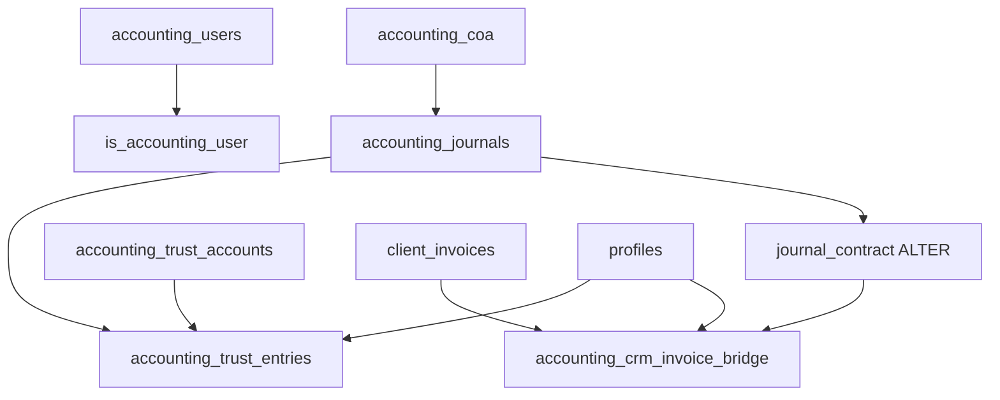

# Accounting A1.5 — Prerequisite deployment (Option 1)

> **Purpose:** Unblock `fn_assess_service_financial_dependencies` and `fn_cleanup_pre_financial_service_drafts` (Phase A1.5) by deploying accounting tables they reference.  
> **Confirmed gap (production):** `accounting_crm_invoice_bridge` and `accounting_trust_entries` do not exist → assess RPC throws `42P01` when any service-linked invoice is found.  
> **Scope:** Deploy existing migrations only. **Do not** change A1.5 business logic. **No** `to_regclass()` guards.

---

## Root cause recap

| Symptom | Cause |
|---------|--------|
| `"Could not clean up draft invoices for this service. Removal aborted."` | `fn_cleanup_pre_financial_service_drafts` calls assess first |
| Assess throws `42P01` | Queries `accounting_crm_invoice_bridge` when `v_service_invoice_ids` is non-empty |
| A1.5 migration applied, bridge not | A1.5 shipped before Accounting Phase 1 bridge/trust migrations were published |

---

## Pre-flight (run in Lovable SQL editor before Publish)

```sql
SELECT
  to_regclass('public.accounting_users') IS NOT NULL          AS accounting_users,
  to_regclass('public.accounting_coa') IS NOT NULL            AS accounting_coa,
  to_regclass('public.accounting_journals') IS NOT NULL       AS accounting_journals,
  to_regclass('public.accounting_crm_invoice_bridge') IS NOT NULL AS bridge,
  to_regclass('public.accounting_trust_accounts') IS NOT NULL AS trust_accounts,
  to_regclass('public.accounting_trust_entries') IS NOT NULL  AS trust_entries,
  EXISTS (
    SELECT 1 FROM pg_proc WHERE proname = 'is_accounting_user'
  ) AS fn_is_accounting_user,
  EXISTS (
    SELECT 1 FROM pg_proc WHERE proname = 'fn_assess_service_financial_dependencies'
  ) AS fn_assess_a15,
  EXISTS (
    SELECT 1 FROM pg_proc WHERE proname = 'fn_cleanup_pre_financial_service_drafts'
  ) AS fn_cleanup_a15;
```

**Interpretation**

| `accounting_journals` | `bridge` / `trust_entries` | Action |
|----------------------|----------------------------|--------|
| false | false | Run **full minimal chain** (§2) |
| true | false | Run **bridge + trust only** (§3) |
| true | true | Skip DDL; run **post-deploy verify** (§5) |

---

## 1. Objects referenced by A1.5 (must exist)

`fn_assess_service_financial_dependencies` (A1.5) reads these when invoices match the service:

| Object | Operation | Created by |
|--------|-----------|------------|
| `public.accounting_crm_invoice_bridge` | `COUNT(journal_id)` | `20260720120040_accounting_invoice_classification.sql` |
| `public.accounting_trust_entries` | `COUNT(*)` JOIN bridge on `journal_id` | `20260720120050_accounting_trust_subledger.sql` |
| `public.accounting_journals` | FK target (nullable on bridge/trust) | `20260517224545_03c8dd52-bb78-487d-8378-a82dc661fc37.sql` |
| `public.wallet_allocations` | `COUNT(*)` reserved/applied | `20260610302000_sprint0_wallet_engine_schema.sql` (already deployed) |
| CRM invoice tables | payments, allocations, receipts, etc. | Pre-A1.5 CRM migrations (already deployed) |

A1.5 does **not** require bridge/trust **rows** — only that the **tables exist** (empty is fine).

---

## 2. Minimal dependency chain (if `accounting_journals` missing)

Publish in **timestamp order**. Do not skip rows marked **required**.

| Order | Migration file | Required for A1.5 | Creates / alters |
|------:|----------------|-------------------|------------------|
| 1 | `20260515054022_ba101861-e3aa-40a8-b074-a115182a2db9.sql` | **Yes** (if no accounting_users) | `accounting_users` |
| 2 | `20260516060234_26d3217e-8e4e-41f7-8f82-d354fd8e77f0.sql` | **Yes** | `is_accounting_user()` |
| 3 | `20260517224518_41184534-749f-4f1b-a6f7-537adc676c93.sql` | **Yes** | `accounting_coa` |
| 4 | `20260517224545_03c8dd52-bb78-487d-8378-a82dc661fc37.sql` | **Yes** | `accounting_journals`, `accounting_journal_lines`, `generate_journal_number()` |
| 5 | `20260720120000_accounting_journal_contract.sql` | Recommended | Alters `accounting_journals` / lines (contract columns) |
| 6 | `20260720120040_accounting_invoice_classification.sql` | **Yes** | `accounting_crm_invoice_bridge`, `accounting_invoice_line_classifications` |
| 7 | `20260720120050_accounting_trust_subledger.sql` | **Yes** | `accounting_trust_accounts`, `accounting_trust_entries`, `fn_trust_entry_apply_balance()` |

**Dependency graph (minimal)**



---

## 3. Bridge + trust only (if `accounting_journals` already exists)

| Order | Migration file | Creates |
|------:|----------------|---------|
| 1 | `20260720120040_accounting_invoice_classification.sql` | Bridge + line classifications |
| 2 | `20260720120050_accounting_trust_subledger.sql` | Trust accounts + entries |

---

## 4. Full Accounting Phase 1 chain (optional — not required for A1.5 unblock)

Publish after §2/§3 when enabling the full Accounting workspace. **Not** needed for service-removal UAT.

| Order | Migration file | Purpose |
|------:|----------------|---------|
| 8 | `20260720120010_accounting_journal_immutability.sql` | Posted journal immutability |
| 9 | `20260720120020_accounting_account_roles.sql` | Account roles + posting rules |
| 10 | `20260720120030_accounting_phase1_coa_seed.sql` | COA seed data |
| 11 | `20260720120060_accounting_trust_disbursements.sql` | Trust disbursements + balance guard |
| 12 | `20260720120070_accounting_tax_framework.sql` | Tax codes / components |
| 13 | `20260720120080_accounting_tax_filings_remittances.sql` | Tax filings |
| 14 | `20260720120090_accounting_payroll.sql` | Payroll batches |
| 15 | `20260720120100_accounting_ap_payments.sql` | AP payments |
| 16 | `20260720120110_accounting_fiscal_periods.sql` | Fiscal periods |
| 17 | `20260720120120_accounting_bank_reconciliation.sql` | Bank recon |
| 18 | `20260720120130_accounting_attachments_and_helpers.sql` | Attachments bucket + helpers |

Later collection-category migrations (`20260722120000`, `20260722120020`, …) ALTER trust/bridge — run only after §4 tables exist.

---

## 5. Post-deploy verification

### 5.1 Schema gate

```sql
SELECT
  to_regclass('public.accounting_crm_invoice_bridge') IS NOT NULL AS bridge_ok,
  to_regclass('public.accounting_trust_entries') IS NOT NULL AS trust_ok;
```

Both must be `true`.

### 5.2 RPC smoke (replace `CLIENT_ID` with failing UAT client)

```sql
SELECT public.fn_assess_service_financial_dependencies(
  'CLIENT_ID'::uuid,
  'c35e6051-f40f-47bf-9cac-0a386c47a336::Canada',
  ARRAY[
    'c35e6051-f40f-47bf-9cac-0a386c47a336::Canada',
    'c35e6051-f40f-47bf-9cac-0a386c47a336'
  ]::text[]
) AS assess;

SELECT public.fn_cleanup_pre_financial_service_drafts(
  'CLIENT_ID'::uuid,
  'c35e6051-f40f-47bf-9cac-0a386c47a336::Canada',
  ARRAY[
    'c35e6051-f40f-47bf-9cac-0a386c47a336::Canada',
    'c35e6051-f40f-47bf-9cac-0a386c47a336'
  ]::text[],
  auth.uid(),
  'uat_post_deploy_probe'
) AS cleanup;
```

**Pass:** JSON with `tier`, no `42P01`. Cleanup returns `"ok": true` (cancelled or empty arrays if already cleaned).

---

## 6. A1.5 UAT re-run (after deploy — before Phase A2)

| # | Scenario | Setup | Expected |
|---|----------|-------|----------|
| **U1** | Single service + draft | New lead → Canada Student Visa → auto-draft → no payment | `tier: pre_financial` → remove service → draft **cancelled/hidden** → case **archived** |
| **U2** | Multiple services + drafts | Two visa services, draft lines each (or separate drafts) | Remove **one** service only → that service's draft(s) cancelled; **other service drafts unchanged** |
| **U3** | Issued invoice | Send/issue invoice for one service (₹0 paid OK) | `tier: financial` → removal **blocked** → Transfer / Refund / Cancel path |
| **U4** | Payment received | Draft or sent invoice + verified payment | `tier: financial` → removal **blocked**; cleanup RPC **not** called from UI |

### UAT audit checks

- [ ] No `"Could not clean up draft invoices"` on U1/U2
- [ ] `client_service_audit_log`: `draft_invoice_cancelled` or `draft_invoice_lines_removed` on U1/U2
- [ ] Cancelled drafts hidden in operational invoice UI (`status = cancelled`, `archived_at` set)
- [ ] U3/U4 show financial block message (not cleanup error)

---

## 7. Deployment readiness gate (Phase A2 blocked until pass)

| Gate | Status |
|------|--------|
| Pre-flight SQL run | Owner |
| Minimal chain (§2 or §3) published in Lovable | Owner |
| §5.1 `bridge_ok` + `trust_ok` = true | Owner |
| §5.2 assess + cleanup smoke pass | Owner |
| U1–U4 UAT pass | Owner |
| Phase A2 work | **Blocked** until above complete |

---

## 8. Owner actions (Lovable)

1. Lovable → **Sync from GitHub** (`feature/service-library-nav` or `main`)
2. **Publish** → approve **all pending** migrations through at least `20260720120050` (and §2 prerequisites if pre-flight shows gaps)
3. Hard refresh CRM (Cmd+Shift+R)
4. Run §5 + §6 UAT

No application code changes required for Option 1.

---

## Related

- `docs/guides/ACCOUNTING_HARDENING_ARCHITECTURE.md` — A1.5 rules + UAT checklist
- `docs/LOVABLE_PUBLISH_CHECKLIST.md` — Accounting A1.5 prereq section
- `supabase/migrations/20260925120000_accounting_hardening_phase_a1_5.sql` — unchanged
