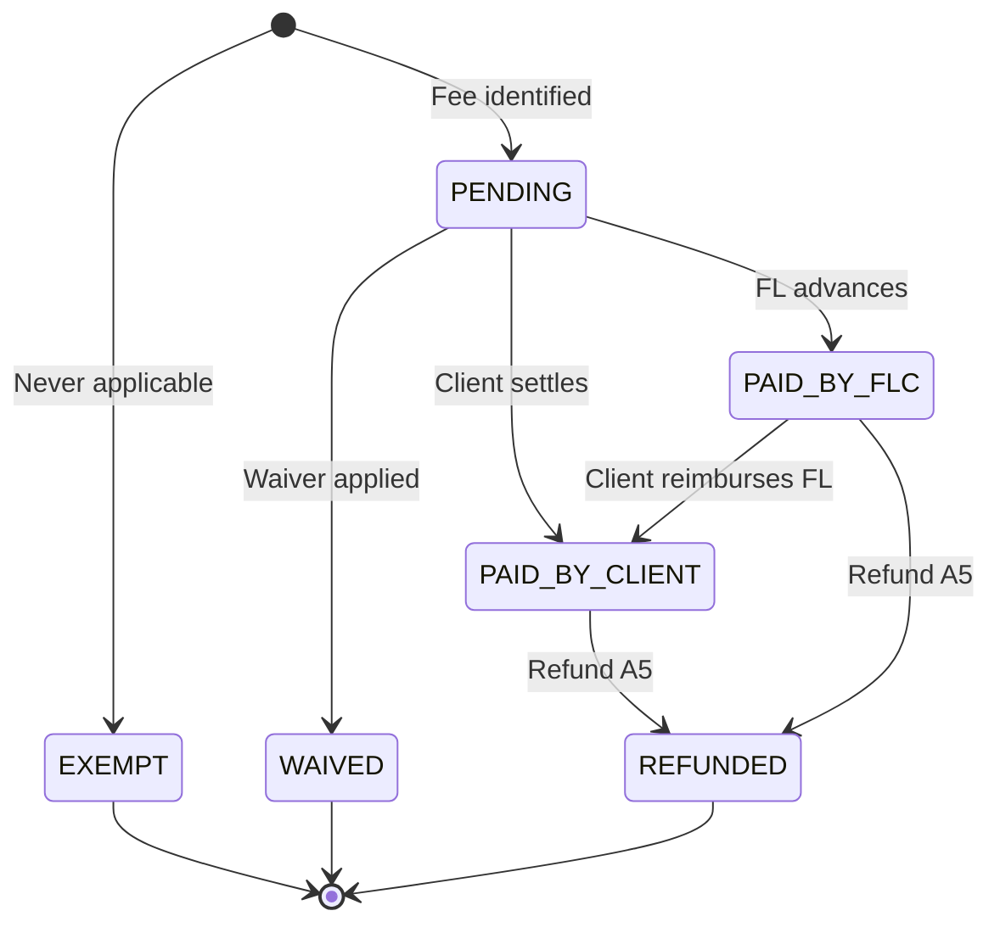
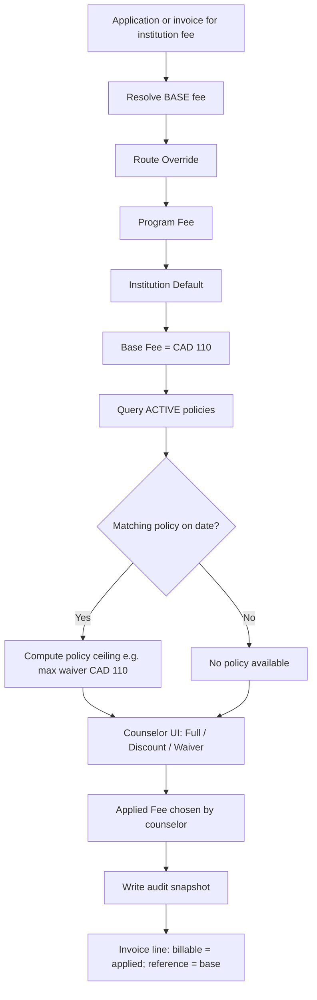

# Fee Master Architecture V1.1 (Phase P2.1 — Design Only)

| Field | Value |
|-------|-------|
| **Status** | **INSTITUTION FEE: LOCKED** — see [`INSTITUTION_FEE_ARCHITECTURE_LOCKED.md`](./INSTITUTION_FEE_ARCHITECTURE_LOCKED.md). Overall doc: DESIGN — no implementation |
| **Phase** | P2.1 complete (institution); P2.2 = Government Fee Master |
| **Date** | June 2026 |
| **Supersedes** | [`FEE_MASTER_ARCHITECTURE_V1.md`](./FEE_MASTER_ARCHITECTURE_V1.md) — V1 remains reference for reuse inventory and screen flows |
| **Governed by** | [`ACCOUNTING_HARDENING_ARCHITECTURE.md`](./ACCOUNTING_HARDENING_ARCHITECTURE.md) |

---

## Executive summary

V1.1 closes six gaps identified before P3 implementation:

1. **Payment Responsibility Model** — who is obligated to pay each fee line (`CLIENT`, `FLC`, `SPONSOR`, `INSTITUTION`, `THIRD_PARTY`).
2. **Payment Status Model** — operational lifecycle for pass-through and institution fees, independent of invoice header status.
3. **Institution Fee Ownership lock** — application fees, deposits, tuition, and all institution charges **must originate from Institution Masters only** — never Service Library.
4. **Collections vs Revenue separation** — formal four-bucket model: **Collections**, **Revenue**, **Pass-through**, **Trust**.
5. **Ancillary Services evaluation** — recommendation to keep under Third Party with a logical sub-group flag (not a new top-level domain).
6. **Operational payment tracking** — mandatory tracking when money never enters Future Link (direct-paid, sponsor-paid, FL-advance).
7. **Institution Fee Policy Engine** — time-bound waivers/discounts/promotions on institution fees; **available to counselors, never auto-applied**; per-application audit without repeat admin approval.

V1.1 adds **future data contracts** (field names and semantics only — no SQL, no migrations). P3 must implement these contracts before wiring collection categories or trust posting.

**Core invariant (unchanged from V1):** CRM `client_invoices.line_items` remains the operational charge record. Fee masters hold defaults; lines hold actuals with responsibility, status, and collection path.

---

## Table of contents

1. [Business rules (locked)](#1-business-rules-locked)
2. [Payment Responsibility Model](#2-payment-responsibility-model)
3. [Payment Status Model](#3-payment-status-model)
4. [Institution Fee Ownership](#4-institution-fee-ownership)
   - [4.6 Institution Fee Policy Engine (locked)](#46-institution-fee-policy-engine-locked)
5. [Collections vs Revenue vs Pass-through vs Trust](#5-collections-vs-revenue-vs-pass-through-vs-trust)
6. [Ancillary Services domain evaluation](#6-ancillary-services-domain-evaluation)
7. [Operational payment tracking](#7-operational-payment-tracking)
8. [Architecture updates from V1](#8-architecture-updates-from-v1)
9. [Future data contracts (P3)](#9-future-data-contracts-p3)
10. [Reporting impact](#10-reporting-impact)
11. [Implementation considerations for P3](#11-implementation-considerations-for-p3)
12. [Appendix: V1 carry-forward](#12-appendix-v1-carry-forward)

**Institution fee architecture:** [LOCKED — P2.1](./INSTITUTION_FEE_ARCHITECTURE_LOCKED.md)  
**Government fee architecture:** [LOCKED — P2.2](./GOVERNMENT_FEE_ARCHITECTURE_LOCKED.md)  
**MD sign-off:** [LOCKED — P2.3 complete](./FEE_MASTER_P2_3_LOCKED.md)  
**P3 readiness:** [Readiness report](./FEE_MASTER_P3_READINESS_REPORT.md)

---

## 1. Business rules (locked)

| # | Rule | Source |
|---|------|--------|
| BR-1 | CRM `client_invoices` is the source of truth for student billing and collections | Accounting hardening |
| BR-2 | Every billable line maps to an `accounting_collection_categories` leaf before invoice send | V1 |
| BR-3 | **Institution fees (application, tuition, deposit, GIC, residence, other institution charges) originate only from Institution Masters** — not Service Library | **V1.1 new** |
| BR-4 | Government fees originate from Service Library (per country/service) | V1 |
| BR-5 | Third-party fees (tests, credentials, ancillary) originate from Service Library or global third-party master — never from institution program tables | V1.1 |
| BR-6 | Future Link revenue (consultancy, coaching) originates from Service Library picker variants | V1 |
| BR-7 | **Payment responsibility** (who owes) and **payment status** (what happened) are line-level fields — not inferred from invoice header alone | **V1.1 new** |
| BR-8 | **Operational tracking is required even when ₹0 flows through FL** (direct-paid, waived, sponsor-paid off-platform) | **V1.1 new** |
| BR-9 | Pass-through and trust amounts **never count as revenue**, branch targets, or incentive qualifying revenue | **V1.1 new** |
| BR-10 | Discount wallets apply to **Revenue lines only** | Accounting hardening + V1 |
| BR-11 | Refunds are line-based (Phase A4+) — payment status `REFUNDED` complements financial reversal | Accounting hardening |
| BR-12 | Fee master precedence for **base institution fee**: **Route Override → Program Fee → Institution Default → Manual Exception** | **V1.1 new** |
| BR-13 | **Institution Fee Policies** are time-bound offers (waiver/discount/promotion) authored and **approved once** by administrators — not per application | **V1.1 policy engine** |
| BR-14 | An **active policy makes a waiver or discount available** — it does **not** automatically reduce the fee to zero | **V1.1 policy engine** |
| BR-15 | Counselor chooses at application/invoice time: **charge full fee**, **apply discount**, or **apply waiver** — no repeat administrator approval when policy is `Active` | **V1.1 policy engine** |
| BR-16 | Institution fee policy adjustments are **pass-through audit** (reference vs collected) — **not** Future Link revenue discounts and **not** counselor wallet discounts | **V1.1 policy engine** |
| BR-17 | Every policy application must audit: base fee, available policy, applied fee, difference, counselor, timestamp, optional reason | **V1.1 policy engine** |
| BR-18 | Institution fee policies apply only to **institution fee types** (application, deposit, tuition, etc.) — not consultancy/revenue lines | **V1.1 policy engine** |
| **BR-19** | **`EXEMPT`** = fee never applicable to case/pathway; **`WAIVED`** = was applicable, obligation removed — do not conflate (P2.3 C5) | **P2.3 MD sign-off** |
| **BR-20** | Direct-paid tolerance: Accounts review when variance exceeds **lesser of 5% or CAD 10 equivalent** (P2.3 C4) | **P2.3 MD sign-off** |

---

## 2. Payment Responsibility Model

### 2.1 Purpose

**Payment responsibility** answers: *Who is contractually or operationally obligated to pay this fee?*

It is **orthogonal** to:

| Concept | Question answered |
|---------|-------------------|
| **Collection path** (V1) | How does money move through FL books? (`FLC_COLLECTS`, `CLIENT_DIRECT`, `FLC_ADVANCE`) |
| **Payment status** (V1.1) | Has the obligation been satisfied, waived, or refunded? |
| **Collection category** | What type of fee is this for accounting/tax/trust? |
| **Fee master domain** | Where does the default rate come from? (Government / Institution / Third Party) |

A single line always has exactly one `payment_responsibility` value.

### 2.2 Supported values

| Value | Definition | Typical fees |
|-------|------------|--------------|
| `CLIENT` | Student or client (or parent paying on their behalf) is obligated | Visa fee, application fee, consultancy, IELTS |
| `FLC` | Future Link absorbs or advances the cost (promotional, goodwill, error correction, corporate sponsorship) | FL-paid application fee waiver top-up, FL advance before client reimburses |
| `SPONSOR` | Third-party sponsor (employer, family abroad, scholarship body) is obligated | Sponsored visa fee, employer-paid credential assessment |
| `INSTITUTION` | Institution pays or credits (rare — fee waived/covered by partner) | Partner waives application fee, institution-funded scholarship offset |
| `THIRD_PARTY` | External vendor initiates charge to client directly; FL tracks only | Client books own medical; insurance bought direct from insurer |

**Note:** `THIRD_PARTY` as responsibility means the **vendor–client relationship is direct** and FL is not the collecting agent. This differs from third-party **fee domain** (IELTS, courier) where FL may still collect (`payment_responsibility = CLIENT`, `collection_path = FLC_COLLECTS`).

### 2.3 Examples

| Scenario | Fee | payment_responsibility | collection_path | payment_status (initial) |
|----------|-----|------------------------|-----------------|--------------------------|
| Client pays Seneca application fee through FL | Application fee | `CLIENT` | `FLC_COLLECTS` | `PENDING` |
| Client pays Seneca portal directly | Application fee | `CLIENT` | `CLIENT_DIRECT` | `PENDING` → `PAID_BY_CLIENT` |
| FL advances Seneca application fee | Application fee | `FLC` | `FLC_ADVANCE` | `PAID_BY_FLC` |
| Client pays IRCC visa fee via FL invoice | Visa fee | `CLIENT` | `FLC_COLLECTS` | `PENDING` |
| Sponsor wire covers visa fee | Visa fee | `SPONSOR` | `FLC_COLLECTS` | `PENDING` → `PAID_BY_CLIENT`* |
| Client pays VFS biometrics directly | Biometrics | `CLIENT` | `CLIENT_DIRECT` | `PAID_BY_CLIENT` |
| Seneca waives application fee | Application fee | `INSTITUTION` | n/a | `WAIVED` |
| Client buys insurance without FL | Insurance | `THIRD_PARTY` | `CLIENT_DIRECT` | `PAID_BY_CLIENT` |

\* When sponsor pays through FL, operational UI may label payer as sponsor; `payment_responsibility` remains `SPONSOR`. Allocation metadata should record sponsor identity (future contract field `payer_party_ref`).

### 2.4 Reporting impact

| Report | Uses payment_responsibility |
|--------|----------------------------|
| Client obligation summary | Sum lines where `CLIENT` + status `PENDING` |
| Sponsor billing / reconciliation | Filter `SPONSOR` + collection path |
| FL subsidy / marketing cost | Sum `FLC` responsibility + `PAID_BY_FLC` |
| Institution waiver tracking | Filter `INSTITUTION` + `WAIVED` |
| Direct ecosystem (no FL float) | Filter `CLIENT_DIRECT` or `THIRD_PARTY` responsibility |

**Does not affect:** Gross revenue KPI (revenue lines only — see §5).

### 2.5 Accounting impact

| Responsibility | Typical GL / subledger |
|----------------|------------------------|
| `CLIENT` + `FLC_COLLECTS` | AR → Trust or Revenue per category |
| `CLIENT` + `CLIENT_DIRECT` | No AR; optional memo entry only in Phase P3+ |
| `FLC` + `FLC_ADVANCE` | AP / recoverable asset; not revenue |
| `SPONSOR` + `FLC_COLLECTS` | Same as CLIENT for cash; sponsor sub-ledger in reporting |
| `INSTITUTION` + `WAIVED` | No trust movement; audit event only |
| `THIRD_PARTY` + direct | No trust; tracking row only |

### 2.6 Reimbursement impact

| Pattern | Responsibility flow |
|---------|----------------------|
| FL advances → client repays FL | Start `FLC` + `PAID_BY_FLC` → recoverable line → client pays → clear recoverable |
| Client paid direct → no FL reimbursement | `CLIENT` + `PAID_BY_CLIENT` + `CLIENT_DIRECT` — **no reimbursement** |
| Sponsor pays FL → FL remits | `SPONSOR` + `FLC_COLLECTS` — sponsor settlement separate from client AR |
| FL promotional waiver | `FLC` + `WAIVED` on revenue line — margin impact, not pass-through |

---

## 3. Payment Status Model

### 3.1 Purpose

**Payment status** tracks the **operational settlement state of each pass-through or institution fee line**. Invoice header status (`draft`, `paid`, `partially_paid`) remains authoritative for **FL collections** but is insufficient for:

- Fees paid directly to government/institution/vendor
- FL advances not yet recovered
- Waived institution fees
- Refunded pass-through lines (Phase A5)

Payment status applies to **non-revenue lines** by default. Revenue (consultancy) lines may use invoice payment state unless FL-advance or waiver patterns apply.

### 3.2 Supported values

| Status | When used |
|--------|-----------|
| `EXEMPT` | Fee **never applicable** to this case/pathway (structural exemption — e.g. biometrics not required for exempt category). **Not** a waiver. **Preferred term (P2.3).** |
| `NOT_REQUIRED` | **Legacy alias** — treat as `EXEMPT` on read in P3; do not use for new records |
| `PENDING` | Obligation exists; not yet satisfied |
| `PAID_BY_CLIENT` | Client (or payer acting for client) settled — via FL or direct |
| `PAID_BY_FLC` | Future Link paid vendor/institution/government on client's behalf |
| `WAIVED` | Fee **was applicable**; obligation removed (institution waiver, promo, policy) — distinct from `EXEMPT` |
| `REFUNDED` | Previously paid; refund processed or approved (Phase A4–A5) |

### 3.2a EXEMPT vs WAIVED (locked — P2.3 C5)

| | EXEMPT | WAIVED |
|---|--------|--------|
| **Meaning** | Never was an obligation | Was an obligation, then removed |
| **Example** | Age-exempt from biometrics | Application fee waived under Seneca promo |
| **Audit** | Exemption reason / rule ref | Policy id or waiver reason |
| **Trust** | No movement | Usually no collection; see policy |

### 3.3 State transitions



### 3.4 Examples

| Fee | Journey | Status sequence |
|-----|---------|-----------------|
| Seneca application fee — client pays portal | Direct | `PENDING` → `PAID_BY_CLIENT` (proof uploaded) |
| Seneca application fee — via FL invoice | Collected | `PENDING` → `PAID_BY_CLIENT` (on verified payment) |
| Visa fee — FL wire to IRCC | Advance | `PENDING` → `PAID_BY_FLC` → client reimburses → remains `PAID_BY_FLC` with recoverable cleared |
| Application fee — partner waiver | Waiver | `PENDING` → `WAIVED` |
| IELTS — not needed (English exempt) | N/A | `EXEMPT` |
| Visa fee — refund after refusal | Refund | `PAID_BY_CLIENT` → `REFUNDED` |

### 3.5 Audit implications

| Event | Required audit artifact |
|-------|-------------------------|
| Status → `PAID_BY_CLIENT` + direct | `direct_paid_proof` (receipt ref, date, amount) + actor + timestamp |
| Status → `PAID_BY_FLC` | AP payment ref or trust disbursement id + approver |
| Status → `WAIVED` | Waiver reason + approver (institution letter or internal approval) |
| Status → `REFUNDED` | `client_invoice_refund_requests` + approval matrix (A4) |
| Any transition | Append to `client_service_billing_events` or dedicated `fee_line_status_log` (P3 contract) |

**Immutability (A2):** Posted status transitions are append-only; corrections via superseding event, not silent UPDATE.

### 3.6 Reporting implications

| KPI | Status filter |
|-----|---------------|
| Outstanding institution/govt/third-party obligations | `PENDING` |
| Direct-paid (no FL float) | `PAID_BY_CLIENT` + `CLIENT_DIRECT` |
| FL advance exposure | `PAID_BY_FLC` + uncleared recoverable |
| Waived fees (partner reporting) | `WAIVED` |
| Refund exposure | `REFUNDED` (historical) + in-flight refund requests |

---

## 4. Institution Fee Ownership

### 4.1 Locked business rule

> **Application fees, tuition, deposits, GIC, residence deposits, and all institution-specific charges MUST originate from Institution Masters. They MUST NOT be sourced from Service Library fee items, picker variants, or hardcoded Service Library fee breakdowns.**

Service Library may **display** institution fee estimates on admission/MBBS academy pages for counselor guidance, but those values must be **read from Institution Masters** (or application snapshot) — never authored in Service Library Admin Fees tab.

**V1 correction:** GIC, accommodation deposit, and university deposit rows previously attributed to Service Library in V1 §3.2 are **Institution Master only** in V1.1.

### 4.2 Hierarchy

```
Institution (upi_institutions)
└── Program (upi_courses_staging → cf_courses)
    ├── Application Fee
    ├── Tuition (per year / semester / program)
    ├── Deposit (seat / tuition deposit)
    ├── Residence Deposit (if institution-managed)
    ├── GIC (if program/country requires — institution-scoped)
    └── Other Charges (lab, insurance mandatory, etc.)
└── Partnership Route (upi_partnership_routes) — may override program-level fees
└── Institution Default — fallback when program fee missing
```

### 4.3 Precedence rules (locked)

When resolving the default amount for an institution fee line, apply **first match wins**:

| Priority | Source | Example |
|----------|--------|---------|
| **1 — Route Override** | `upi_partnership_routes.application_fee`, route-level waiver window | Aggregator channel: $0 application fee until promo end date |
| **2 — Program Fee** | `upi_courses_staging` / `cf_courses` for matched program | Seneca Computer Programming diploma: tuition CAD 16,000 yr1 |
| **3 — Institution Default** | Institution-level default schedule when program not staged | Generic application fee CAD 100 for all undergrad programs |
| **4 — Manual Exception** | Case-level override on `client_service_cases` or application snapshot with reason + approver | VIP client deposit reduced — logged in billing events |

**Conflict resolution example:**

- Institution default application fee: CAD 100  
- Program "Health Informatics" staged fee: CAD 120  
- Partnership route "India Direct" override: CAD 0 (waiver active)  
- **Resolved default:** CAD 0 (route wins)  
- Counselor manually sets CAD 120 with approval → **Manual exception** overrides for that case only  

**Tuition example:**

- Program tuition on staging: CAD 16,000  
- No route override  
- **Resolved default:** CAD 16,000 from program  
- At application create → snapshot to `client_institution_qualifications.tuition_fee`

### 4.4 Operational snapshot

When a client applies to an institution program:

1. Resolve fee from precedence chain  
2. Snapshot to `client_institution_qualifications` and/or `qualification_deposit_track` / `qualification_tuition_track`  
3. Copy deposit reference to `client_service_cases.institution_required_deposit` when service case linked  
4. Invoice lines reference snapshot + `fee_master_ref` — not live master rate after issue  

### 4.5 Module boundaries (revised)

| Data | Authoritative module |
|------|---------------------|
| Application fee, tuition, deposit, GIC, residence | **Institution** — Course Review, Partnership Routes, future Fee Schedule UI |
| Consultancy fee for admission service | **Service Library** — picker variants (REVENUE only) |
| Visa/government fees bundled with admission | **Service Library** — government fee master |
| IELTS, WES, courier | **Service Library** — third-party master |

---

### 4.6 Institution Fee Policy Engine (locked)

#### Purpose

Institution application fees (and other institution fee types) may have **temporary waivers, discounts, partner campaigns, regional promotions, or special intake offers**. These must not require administrator approval on every counselor action once the policy is active.

The **Fee Policy Engine** sits on top of the **Institution Fee Master** (base rates from §4.3). It separates:

| Layer | Role |
|-------|------|
| **Base fee** | Authoritative rate from Route → Program → Institution precedence |
| **Active policy** | Time-bound offer that makes a waiver or discount **available** |
| **Applied fee** | Amount counselor actually charges — chosen at application/invoice time |
| **Audit trail** | Immutable record of base, policy, applied, difference, counselor, reason |

**This is not the counselor discount wallet.** Wallet discounts reduce **Future Link revenue** (consultancy). Institution fee policies adjust **pass-through institution charges** only.

#### Policy types (supported)

| Policy type | Typical use |
|-------------|-------------|
| `APPLICATION_FEE_WAIVER` | 100% waiver window (e.g. fall intake promo) |
| `APPLICATION_FEE_DISCOUNT` | Fixed or percentage reduction |
| `PARTNER_PROMOTION` | Aggregator or agent channel campaign |
| `REGIONAL_CAMPAIGN` | Country/region-specific offer |
| `SPECIAL_INTAKE_OFFER` | Intake-season bound (Jan, Sep, etc.) |

Future types (tuition deposit discount, etc.) use the same engine with `fee_type` scope — P3 may extend beyond application fee.

#### Policy fields (logical contract)

| Field | Required | Description |
|-------|----------|-------------|
| `institution_id` | Yes | `upi_institutions.id` |
| `fee_type` | Yes | `APPLICATION` \| `TUITION` \| `DEPOSIT` \| … (see §9.2) |
| `policy_type` | Yes | One of policy types above |
| `program_id` | No | Scope to program; null = institution-wide |
| `partnership_route_id` | No | Scope to route/channel |
| `start_date` | Yes | Inclusive policy start |
| `end_date` | Yes | Inclusive policy end |
| `discount_type` | Yes | `PERCENTAGE` \| `FIXED_AMOUNT` |
| `discount_value` | Yes | e.g. `100` (%) or `50` (CAD) |
| `currency` | When fixed | Required for `FIXED_AMOUNT` |
| `status` | Yes | `DRAFT` \| `PENDING_APPROVAL` \| `ACTIVE` \| `EXPIRED` \| `ARCHIVED` |
| `created_by` | Yes | Administrator who drafted |
| `approved_by` | Yes | Required before `ACTIVE` |
| `approved_at` | Yes | Approval timestamp |
| `notes` | No | Internal campaign description |

**Reuse:** `upi_partnership_routes.application_fee_waiver*` fields remain valid as **structural route overrides** (base fee layer). Time-bound marketing campaigns should use the Fee Policy Engine instead of ad-hoc route edits.

#### Worked examples (locked)

**Example A — Seneca Polytechnic application fee waiver**

| Field | Value |
|-------|-------|
| Institution | Seneca Polytechnic |
| Base application fee (master) | CAD 110 |
| Policy type | Application Fee Waiver |
| Period | 01-Aug-2026 to 31-Oct-2026 |
| Discount | 100% |
| Status | Active |

**Example B — Conestoga College application fee discount**

| Field | Value |
|-------|-------|
| Institution | Conestoga College |
| Base application fee (master) | CAD 100 (illustrative) |
| Policy type | Application Fee Discount |
| Period | 01-Sep-2026 to 30-Sep-2026 |
| Discount | CAD 50 fixed |
| Status | Active |

#### Resolution order (base + policy)



**Critical rule (BR-14):** Step I computes the **maximum available reduction**, not the applied amount. Counselor step K is mandatory.

#### Counselor workflow (application create)

When counselor creates an institution application (or adds application fee to invoice):

**System displays:**

```
Institution:     Seneca Polytechnic
Fee type:        Application Fee
Base Fee:        CAD 110
Active Policy:   Application Fee Waiver (100%)
Effective Until: 31-Oct-2026
Maximum Saving:  CAD 110
```

**Counselor actions (no administrator approval if policy is Active):**

| Action | Applied fee | Typical reason |
|--------|-------------|------------------|
| **1. Charge full fee** | CAD 110 | "Included in package" / client opted to pay |
| **2. Apply discount** | CAD 60 (if policy allows partial — fixed CAD 50 off) | Partial promotion |
| **3. Apply waiver** | CAD 0 | Full waiver under active policy |

Counselor may enter **optional reason** text. Branch and company policy may constrain choices in P3 (configuration — not per-transaction approval).

#### Locked rule — policy availability ≠ forced waiver

> An active waiver or discount policy **does not** automatically set the fee to zero.  
> The policy **makes the waiver or discount available**.  
> The counselor decides whether to collect full fee, partially discount, or fully waive — subject to branch and company policy.

#### Audit requirements (mandatory)

Every institution fee line with a policy context must record:

| Audit field | Description |
|-------------|-------------|
| `base_fee_amount` | Resolved from master precedence (reference) |
| `base_fee_currency` | e.g. CAD |
| `available_policy_id` | Policy id if active on date; null if none |
| `available_policy_label` | Display name / type |
| `policy_max_reduction` | Maximum discount/waiver allowed by policy |
| `applied_fee_amount` | Actual amount charged to client |
| `difference_amount` | `base_fee_amount − applied_fee_amount` |
| `counselor_id` | Who made the choice |
| `applied_at` | Timestamp |
| `reason` | Optional counselor text |
| `fee_policy_decision` | `FULL_FEE` \| `DISCOUNT_APPLIED` \| `WAIVER_APPLIED` |

**Audit examples (locked):**

| base | policy available | applied | difference | decision | reason |
|------|------------------|---------|------------|----------|--------|
| CAD 110 | Waiver 100% | CAD 110 | 0 | `FULL_FEE` | Included in package |
| CAD 110 | Waiver 100% | CAD 0 | 110 | `WAIVER_APPLIED` | — |
| CAD 100 | Discount CAD 50 | CAD 50 | 50 | `DISCOUNT_APPLIED` | Sep promo |

Append event `institution_fee_policy_applied` to `client_service_billing_events` or dedicated policy audit log (P3). **Immutable after application submit** (A2 alignment).

#### Accounting treatment

| Concept | Amount | GL / reporting |
|---------|--------|----------------|
| **Institution fee (reference)** | Base fee from master | Informational / pass-through reference — not FL revenue |
| **Collected amount** | Applied fee actually charged | AR + trust (if FL collects) |
| **Discount/waiver** | `base − applied` | **Separate audit dimension** — not netted silently into revenue |
| **Trust** | Applied fee when `FLC_COLLECTS` | Trust credit for amount collected |
| **Waived portion** | Difference when applied < base | Tracking only unless FL remits full base to institution (FL advance — separate path) |

**Pass-through integrity:** Waived institution application fee does **not** reduce Future Link consultancy revenue. Performance Hub revenue KPIs unchanged (BR-9).

If FL still remits full base to institution while client paid reduced amount, treat shortfall as **`FLC` payment responsibility** (promotional subsidy) — separate from policy audit; requires MD policy on who absorbs gap (see MD-6).

#### Payment status interaction

| Applied fee | collection_path | payment_status |
|-------------|-----------------|----------------|
| > 0, client pays FL | `FLC_COLLECTS` | `PENDING` → `PAID_BY_CLIENT` |
| > 0, client pays institution direct | `CLIENT_DIRECT` | `PAID_BY_CLIENT` |
| 0 (full waiver) | n/a or informational line | `WAIVED` |
| 0, institution partner waiver | n/a | `WAIVED`, responsibility may be `INSTITUTION` |

#### Reporting (policy engine)

| Report | Definition |
|--------|------------|
| **Application fees collected** | Sum `applied_fee_amount` where `fee_type = APPLICATION` and collected |
| **Application fees waived** | Sum `difference_amount` where `fee_policy_decision = WAIVER_APPLIED` |
| **Application fee discounts given** | Sum `difference_amount` where `fee_policy_decision = DISCOUNT_APPLIED` |
| **Counselor utilization of waivers** | Count/sum by `counselor_id`, policy id, decision type |
| **Institution promotion impact** | By `institution_id`, policy type, date range — base vs applied |
| **Branch-level waiver analysis** | Above grouped by client branch |

#### Admin UI placement (design only)

| Surface | Role |
|---------|------|
| **Institution Detail** → Fee Policies tab | Create, approve, expire policies |
| **Application create / qualification** | Counselor policy picker + audit |
| **CRM Payments tab** | Invoice line shows reference vs applied |
| **Performance / institution reports** | Promotion impact dashboards |

**Not in Service Library. Not in discount wallet / Offers Studio** — institution pass-through only.

---

## 5. Collections vs Revenue vs Pass-through vs Trust

### 5.1 Purpose

Future Link invoices often **commingle** Future Link income with pass-through charges. Reporting, incentives, branch targets, and profitability **must never treat total collections as revenue**.

Four buckets are required on every issued invoice:

| Bucket | Definition | Includes |
|--------|------------|----------|
| **COLLECTIONS** | Total cash or verified payment received by FL for the invoice | All lines where `collection_path = FLC_COLLECTS` and payment verified |
| **REVENUE** | Future Link earned income | Lines with `accounting_treatment = REVENUE` (SERVICE_FEE, COACHING_FEE) net of discounts |
| **PASS-THROUGH** | Client charges FL collects on behalf of others — **not income** | Government, institution, third-party categories |
| **TRUST** | Pass-through subset held as client liability until disbursement | Pass-through lines with `requires_trust = true` on category |

**Relationship:**

```
COLLECTIONS (FL bank receipt)
  = REVENUE portion
  + PASS-THROUGH portion (held in TRUST until disbursed)

PASS-THROUGH ≥ TRUST balance (trust is subset of pass-through still held)
Direct-paid fees are NOT in COLLECTIONS or TRUST
```

### 5.2 Worked example (locked)

Client invoice — Canada Study Visa service:

| Line | Amount (CAD) | Category | Treatment | Bucket |
|------|-------------|----------|-----------|--------|
| Future Link service fee | 1,500 | SERVICE_FEE | REVENUE | Revenue |
| Visa fee (IRCC) | 235 | VISA_FEE | THIRD_PARTY | Pass-through / Trust |
| Biometrics (VFS) | 85 | BIOMETRIC_FEE | THIRD_PARTY | Pass-through / Trust |
| **Invoice total** | **1,820** | | | |

**After client pays FL in full (verified):**

| Metric | Amount (CAD) | Notes |
|--------|-------------|-------|
| **Collected** | 1,820 | Verified payment on invoice |
| **Revenue** | 1,500 | Only SERVICE_FEE — incentive & branch targets use this |
| **Pass-through** | 320 | 235 + 85 — never revenue |
| **Trust** | 320 | Held until IRCC/VFS disbursement |

**If biometrics paid direct by client (not on FL invoice):**

| Line | On invoice? | Collected by FL | Pass-through tracked | Trust |
|------|-------------|-----------------|------------------------|-------|
| Service fee | Yes | 1,500 | — | — |
| Visa fee | Yes | 235 | 235 | 235 |
| Biometrics | Informational (₹0 billable) | 0 | 85 (`PAID_BY_CLIENT`, direct) | 0 |

| Metric | Amount |
|--------|--------|
| Collected | 1,735 |
| Revenue | 1,500 |
| Pass-through (total case) | 320 |
| Trust | 235 |

### 5.3 Reporting requirements

| Report | Formula / source |
|--------|------------------|
| Invoice total | Sum all line totals (billable + informational) |
| **Collections (FL)** | Sum verified payments on invoice |
| **Revenue** | Sum REVENUE lines − line discounts − wallet discounts |
| **Pass-through volume** | Sum non-REVENUE billable + direct-paid tracked amounts |
| **Trust balance** | `accounting_trust_accounts` by client/category |
| **Net revenue (A6)** | Revenue − refunds on revenue lines |
| **Outstanding AR** | Issued invoice balance for FL-collect lines |

### 5.4 Accounting treatment

| Bucket | GL impact |
|--------|-----------|
| Revenue | Credit revenue COA (4201 etc.) via bridge |
| Pass-through (collected) | Credit trust liability COA — **not revenue** |
| Trust disbursement | Debit trust liability; credit bank / AP |
| Direct-paid | **No** trust credit — memo or status-only until policy defines memo journal |

### 5.5 Incentive impact

| Data | Incentive engine |
|------|------------------|
| Revenue lines only | `fn_incentive_record_payment_event`, qualifying payment events |
| Pass-through | **Excluded** from counselor commission and performance revenue |
| Wallet discounts | Reduce qualifying revenue base |
| Refunds (A5) | `fn_incentive_clawback_on_refund` on revenue portion only |

### 5.6 Branch target impact

Branch and counselor **sales targets** use **Revenue bucket only**. Pass-through must be visible on client financial views but **must not inflate branch attainment dashboards**.

### 5.7 Profitability reporting impact

| View | Pass-through handling |
|------|----------------------|
| Client profitability | Show pass-through as **cost pass-through** — margin on REVENUE only |
| Service line profitability | Allocate REVENUE to service; show pass-through separately |
| FL consolidated P&L | Pass-through flows through balance sheet (trust), not top-line revenue |

---

## 6. Ancillary Services domain evaluation

### 6.1 Scope

Ancillary services are **operational add-ons** often sold or tracked alongside visa/admission/coaching:

Courier, Medical, Insurance, Translation, PCC, Airport Pickup, Accommodation Booking, Forex, SIM Card — plus existing categories COURIER, MEDICAL, INSURANCE, TRANSLATION, POLICE_CLEARANCE, AIRPORT_PICKUP, AIR_TICKET.

### 6.2 Option A — Keep under Third Party (with sub-group)

| Pros | Cons |
|------|------|
| Reuses existing collection categories (`COURIER`, `MEDICAL`, etc.) | Third Party group becomes large and heterogeneous |
| No new taxonomy migration | Test fees (IELTS) and ancillary (courier) share parent `THIRD_PARTY` |
| Simpler P3 — add `fee_subgroup: ANCILLARY` metadata | Less obvious admin navigation without UI filters |
| Aligns with current seed in `accounting_collection_categories` | |

### 6.3 Option B — Separate Ancillary Services domain

| Pros | Cons |
|------|------|
| Clear counselor mental model | Fourth top-level domain alongside Government / Institution / Third Party |
| Dedicated admin UI and reporting | Risk duplicating collection category tree |
| Different workflow (often direct-paid, optional) | P3 scope increase — new master tables/views |
| | Forex/SIM may blur into travel/financial — boundary disputes |

### 6.4 Recommendation — **Option A with logical sub-group**

**Do not create a separate Ancillary Services domain at the taxonomy level.**

Instead:

1. Keep ancillary fees under **Third Party** domain and existing collection category leaves.  
2. Add logical metadata: `fee_subgroup = ANCILLARY | TEST | CREDENTIAL | INSTITUTION_PASSTHROUGH` on fee master rows and invoice lines.  
3. Provide **filtered admin views** in Service Library Admin ("Ancillary rates") — UI concern for P3, not a new domain.  
4. Add collection category leaves only where missing (`FOREX`, `SIM_CARD` under `OTHER` or new leaves under `THIRD_PARTY` — **MD decision**, see §Closing).

**Reason:** Collection categories already encode trust buckets and COA roles. Splitting domains would duplicate that spine. Ancillary-specific reporting is achieved via `fee_subgroup` without migration risk.

**Exception:** If MD later requires separate P&L ownership for ancillary products (e.g. insurance brokerage margin), revisit Option B for **revenue** ancillary only — not pass-through ancillary.

---

## 7. Operational payment tracking

### 7.1 Requirement

Future Link must record **all three settlement patterns** for third-party and institution fees:

| Pattern | Money through FL? | Must track? |
|---------|-------------------|-------------|
| Paid to Future Link | Yes | Yes — invoice + trust |
| Paid directly by client | No | **Yes — status + proof** |
| Paid by FL on behalf of client | Yes (outbound first) | Yes — AP/trust + recoverable |

**Tracking is mandatory even when ₹0 enters FL.**

### 7.2 Recommended architecture

Extend the **line-item contract** (not a parallel transaction table):

```
operational_fee_line (extends invoice line or parallel status row keyed by line_item_key)
├── line_item_key
├── collection_category_id
├── payment_responsibility
├── collection_path
├── payment_status
├── billable_amount          may be 0 for direct-paid informational lines
├── tracked_amount           full economic amount for reporting
├── payer_party_ref          optional — sponsor id, institution waiver ref
├── direct_paid_proof        { ref, date, attachment_id }
├── fl_disbursement_ref      trust disbursement or AP payment id
├── status_changed_at
├── status_changed_by
└── fee_master_ref
```

**Optional P3 table:** `client_fee_line_status` — keyed by `(invoice_id, line_item_key)` or `(case_id, fee_type)` for fees never invoiced. Design decision: prefer invoice line JSON first; add table only if query/report performance requires.

### 7.3 Examples (required scenarios)

| Fee | Pattern | responsibility | path | status | FL collections |
|-----|---------|----------------|------|--------|------------------|
| Application Fee | Client pays Seneca direct | `CLIENT` | `CLIENT_DIRECT` | `PAID_BY_CLIENT` | 0 |
| Visa Fee | FL wire to IRCC | `FLC` | `FLC_ADVANCE` | `PAID_BY_FLC` | 0 until client reimburses |
| Courier | Client pays courier direct | `CLIENT` | `CLIENT_DIRECT` | `PAID_BY_CLIENT` | 0 |
| IELTS | Client pays FL invoice | `CLIENT` | `FLC_COLLECTS` | `PAID_BY_CLIENT` | Full line |
| Seneca deposit | Client pays via FL | `CLIENT` | `FLC_COLLECTS` | `PAID_BY_CLIENT` | Full line → trust |

### 7.4 UI surfaces (future P3 — design only)

| Surface | Capability |
|---------|------------|
| CRM Payments tab | Per-line: responsibility, path, status, proof upload |
| Service case detail | Fee checklist — all required fees with status |
| Application module | Institution fee status synced from qualification tracks |
| Accounting Trust | Only lines with FLC_COLLECTS + trust |
| Reporting | Direct-paid vs FL-collected vs FL-advance |

---

## 8. Architecture updates from V1

| Area | V1 | V1.1 change |
|------|-----|-------------|
| Institution fees source | Mixed Service Library + Institution | **Institution Masters only** |
| GIC / residence deposit | Service Library + Institution | **Institution only** |
| Line contract | `collection_path` only | Add `payment_responsibility`, `payment_status`, `tracked_amount`, `fee_subgroup` |
| Invoice totals | Implicit | Explicit four-bucket split (§5) |
| Third party | Monolithic | Sub-groups including **ANCILLARY** (recommended) |
| Operational tracking | Described in flows | **Mandatory** for direct-paid (§7) |
| Institution fee promotions | Route waiver fields only | **Fee Policy Engine** — time-bound, counselor choice (§4.6) |
| Precedence | Mentioned | **Locked** route → program → institution → manual; policy **on top** of base |

V1 sections retained unchanged: reuse inventory (§4 V1), screen flows (§7 V1), duplicate structures (§10 V1), collection category list — see [Appendix](#12-appendix-v1-carry-forward).

---

## 9. Future data contracts (P3)

**Design contracts only — not SQL.** P3 implementation must satisfy these semantics.

### 9.1 `line_items[]` JSON extensions

| Field | Type | Required | Description |
|-------|------|----------|-------------|
| `payment_responsibility` | enum | Yes (on send) | `CLIENT` \| `FLC` \| `SPONSOR` \| `INSTITUTION` \| `THIRD_PARTY` |
| `payment_status` | enum | Yes (pass-through/institution) | §3 values incl. **EXEMPT** |
| `collection_path` | enum | Yes | `FLC_COLLECTS` \| `CLIENT_DIRECT` \| `FLC_ADVANCE` |
| `collection_category_id` | uuid | Yes (on send) | Existing |
| `accounting_treatment` | enum | Derived | From category |
| `fee_subgroup` | enum | Optional | `ANCILLARY` \| `TEST` \| `CREDENTIAL` \| `GOVERNMENT` \| `INSTITUTION` |
| `fee_master_ref` | object | Optional | `{ domain, source_id, precedence_level }` |
| `billable_amount` | number | Yes | May be 0 when direct-paid |
| `tracked_amount` | number | Yes | Economic amount for reporting |
| `direct_paid_proof` | object | When direct | `{ ref, paid_at, attachment_id }` |
| `payer_party_ref` | string | When sponsor | Sponsor or waiver reference |
| `institution_fee_reference` | number | Institution lines | Base fee from master (§4.3) |
| `institution_fee_applied` | number | Institution lines | Counselor-chosen applied amount |
| `institution_fee_policy_audit` | object | When policy context | See §4.6 audit fields |

### 9.2 Institution fee master contract

| Field | Description |
|-------|-------------|
| `upi_institution_id` | Required |
| `program_id` | Optional — null = institution default |
| `partnership_route_id` | Optional — override |
| `fee_type` | `APPLICATION` \| `TUITION` \| `DEPOSIT` \| `RESIDENCE` \| `GIC` \| `OTHER` |
| `precedence_level` | `ROUTE` \| `PROGRAM` \| `INSTITUTION` \| `MANUAL` |
| `collection_category_id` | Required mapping |
| `amount`, `currency`, `effective_from`, `effective_to` | Rate |

### 9.2a Institution fee policy contract

| Field | Description |
|-------|-------------|
| `id` | Policy uuid |
| `institution_id` | Required |
| `fee_type` | `APPLICATION` \| `TUITION` \| `DEPOSIT` \| … |
| `policy_type` | §4.6 policy types |
| `program_id`, `partnership_route_id` | Optional scope |
| `start_date`, `end_date` | Inclusive window |
| `discount_type` | `PERCENTAGE` \| `FIXED_AMOUNT` |
| `discount_value`, `currency` | Policy ceiling |
| `status` | `DRAFT` \| `PENDING_APPROVAL` \| `ACTIVE` \| `EXPIRED` \| `ARCHIVED` |
| `created_by`, `approved_by`, `approved_at` | Approval once at policy level |

**Physical reuse (future P3):** New logical entity; may extend `upi_partnership_routes` waiver fields for migration only — canonical store is institution fee policy table or institution-scoped JSON master.

### 9.2b Institution fee policy application audit contract

| Field | Description |
|-------|-------------|
| `application_id` or `case_id` | Context |
| `line_item_key` | If invoiced |
| `base_fee_amount`, `base_fee_currency` | From master |
| `available_policy_id` | Nullable |
| `policy_max_reduction` | Computed ceiling |
| `applied_fee_amount` | Counselor choice |
| `difference_amount` | base − applied |
| `fee_policy_decision` | `FULL_FEE` \| `DISCOUNT_APPLIED` \| `WAIVER_APPLIED` |
| `counselor_id`, `applied_at`, `reason` | Audit |

### 9.3 Computed invoice aggregates (read-only at issue)

| Field | Description |
|-------|-------------|
| `totals.collections` | Expected FL collect |
| `totals.revenue` | REVENUE lines |
| `totals.pass_through` | Non-revenue billable + tracked direct |
| `totals.trust` | Pass-through with trust flag |

### 9.4 Events

| Event type | Trigger |
|------------|---------|
| `fee_line_status_changed` | Any payment_status transition |
| `direct_paid_recorded` | CLIENT_DIRECT + proof |
| `fl_advance_disbursed` | PAID_BY_FLC |
| `institution_fee_snapshotted` | Application create |
| `institution_fee_policy_applied` | Counselor selects full/discount/waiver |

Append to `client_service_billing_events` or parallel audit log per A2 immutability rules.

---

## 10. Reporting impact

### 10.1 New / revised reports (P3+)

| Report | Key dimensions |
|--------|----------------|
| Fee obligation register | case_id, fee type, payment_status, responsibility |
| Direct-paid register | `CLIENT_DIRECT` + proof status |
| FL advance / recoverable aging | `PAID_BY_FLC` uncleared |
| Collections vs revenue reconciliation | Per invoice four-bucket |
| Institution fee compliance | Master rate vs snapshot vs invoiced |
| Ancillary fee summary | `fee_subgroup = ANCILLARY` |
| Sponsor settlement | `payment_responsibility = SPONSOR` |
| Application fees collected | Sum applied institution application fees |
| Application fees waived | `fee_policy_decision = WAIVER_APPLIED` |
| Application fee discounts | `fee_policy_decision = DISCOUNT_APPLIED` |
| Counselor waiver utilization | By counselor + policy |
| Institution promotion impact | By institution + policy type |
| Branch-level waiver analysis | By branch + decision type |

### 10.2 Unchanged from V1

CRM outstanding AR, trust balance by category, AP by vendor, Performance Hub net revenue (A6) — with explicit exclusion of pass-through from revenue KPIs.

---

## 11. Implementation considerations for P3

| Order | Workstream | Depends on |
|-------|------------|------------|
| 1 | A1.5 bridge/trust deploy + UAT | Production prerequisite |
| 2 | Line-item data contract in TypeScript types + validation (no DB migration if JSONB sufficient) | V1.1 §9 |
| 3 | Institution fee schedule UI + precedence resolver | §4 — **before** institution lines on invoices |
| 3a | **Institution Fee Policy Engine** — admin CRUD, approval, active policy query | §4.6 |
| 3b | Application UI — counselor full/discount/waiver + audit | §4.6 |
| 4 | Wire `collection_category_id` + four-bucket totals on issue | V1 + §5 |
| 5 | Payment responsibility + status UI on ClientInvoicesPanel | §2, §3 |
| 6 | Direct-paid proof upload + billing events | §7 |
| 7 | Remove institution fee authoring from Service Library Admin | §4 lock |
| 8 | Government fee consolidation (single write path) | V1 D1 |
| 9 | `fee_subgroup` on third-party masters | §6 |
| 10 | Reporting slices (collections vs revenue) | §10 |

**Do not start:** Trust posting automation, refund engine, or incentive changes until line contract and four-bucket split are validated in UAT.

**Service Library scope after P3:** Government fees, consultancy/revenue, third-party test/credential/ancillary — **not** institution tuition/deposit/GIC.

---

## 12. Appendix: V1 carry-forward

The following V1 content remains valid and is not duplicated here:

- [§4 Reuse inventory](./FEE_MASTER_ARCHITECTURE_V1.md#4-reuse-inventory) — tables, screens, categories  
- [§7 Screen flow diagrams](./FEE_MASTER_ARCHITECTURE_V1.md#7-screen-flow-diagrams) — A through H (augment with responsibility/status in P3 UI)  
- [§10 Duplicate structures](./FEE_MASTER_ARCHITECTURE_V1.md#10-duplicate-structures-current-crm)  
- [§8 Fee ownership matrix](./FEE_MASTER_ARCHITECTURE_V1.md#8-fee-ownership-matrix) — extend with payment_responsibility column in P3  

---

## Document closure

### 1. What changed from V1

| # | Change |
|---|--------|
| 1 | Added **Payment Responsibility Model** (`CLIENT`, `FLC`, `SPONSOR`, `INSTITUTION`, `THIRD_PARTY`) with reporting, accounting, and reimbursement impact |
| 2 | Added **Payment Status Model** (`NOT_REQUIRED`, `PENDING`, `PAID_BY_CLIENT`, `PAID_BY_FLC`, `WAIVED`, `REFUNDED`) with audit and reporting rules |
| 3 | **Locked institution fee ownership** — Institution Masters only; Service Library must not author institution fees |
| 4 | Locked **precedence chain**: Route → Program → Institution Default → Manual Exception |
| 5 | Added **Collections / Revenue / Pass-through / Trust** four-bucket model with worked CAD example |
| 6 | Evaluated ancillary domain — **recommend Option A** with `fee_subgroup` metadata |
| 7 | Mandated **operational tracking** for direct-paid and FL-advance when no FL collection |
| 8 | Defined **P3 data contracts** for line items and institution fee master |
| 9 | Moved GIC, residence deposit, university deposit authoring to **Institution module only** |
| 10 | Added **Institution Fee Policy Engine** — time-bound policies, counselor choice, audit, reporting (§4.6) |

### 2. Open decisions requiring MD approval

**All items consolidated in [`FEE_MASTER_MD_SIGNOFF_P2_3.md`](./FEE_MASTER_MD_SIGNOFF_P2_3.md)** — MD-1 through MD-8, MD-G1 through MD-G5.

### 3. Recommended next phase after V1.1 approval

| Phase | Name | Scope |
|-------|------|-------|
| **P2.2** | Government Fee Master | **Complete — LOCKED** |
| **P2.3** | Final MD Sign-Off | Resolve all MD decisions — **in progress** |
| **P3** | Implementation | Blocked until P2.3 + A1.5 UAT |

### 4. Risks if implementation starts without V1.1 additions

| Risk | Consequence |
|------|-------------|
| Institution fees remain in Service Library | Rate conflicts with Course Finder; wrong application snapshots; commission/tuition mismatch |
| No payment responsibility / status | Cannot report direct-paid, sponsor-paid, or FL-advance; trust reconciliation breaks |
| Collections treated as revenue | Inflated branch targets, incorrect incentive payouts, MD misreporting |
| No four-bucket split | Profitability dashboards show false margin; pass-through double-counted as sales |
| Auto-draft without precedence | Wrong application fee on invoice; route waivers ignored |
| Ancillary domain built as duplicate taxonomy | Migration debt; COA/trust mapping fragmentation |
| Direct-paid not tracked | Compliance gap — cannot prove client paid government/institution; audit failure |
| Direct-paid not tracked | Compliance gap — cannot prove client paid government/institution; audit failure |
| P3 before A1.5 bridge/trust | Service removal errors; assess RPC failures in production |
| Policy auto-applied without counselor choice | Violates BR-14; incorrect waivers; branch disputes |
| Policy discounts mixed into FL revenue | Wrong margin and incentive calculations |
| Per-application approval for active policies | Operational bottleneck — violates BR-15 |

---

**End of document — design only. No implementation, migrations, SQL, RPCs, or UI code.**
