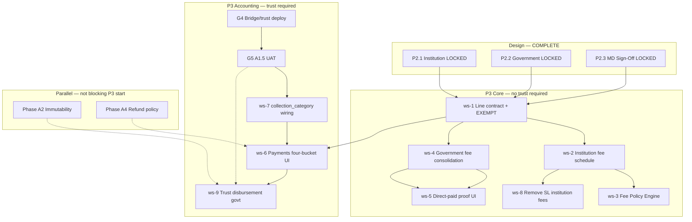

# Fee Master — P3 Readiness Report

| Field | Value |
|-------|-------|
| **Status** | Readiness assessment — **no implementation in this document** |
| **Date** | June 2026 |
| **Design gate** | P2.1 + P2.2 + P2.3 **LOCKED** — see [`FEE_MASTER_P2_3_LOCKED.md`](./FEE_MASTER_P2_3_LOCKED.md) |
| **MD sign-off** | [`FEE_MASTER_MD_SIGNOFF_P2_3.md`](./FEE_MASTER_MD_SIGNOFF_P2_3.md) |

---

## 1. Executive summary

**Design is ready for P3.** Operational prerequisites remain before trust-linked production features and before Lovable publish of accounting bridge migrations.

P3 should proceed in **layers**: data contracts and masters first, UI second, trust posting last (after A1.5 UAT).

---

## 2. Gate status

| Gate | Requirement | Status | Owner |
|------|-------------|--------|-------|
| **G1** | Institution fee architecture locked | ✓ Pass | — |
| **G2** | Government fee architecture locked | ✓ Pass | — |
| **G3** | MD sign-off P2.3 | ✓ Pass | MD — June 2026 |
| **G4** | A1.5 bridge/trust tables deployed | ☐ **Open** | Lovable Publish — [`ACCOUNTING_A1_5_PREREQ_DEPLOY.md`](./ACCOUNTING_A1_5_PREREQ_DEPLOY.md) |
| **G5** | A1.5 UAT (U1–U4) | ☐ **Open** | Owner |
| **G6** | `fn_assess_service_financial_dependencies` smoke pass | ☐ Blocked on G4 | — |

**P3 start:** Authorized for **non-trust** workstreams immediately. **Trust posting, bridge sync, and service-removal financial paths** require G4–G6.

---

## 3. Remaining prerequisites

### 3.1 Accounting (parallel track — not optional for trust)

| Prerequisite | Migration / action | Blocks |
|--------------|-------------------|--------|
| `accounting_crm_invoice_bridge` exists | `20260720120040_accounting_invoice_classification.sql` | Service removal assess RPC; trust classification |
| `accounting_trust_entries` exists | `20260720120050_accounting_trust_subledger.sql` | Trust balances; govt fee disbursement |
| A1.5 UAT pass | [`ACCOUNTING_A1_5_PREREQ_DEPLOY.md`](./ACCOUNTING_A1_5_PREREQ_DEPLOY.md) §6 | Phase A2; production service archive cleanup |
| Collection categories deployed | `20260722120000` + seed + backfill | `collection_category_id` wiring (P3 ws-7) |

### 3.2 Data / codebase (pre-P3 inventory)

| Prerequisite | Current state | P3 action |
|--------------|---------------|-----------|
| Four government fee stores | Fragmented (fee_items, picker, metadata, TS) | Consolidate ws-4 |
| Institution fees in Service Library | Partial overlap | Remove SL institution authoring ws-8 |
| `collection_category_id` on catalogue | Not populated in `fetchAllServiceCatalogue` | Wire ws-7 |
| Line-item contract | Partial JSONB | TypeScript validation ws-1 |
| `payment_status` EXEMPT | Not in code | Add to contract ws-1 |
| Direct-paid proof UI | Not built | ws-5 |
| Institution fee policy engine | Not built | ws-3 |
| Institution fee schedule UI | Staging tables only | ws-2 |

### 3.3 MD-locked behaviours to implement

| ID | Implementation note |
|----|---------------------|
| MD-1 / C1 | `OTHER` until Forex/SIM production case |
| MD-G1 / C4 | Tolerance function: `min(5%, CAD10eq)` |
| MD-6 / C2 | `flc_subsidy_source` + branch BM approval flag |
| MD-7 / C3 | Separate report dimensions institution vs FLC |
| C5 | `EXEMPT` status in enum + pipeline rules |

---

## 4. Dependencies

### Dependency table

| Workstream | Depends on | Can start without trust? |
|------------|------------|--------------------------|
| ws-1 Line contract | P2.3 | **Yes** |
| ws-2 Institution schedule | ws-1 | **Yes** |
| ws-3 Fee Policy Engine | ws-2 | **Yes** |
| ws-4 Government consolidation | ws-1 | **Yes** |
| ws-5 Direct-paid UI | ws-1, ws-4 | **Yes** (status-only, no trust post) |
| ws-6 Payments four-bucket | ws-1, ws-7 partial | Partial — totals without trust post |
| ws-7 Category wiring | G4 (categories migration) | Partial — mapping logic yes; live trust no |
| ws-8 Remove SL institution fees | ws-2 | **Yes** |
| ws-9 Reporting | ws-1–5 | **Yes** (operational reports); trust reports need G4 |
| ws-10 Trust govt disbursement | G4, G5, ws-7 | **No** |

---

## 5. Recommended P3 workstream sequence

### Wave 1 — Foundation (weeks 1–2, no trust)

| # | Workstream | Deliverable |
|---|------------|-------------|
| **ws-1** | Line-item data contract | TypeScript types + validators: `payment_responsibility`, `payment_status` incl. **EXEMPT**, `collection_path`, `institution_fee_*`, `govt_fee_*`, tolerance helper (C4) |
| **ws-2** | Institution fee schedule | Precedence resolver (Route → Program → Default → Manual); admin UI on Institution detail |
| **ws-8** | SL cleanup | Remove institution fee authoring from Service Library Admin Fees tab |

### Wave 2 — Masters & policy (weeks 2–4)

| # | Workstream | Deliverable |
|---|------------|-------------|
| **ws-3** | Institution Fee Policy Engine | Admin CRUD + approval; counselor full/discount/waiver; audit (BR-13–17, C2–C3) |
| **ws-4** | Government fee consolidation | Single write path; Government Fees tab in SL Admin; deprecate TS as write source |
| **ws-5** | Direct-paid proof | Per-component proof upload; EXEMPT vs WAIVED; pipeline gate (MD-G3) |

### Wave 3 — Payments UI (weeks 4–5)

| # | Workstream | Deliverable |
|---|------------|-------------|
| **ws-6** | Payments tab enhancement | Responsibility, status, reference vs applied, four-bucket display |
| **ws-9** | Operational reporting v1 | Collected/waived/direct-paid/exempt; institution vs FLC subsidy split |

### Wave 4 — Accounting integration (after G4–G5)

| # | Workstream | Deliverable |
|---|------------|-------------|
| **ws-7** | `collection_category_id` end-to-end | Catalogue → invoice lines → classifications |
| **ws-10** | Trust + bridge | Verified payment → trust RECEIPT; govt disbursement; four-bucket with live trust |

### Explicitly deferred (post-P3 or parallel)

| Item | Phase |
|------|-------|
| Memo JE for direct-paid | Accounting Phase 2 (MD-3) |
| Refund engine line eligibility | A4–A5 |
| Financial immutability enforcement | A2 |
| Forex/SIM dedicated categories | First production use case (MD-1) |
| UK IHS category leaf seed | ws-4 when UK route activated (MD-G2) |
| Sponsor dual invoice entity | Post-P3 (MD-2) |

---

## 6. Risk if P3 starts out of sequence

| Risk | Mitigation |
|------|------------|
| Trust posting before G4 | **Do not** — assess RPC fails in production |
| Government consolidation after invoice wiring | Wrong defaults on live invoices — do ws-4 before ws-6 send-gate |
| Policy engine before schedule resolver | Wrong base fee on policies — ws-2 before ws-3 |
| Skipping EXEMPT distinction | Pipeline gates misfire — implement in ws-1/ws-5 first |

---

## 7. Success criteria for P3 phase complete

- [ ] Single government fee write path; no new edits to `feeBreakdown/*.ts` as authority  
- [ ] Institution fees only from Institution module + policy engine  
- [ ] Direct-paid recorded with proof; EXEMPT vs WAIVED distinguished  
- [ ] Invoice lines carry full contract; four-bucket totals on issue  
- [ ] MD reporting: institution vs FLC waivers; govt direct-paid register  
- [ ] `collection_category_id` on all sent pass-through lines  
- [ ] Trust receipt/disbursement for FL-collected govt fees (after G4–G5)  

---

## Related documents

| Document | Role |
|----------|------|
| [`FEE_MASTER_ARCHITECTURE_V1_1.md`](./FEE_MASTER_ARCHITECTURE_V1_1.md) | Cross-cutting spec |
| [`GOVERNMENT_FEE_MASTER_ARCHITECTURE_V1.md`](./GOVERNMENT_FEE_MASTER_ARCHITECTURE_V1.md) | Government spec |
| [`FEE_MASTER_ARCHITECTURE_V1.md`](./FEE_MASTER_ARCHITECTURE_V1.md) | Screen flows, reuse inventory |
| [`ACCOUNTING_A1_5_PREREQ_DEPLOY.md`](./ACCOUNTING_A1_5_PREREQ_DEPLOY.md) | G4–G6 unblock |

---

**P3 readiness: Design PASS. Operational: G4–G6 pending. Proceed Wave 1.**
