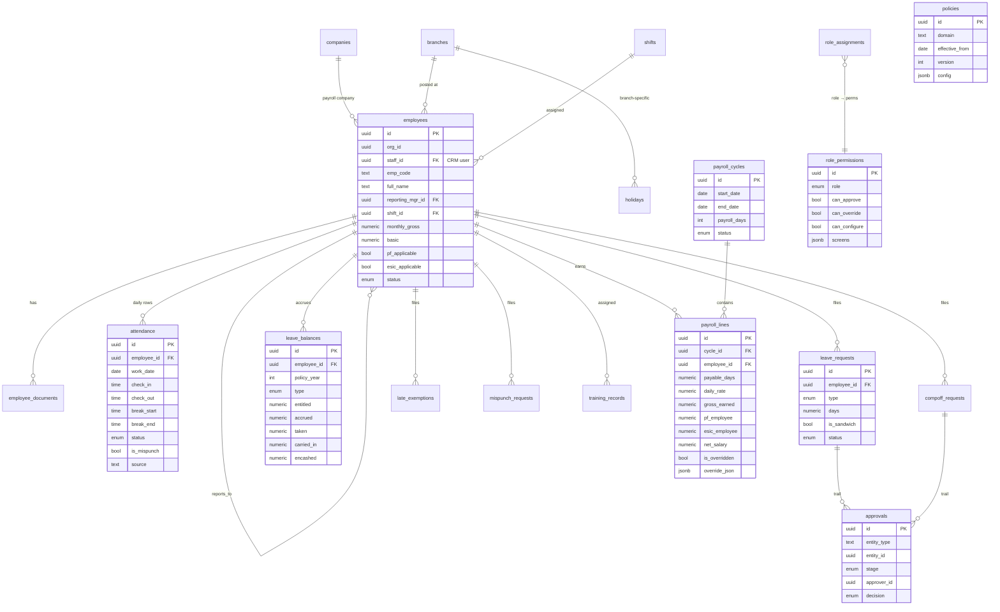

# Supabase Schema & ERD (v1)

Full DDL lives in `supabase/01_schema.sql` (tables, enums, indexes), `02_rls.sql` (policies + helper functions), `03_functions.sql` (payroll engine). This doc is the map.

## Design principles
- **Org-scoped**: every table carries `org_id` (the CRM org). RLS filters on it.
- **Engine in the database**: payable-days/PF/ESIC live in Postgres functions, called by RPC. The client never computes money.
- **Snapshot payroll**: `payroll_lines` freezes its inputs so a locked cycle can't drift when historical attendance is corrected.
- **Request + approval split**: each workflow (leave/comp-off/late/mispunch/training) is a request table plus a shared `approvals` trail, enabling multi-stage chains.
- **Versioned policy**: rule parameters live in `policies` keyed by `(domain, version, effective_from)` rather than hard-coded.

## ERD

## Table groups

**People & org** — `companies`, `branches`, `shifts`, `employees`, `employee_documents`
**Time** — `attendance`, `holidays`
**Workflows** — `leave_requests`, `leave_balances`, `compoff_requests`, `late_exemptions`, `mispunch_requests`, `training_records`, `approvals`
**Payroll** — `payroll_cycles`, `payroll_lines`
**Governance** — `role_permissions`, `role_assignments`, `policies`, `audit_log`

## Key relationships to watch in code
- `employees.staff_id` is the bridge to the CRM's existing user/staff table (Team & Roles). It is nullable so an employee record can exist before a login is provisioned.
- `employees.reporting_mgr_id` is self-referential and drives both the approval chain and manager-scoped RLS (`manages_employee`).
- `payroll_lines` is unique on `(cycle_id, employee_id)`; rebuild is idempotent via upsert while the cycle is Draft.
- `policies` is read newest-effective-first; the engine resolves the row whose `effective_from <= cycle.start_date`.
