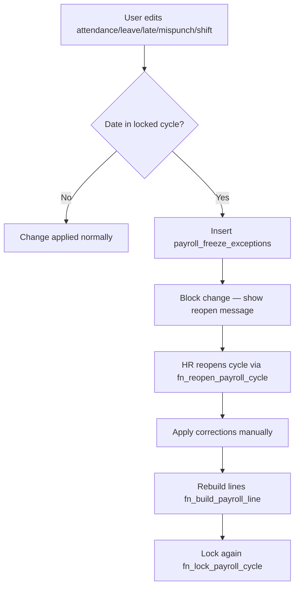

# HR Payroll — Implementation Roadmap (Updated)

Pre–Phase 1 foundation aligned with CRM master validation (June 2026).

## Master data architecture (locked decisions)

| Master | Owner | HR Config behavior |
|--------|-------|-------------------|
| **Branch** | CRM `public.branches` | Link to CRM Masters — no HR duplicate |
| **Department** | CRM `public.departments` | Link to CRM Masters — `employees.department_id` FK |
| **Designation** | CRM `public.designations` | Link to CRM Masters — shared with Users + HR |
| **Employee Category** | HR `hr_employee_categories` | HR Configuration → `/hr/config/categories` |
| **Document Types** | HR `hr_document_types` | Separate from CRM `master_items.document_types` |
| **CRM Permissions** | `user_module_permissions` | Controls module access (incl. `hr_payroll` gate) |
| **HR Permissions** | `role_assignments` + `role_permissions` | In-module screens and approvals |

Migration: `20260721120000_hr_payroll_crm_masters_foundation.sql`

---

## Foundation delivered (pre–Phase 1)

- Shared `designations` table + CRM Masters UI section
- `employees.department_id`, `designation_id`, `employee_category_id`
- HR employee categories seeded (Permanent, Probation, Contract, Consultant, Intern, Part Time, India Staff, Canada Staff)
- `employee_shift_history` with `fn_employee_shift_at()` for payroll-period shift resolution
- `payroll_freeze_exceptions` + guards on attendance, leave, late, mispunch, shift assignment
- Locked payroll does **not** auto-recalculate on reopen — manual rebuild required

---

## Phase 1 — Configuration centralization

**Goal:** Single Configuration hub; no duplicate masters; policies as SSOT.

| Task | Status |
|------|--------|
| Config hub navigation (7 sections) | Done (nav restructure) |
| CRM master links (branch, department, designation) | Done |
| HR Employee Category master UI | Done |
| HR Document Types (separate from CRM) | Done |
| Layered RBAC documentation in hub | Done |
| Wire remaining policy placeholders to `policies` table | **Next** |
| Remove `DEFAULT_CONFIG` duplication in `HrConfigPage.tsx` | **Next** |
| Organization settings → `companies` + org profile | **Next** |
| Payroll freeze exception review UI | **Next** |

**Do not in Phase 1:** Create `hr_branches`, `hr_departments`, or merge document type masters.

---

## Phase 2 — Shift architecture cleanup

**Goal:** All attendance timing from shift master + shift history — zero SQL hardcoded `'10:00'` fallbacks.

| Task | Notes |
|------|-------|
| Update `fn_derive_status`, `fn_record_punch` to use `fn_employee_shift_at` | Partially done in foundation rollup |
| Remove `COALESCE(sh.login_time, '10:00')` fallbacks in migrations 35/40 | Pending |
| Shift change UI: full history viewer on Employee 360 | Pending |
| Holiday / branch tags unchanged (CRM branches) | — |

---

## Phase 3 — Rule engine consolidation

**Goal:** `policies` table as single source; dedupe `leavePolicy.ts` constants.

| Task | Notes |
|------|-------|
| Leave policy JSON → admin UI only | Pending |
| Late / mispunch policy keys aligned with shift engine | Pending |
| Employee category flags drive eligibility in SQL + TS | Started (`fn_is_leave_eligible`) |

---

## Phase 4 — Leave eligibility & accrual

**Goal:** Category-based accrual; no credits for ineligible categories.

| Task | Notes |
|------|-------|
| `fn_accrue_leave_balances` filter by `leave_accrual_eligible` | Pending |
| Notice, sick cert, sandwich rules from policy SSOT | Partial |
| Probation category auto-assignment on join | Pending |

---

## Phase 5 — Late / mispunch engine

**Goal:** Shift-driven late marks; exemption workflow; payroll impact from policy.

| Task | Notes |
|------|-------|
| Per-day shift for late calculation | Started in `fn_rollup_inputs` |
| Free marks from policy, not UI constants | Pending |
| Freeze exceptions surface in Approval Center | Pending |

---

## Phase 6 — Payroll engine cleanup

**Goal:** PT parity, snapshots, category-based payroll rules.

| Task | Notes |
|------|-------|
| `input_snapshot` at lock (existing) | Done |
| Category `payroll_rules_apply` gate in calculator | Pending |
| Canada / India entity split | Partial |
| Reopen workflow: explicit rebuild, no silent recalc | Documented + enforced |

---

## Phase 7 — Approval Center (actions)

**Goal:** Approve/reject from hub; not just deep links.

| Task | Notes |
|------|-------|
| Pending counts on dashboard | Partial |
| Inline approve for leave/late/mispunch/comp-off | Pending |
| Payroll freeze exception resolution flow | Pending |

---

## Phase 8 — Reports & analytics

**Goal:** Operational reports from config SSOT.

| Task | Notes |
|------|-------|
| Reports hub placeholders | Done |
| Employee report with CRM department/designation FKs | Pending |
| Shift history audit report | Pending |
| Freeze exception audit report | Pending |

---

## Payroll freeze workflow

**Rules:**
- Locked payroll lines and `input_snapshot` are immutable until reopen.
- Reopen sets status `Draft` only — does **not** auto-recalculate.
- Shift for historical payroll: `fn_employee_shift_at(employee, work_date)`.

---

## Employee category rule matrix (seed defaults)

| Category | Leave | Accrual | Attendance | Payroll |
|----------|-------|---------|------------|---------|
| Permanent | Yes | Yes | Yes | Yes |
| Probation | No | No | Yes | Yes |
| Contract | No | No | Yes | Yes |
| Consultant | No | No | Yes | Yes |
| Intern | No | No | Yes | No |
| Part Time | No | No | Yes | Yes |
| India Staff | Yes | Yes | Yes | Yes |
| Canada Staff | Yes | Yes | Yes | Yes |

Adjust per org in **Configuration → Employee Category Master**.

---

## References

- CRM Masters: `/masters?section=__branches|__departments|__designations`
- HR Config hub: `/hr/config`
- Migration: `supabase/migrations/20260721120000_hr_payroll_crm_masters_foundation.sql`
