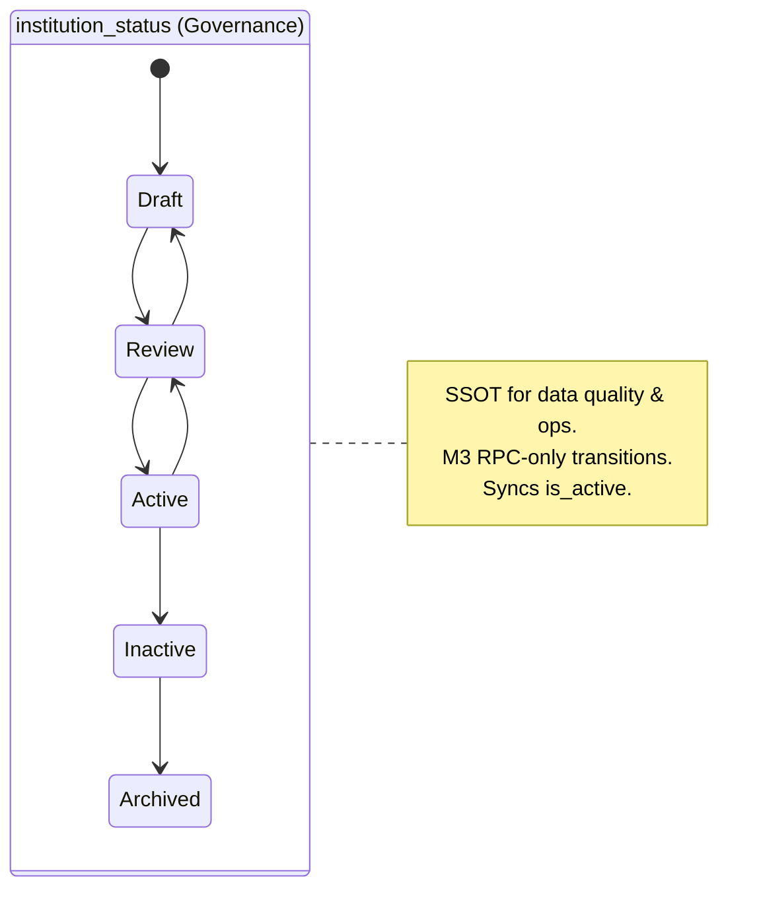
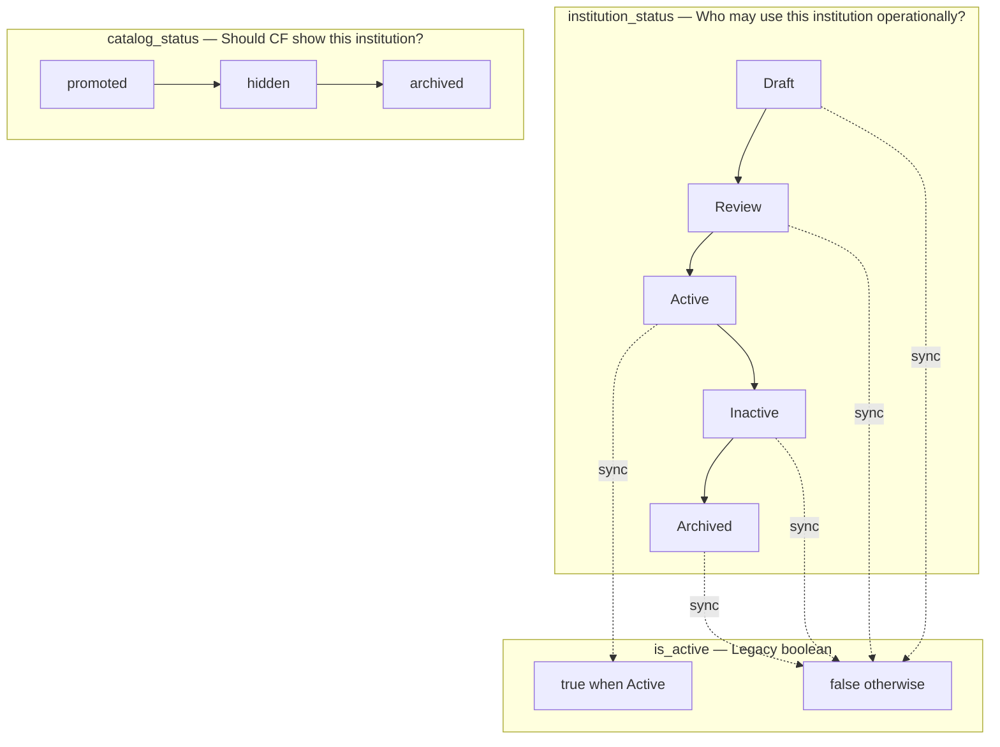

# Institution Database Cleanup Audit

| Field | Value |
|-------|-------|
| **Status** | Audit only — no code, migrations, or UI changes |
| **Date** | 2026-06-23 |
| **Table** | `public.upi_institutions` |
| **Prerequisite** | [`INSTITUTION_MASTER_UI_FIELD_AUDIT.md`](./INSTITUTION_MASTER_UI_FIELD_AUDIT.md) |

---

## 1. Complete column inventory (`upi_institutions`)

**46 columns** across base schema, partnership/catalog extension, and M1 profile.

| # | Column | Type | Origin | UI visibility | Classification |
|---|--------|------|--------|---------------|----------------|
| 1 | `id` | uuid PK | Base | Hidden (system) | **Keep** — primary key |
| 2 | `name` | text NOT NULL | Base | **Visible** — Header, Overview, List | **Keep** — SSOT identity |
| 3 | `slug` | text UNIQUE | Base | Hidden | **Keep** — URLs/seeds; system-managed |
| 4 | `country_id` | uuid → `upi_countries` | Base | Hidden | **Hidden / duplicated** — FK exists; UI writes `country_name` only |
| 5 | `country_name` | text | Base | **Visible** — Header, Overview, List | **Visible / duplicated** — denormalized display; dedup index key |
| 6 | `website_url` | text | Base | **Visible** — Overview | **Keep** — official website (M3 activation gate) |
| 7 | `logo_url` | text | Base | **Visible** — Header, Overview, List | **Keep** |
| 8 | `phone` | text | Base | **Visible** — Overview | **Keep** — institution switchboard |
| 9 | `email` | text | Base | **Visible** — Overview | **Keep** — general inbox |
| 10 | `address` | text | Base | Hidden | **Hidden** — valid profile field; expose in Location subsection |
| 11 | `city` | text | Base | Hidden | **Hidden** — used in completeness score; expose in Location |
| 12 | `state_province` | text | Base | Hidden | **Hidden** — used in completeness score; expose in Location |
| 13 | `institution_type` | text | Base | **Visible** — Header, Overview, List | **Keep** — M1 CHECK normalized |
| 14 | `ranking_info` | text | Base | Hidden | **Obsolete candidate** — never populated; no consumer |
| 15 | `accreditation` | text | Base | Hidden | **Obsolete candidate** — never populated; MBBS uses separate model |
| 16 | `established_year` | int | Base | Hidden | **Obsolete candidate** — never populated |
| 17 | `total_programs` | int | Base | Hidden | **Obsolete candidate** — stale if manual; derive from staging/CF |
| 18 | `is_active` | boolean DEFAULT true | Base | Partial — List filter only | **Duplicated / legacy** — sync from `institution_status`; hide manual edit |
| 19 | `is_partner` | boolean DEFAULT false | Base | Partial — List badge, CF sync | **Duplicated / derived** — maintained by route trigger; do not edit directly |
| 20 | `partner_since` | date | Base | Hidden | **Legacy** — superseded by route `valid_from`; read-only if shown |
| 21 | `notes` | text | Base | **Visible** — Overview | **Keep** — internal staff notes (≠ public description) |
| 22 | `metadata` | jsonb DEFAULT `{}` | Base | **Visible** — Overview (read-only keys) | **Keep** — seed/audit provenance; not profile SSOT |
| 23 | `created_at` | timestamptz | Base | Hidden | **Keep** — audit |
| 24 | `updated_at` | timestamptz | Base | Hidden | **Keep** — audit |
| 25 | `catalog_status` | text NOT NULL | Partnership ext. | **Visible** — Overview partnerships | **Keep** — CF/catalog visibility axis |
| 26 | `promotion_notes` | text | Partnership ext. | **Visible** — Overview partnerships | **Keep** — catalog context only |
| 27 | `institution_status` | text NOT NULL | M1 | Hidden | **Hidden** — M3 governance SSOT; replaces `is_active` as user control |
| 28 | `dli_number` | text | M1 | Hidden | **Hidden** — Canada compliance; add to Overview |
| 29 | `pgwp_eligible` | boolean | M1 | Hidden | **Hidden** — Canada compliance |
| 30 | `pal_required` | boolean | M1 | Hidden | **Hidden** — Canada compliance |
| 31 | `international_student_url` | text | M1 | Hidden | **Hidden** — add to URLs subsection |
| 32 | `application_portal_url` | text | M1 | Hidden | **Hidden / duplicated** — institution default; routes have per-route URL |
| 33 | `deposit_policy_url` | text | M1 | Hidden | **Hidden** — add to URLs subsection |
| 34 | `main_intakes` | text[] | M1 | Hidden | **Hidden** — recruitment profile |
| 35 | `processing_time` | text | M1 | Hidden | **Hidden / duplicated** — institution SLA text vs route `processing_sla_days` |
| 36 | `application_method` | text | M1 | Hidden | **Hidden / duplicated** — institution default vs route `channel_type` |
| 37 | `institution_description` | text | M1 | Hidden | **Hidden** — public copy; ≠ `notes` |
| 38 | `last_loa_verified_at` | timestamptz | M1 | Hidden | **Hidden** — verification block |
| 39 | `profile_source_url` | text | M1 | Hidden | **Hidden / duplicated** — profile attestation vs fee-row `source_url` |
| 40 | `profile_source_type` | text | M1 | Hidden | **Hidden / duplicated** — vs fee `verification_method` |
| 41 | `profile_source_reference` | text | M1 | Hidden | **Hidden / duplicated** — vs fee `detected_source_reference` |
| 42 | `profile_source_notes` | text | M1 | Hidden | **Hidden** — verification block |
| 43 | `last_human_verified_at` | timestamptz | M1 | Hidden | **Hidden / duplicated** — vs fee `last_verified_at` |
| 44 | `last_human_verified_by` | uuid → `profiles` | M1 | Hidden | **Hidden** — verification block |
| 45 | `human_verification_method` | text | M1 | Hidden | **Hidden / duplicated** — vs fee verification |
| 46 | `completeness_score` | numeric(5,2) | M1 | Hidden | **Hidden** — computed; display read-only in header (M3) |

### Summary counts

| Classification | Count | Columns |
|----------------|------:|---------|
| **Visible in UI today** | 14 | name, country_name, website_url, logo_url, phone, email, institution_type, notes, catalog_status, promotion_notes, metadata (read-only), is_active (list), is_partner (list badge) |
| **Hidden — planned for UI** | 22 | M1 profile + location + institution_status + completeness_score |
| **Hidden — system/audit** | 4 | id, slug, created_at, updated_at |
| **Duplicated / dual-path** | 8 | country_id/country_name, is_active/institution_status, application_portal_url, processing_time, application_method, is_partner, profile verification vs fees |
| **Obsolete candidates** | 4 | ranking_info, accreditation, established_year, total_programs |
| **Legacy — retain, don’t expand** | 2 | partner_since, metadata as catch-all |

---

## 2. Related tables (not on `upi_institutions` but part of Institution Master)

| Table | Role | Cleanup note |
|-------|------|--------------|
| `upi_institution_contacts` | Named contacts | Country on **`country_code`** → `cf_countries` (M2.1); drop free-text `country` after backfill |
| `institution_fee_schedule` | Fee defaults | Row-level verification; do not duplicate institution profile source fields |
| `upi_partnership_routes` | Channel-specific portal, SLA, fees | Route overrides institution defaults |
| `upi_institution_sources` | Crawl/sync URLs | Inputs, not canonical profile |
| `cf_universities` | CF publish row | `description`, `city`, `province` may mirror UPI when linked — CF is consumer, UPI is SSOT |
| `upi_countries` | UPI FK lookup | Parallel to `cf_countries`; needs alignment (§5) |

---

## 3. Duplicate detection matrix

### A. Same concept, multiple storage locations

| Concept | Primary (target SSOT) | Duplicate / derived | Action |
|---------|----------------------|---------------------|--------|
| **Country** | `country_code` → `cf_countries` (future) + denormalized `country_name` | `country_id` → `upi_countries`; free-text-only path | Standardize on ISO (§5); keep `country_name` as display cache |
| **Lifecycle / operational** | `institution_status` (M3) | `is_active` (legacy boolean) | Sync `is_active = (institution_status = 'Active')`; remove manual toggle |
| **Catalog / CF visibility** | `catalog_status` | None on institution_status | **Separate axes** — do not merge (§6) |
| **Partner flag** | `upi_partnership_routes` (active direct route) | `is_partner`, `partner_since` | Keep derived columns for list/CF performance; no UI edit |
| **Application portal** | `upi_institutions.application_portal_url` (default) | `upi_partnership_routes.application_portal_url` | Default + route override pattern |
| **Processing SLA** | `processing_time` (human text) | `processing_sla_days` (numeric, per route) | Both valid — institution narrative vs route SLA |
| **Application channel** | `application_method` (institution default) | `channel_type` on routes | Both valid — default vs partnership-specific |
| **Public description** | `institution_description` | `notes`, `cf_universities.description` | Three roles: public / internal / CF mirror |
| **Verification** | Profile block (`profile_source_*`, `last_human_*`) | Fee row verification on `institution_fee_schedule` | Profile = institution attestation; fees = evidence per fee type |
| **Phone / email** | Profile switchboard | `upi_institution_contacts` | Keep both — different granularity |
| **Website** | `website_url` | `upi_institution_sources` (crawl URL) | Profile canonical; sources = ingestion |

### B. Obsolete columns (do not invest in UI or new migrations except deprecation doc)

| Column | Reason |
|--------|--------|
| `ranking_info` | Zero UI/RPC usage; rankings live on CF course/university if needed |
| `accreditation` | Zero UPI usage; domain-specific (e.g. MBBS) uses other tables |
| `established_year` | Never bound; low governance value |
| `total_programs` | Becomes stale immediately; count from `upi_courses_staging` / CF |

**Recommendation:** Mark as **deprecated** in schema comments; do not surface in Institution Master UI. Optional future migration: drop columns after confirming no seed/metadata reliance (low priority).

### C. Legacy columns to retain (computed / synced, not user-edited)

| Column | Retain because |
|--------|----------------|
| `is_active` | List filters, dashboard counts, backward-compatible queries until M3 UI ships |
| `is_partner` | Course Finder filter, `syncCourseFinderInstitution`, dashboard |
| `partner_since` | Historical backfill from pre-routes era; optional read-only |
| `slug` | Deep links, seeds, dedup helpers |

---

## 4. Recommended final Institution Master layout

**Principle:** One institution row (`upi_institutions`) + satellite tables. No new top-level tabs. Extend Overview only.

### 4.1 Column groups on `upi_institutions` (final)

```
IDENTITY
  name, slug, institution_type, logo_url

LOCATION & COUNTRY
  country_code (FK → cf_countries.code)     ← NEW standardization target
  country_name (denormalized display)       ← kept for dedup/display during transition
  country_id (FK → upi_countries)           ← sync from country_code or deprecate later
  city, state_province, address

WEB & URLS
  website_url                               ← M3 mandatory for Active
  international_student_url
  application_portal_url                    ← institution default
  deposit_policy_url

RECRUITMENT
  main_intakes[], processing_time, application_method, institution_description

COMPLIANCE (Canada-gated in UI)
  dli_number, pgwp_eligible, pal_required

VERIFICATION & PROVENANCE
  last_loa_verified_at
  profile_source_url, profile_source_type, profile_source_reference, profile_source_notes
  last_human_verified_at, last_human_verified_by, human_verification_method

GOVERNANCE
  institution_status                        ← user-facing lifecycle (M3)
  completeness_score                        ← read-only, trigger-computed
  is_active                                 ← synced derived (hidden from editors)

CATALOG (Course Finder publish intent)
  catalog_status, promotion_notes

CONTACT SURFACE (institution-level only)
  phone, email                              ← switchboard; named people in contacts table

INTERNAL
  notes                                     ← staff-only

PARTNERSHIP DERIVED (DB-maintained)
  is_partner, partner_since                 ← do not expose as editable fields

AUDIT / SEED
  metadata, created_at, updated_at

DEPRECATED (retain column, no UI)
  ranking_info, accreditation, established_year, total_programs
```

### 4.2 Satellite tables (unchanged roles)

| Satellite | Purpose |
|-----------|---------|
| `upi_institution_contacts` | People; `country_code` ISO |
| `institution_fee_schedule` | Fee defaults + row verification |
| `upi_partnership_routes` | Channel overrides (portal, SLA, commission) |
| `upi_institution_sources` | Crawl/sync inputs |
| `upi_uploaded_documents` | LOA, agreements, evidence |

### 4.3 UI section map (Overview tab only — aligns with UI audit)

| Section | Columns bound |
|---------|---------------|
| Header badges | `institution_status`, `completeness_score`, `catalog_status` (read-only badge) |
| Core profile | name, country*, type, website, email, phone, logo |
| Location | city, state_province, address |
| URLs & portals | international_student_url, application_portal_url, deposit_policy_url |
| Compliance (CA) | dli_number, pgwp_eligible, pal_required |
| Recruitment | main_intakes, processing_time, application_method, institution_description |
| Verification | LOA + profile source + human verification fields |
| Internal notes | notes |
| Catalog & partnerships | catalog_status, promotion_notes + routes CRUD |

\* Country = CRM `CountrySelect` → `country_code` + synced `country_name` + `country_id`.

---

## 5. Fields to remove from future plans (equivalents already exist)

Do **not** plan or build these as new work — reuse existing columns/tables:

| Do not add | Use instead |
|------------|-------------|
| “Official Website URL” (new column) | `website_url` |
| Second active/inactive toggle | `institution_status` (+ synced `is_active`) |
| “Catalog archived” as institution status | `catalog_status = 'archived'` |
| Fixed 4-role contact schema (Admissions/Agent/Finance/RM only) | `upi_institution_contacts.contact_type` (flexible) |
| Institution-level `country` free text (new) | `country_code` → `cf_countries` (match Contacts M2.1) |
| Editable `is_partner` checkbox | Active direct route on `upi_partnership_routes` |
| Duplicate application portal at institution **only** | Institution default exists (M1); extend route inheritance UX |
| Institution-level fee verification replacing fee schedule | `institution_fee_schedule` per fee type |
| `Public notes` field merging into `notes` | `institution_description` (public) vs `notes` (internal) |
| New completeness metric | `completeness_score` + trigger (M1/M2) |
| New LOA date on fee rows only | `last_loa_verified_at` (institution) + fee `last_verified_at` (per fee) |
| Ranking / accreditation on institution row | Drop from roadmap unless product scope changes |
| `total_programs` counter field | Query staging/CF counts |
| Separate “Draft shell” flag | `institution_status = 'Draft'` (M5 remediation) |

---

## 6. Country standardization plan

### 6.1 Current state (three parallel country masters)

| Master | Key | Used by |
|--------|-----|---------|
| `cf_countries` | `code` (ISO-2) | Course Finder, leads, Mark Final, **contacts (M2.1)** |
| `upi_countries` | `id` (uuid), `iso_alpha2` | `upi_institutions.country_id`, M1 Canada check |
| `master_items` (`list_key = 'countries'`) | `code` | CRM UI labels; maps to `cf_countries` |

**Institution gap:** Detail UI and create modal write **`country_name` free text only**. `country_id` is backfilled in seeds but not maintained by editors. Dedup unique index uses `upi_normalize_country(country_name)`.

**Contacts (done):** M2.1 standardized on `country_code` → `cf_countries.code`.

### 6.2 Target model

| Layer | Rule |
|-------|------|
| **SSOT for ISO** | `cf_countries.code` |
| **Institution storage** | Add `country_code text REFERENCES cf_countries(code)` on `upi_institutions` *(future migration — not in this audit)* |
| **Denormalized display** | Keep `country_name` = `cf_countries.name` (trigger or RPC on save) |
| **Legacy FK** | Keep `country_id` synced from `upi_countries` where `iso_alpha2 = country_code` until `upi_countries` is retired or unified |
| **UI** | Same `CountrySelect` as leads + contacts on Overview and Add Institution modal |
| **Dedup** | Transition dedup key from normalized text → `country_code` when backfill complete |

### 6.3 Phased cleanup (documentation only)

| Phase | Action |
|-------|--------|
| **C1 — Backfill** | Map existing `country_name` → `country_code` via `cf_countries` + alias table (same patterns as M2.1 contact backfill) |
| **C2 — Sync** | On institution save: set `country_name`, `country_id`, `country_code` atomically from selected ISO |
| **C3 — UI** | Replace free-text Country inputs (list create + detail Overview) |
| **C4 — Dedup** | Update unique index to `(normalize(name), country_code)` when ≥95% backfilled |
| **C5 — Retire** | Stop writing `country_name`-only creates; optional long-term drop of redundant `upi_countries` if fully mapped to `cf_countries` |

### 6.4 Canada detection (already in M1)

`fn_upi_institution_is_canada()` checks both `country_name` aliases and `country_id → upi_countries.iso_alpha2 = 'CA'`. After standardization, prefer **`country_code = 'CA'`** as single check.

---

## 7. Institution Status / Catalog Status governance model

Three **orthogonal** controls — never collapse into one field.





### 7.1 `institution_status` (governance SSOT — M3)

| Status | Meaning | `is_active` | New applications | Profile edits |
|--------|---------|-------------|------------------|---------------|
| **Draft** | Incomplete / shell | `false` | Allowed (Mark Final unchanged) | Allowed |
| **Review** | Internal QA complete | `false` | Allowed | Allowed |
| **Active** | Governed operational SSOT | `true` | Allowed | Allowed |
| **Inactive** | Suspended | `false` | Allowed | Allowed |
| **Archived** | Historical record | `false` | Discouraged (policy) | Read-only (future) |

**Activation (→ Active):** RPC `fn_upi_institution_set_status` with hard errors (name, type, country, website, portal, CA: DLI + PGWP) and warnings (fees, contacts, LOA date).

**Mark Final:** **Does not** check `institution_status` (locked decision).

### 7.2 `catalog_status` (Course Finder catalog intent)

| Value | Meaning | Typical pairing with governance |
|-------|---------|--------------------------------|
| **promoted** | Visible in CF catalog when CF row exists | Usually `Active`; may be `Review` during soft launch |
| **hidden** | Suppressed from CF browse | Any status; common for `Inactive` |
| **archived** | Removed from active catalog | Often `Archived` or `Inactive` |

**Rule:** Changing catalog_status **does not** change institution_status. Promoting a Draft institution to CF should warn, not auto-activate governance.

### 7.3 `is_active` (legacy derived)

| Rule | Implementation (M3) |
|------|------------------------|
| Set only via status transition | Trigger or RPC side-effect |
| `true` iff `institution_status = 'Active'` | Single direction |
| List page filter | Replace “Active/Inactive” filter with `institution_status` when M3 UI ships |
| Do not expose on Detail as editable | Prevents drift |

### 7.4 Decision matrix (operator cheat sheet)

| Goal | Change |
|------|--------|
| Block sloppy data entering SSOT | Keep in **Draft** / **Review**; fix checklist |
| Temporarily pause institution | **Inactive** (governance) + optionally **hidden** (catalog) |
| Remove from CF browse but keep master | **catalog_status = hidden** (governance may stay **Active**) |
| Retire institution entirely | **Archived** + **catalog_status = archived** |
| Show partner badge in CF | Active **direct route** (not `is_partner` manual edit) |

### 7.5 Conflicts to resolve in M3 UI

| Current confusion | Resolution |
|-------------------|------------|
| List filters on `is_active` | Filter on `institution_status` |
| No status badge on Detail | Header: status + completeness % |
| `catalog_status` feels like “status” | Rename section label to “Course Finder catalog visibility” |
| Shell UPI rows appear “active” via old `is_active` | M5 remediation → `Draft` + `is_active false` |

---

## 8. Cleanup priority queue (no implementation in this audit)

| Priority | Item | Type |
|----------|------|------|
| P0 | M3 governance RPC + status UI + `is_active` sync | Governance |
| P1 | Country standardization C1–C3 on institutions | Data quality |
| P1 | Surface M1 hidden columns in Overview sections | UI (post-audit) |
| P2 | Route ↔ institution portal inheritance UX | UX dedup |
| P2 | **Portal Access Vault** — credentials out of masters; encrypted module + RBAC | Security / ops — [`docs/backlog/PORTAL_ACCESS_VAULT.md`](../backlog/PORTAL_ACCESS_VAULT.md) |
| P2 | Deprecate `ranking_info`, `accreditation`, `established_year`, `total_programs` in docs | Schema hygiene |
| P3 | Dedup index on `country_code` | Index migration |
| P3 | Evaluate retiring `upi_countries` vs merge with `cf_countries` | Architecture |

---

## 9. Sign-off checklist

- [x] All 46 `upi_institutions` columns inventoried
- [x] Visible / hidden / obsolete / duplicated classification
- [x] Final Institution Master layout defined
- [x] Future-plan duplicates identified for removal
- [x] Country standardization plan documented
- [x] institution_status vs catalog_status vs is_active model locked

**Next step after approval:** M3 governance migration + Overview profile expansion (separate implementation pass).

---

## Related documents

- [`INSTITUTION_MASTER_UI_FIELD_AUDIT.md`](./INSTITUTION_MASTER_UI_FIELD_AUDIT.md)
- [`INSTITUTION_MASTER_COMPLETION_PLAN.md`](./INSTITUTION_MASTER_COMPLETION_PLAN.md)
- M1 migration: `20261004120000_upi_institution_profile_phase1.sql`
- M2.1 contacts country: `20261004120150_upi_institution_contacts_country_standardization.sql`
