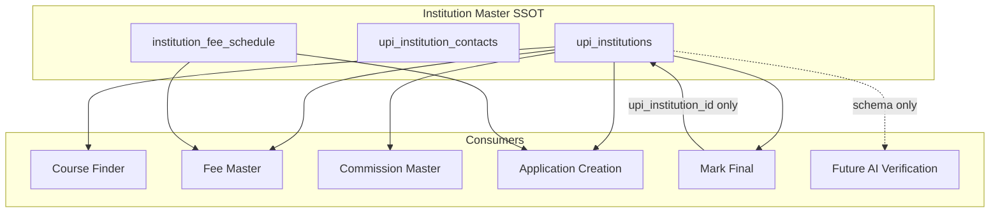

# Institution Master Completion — Implementation Plan (Approved)

| Field | Value |
|-------|-------|
| **Status** | **Approved with modifications** — audit complete; **no coding until this plan is acknowledged** |
| **Date** | 2026-06-23 |
| **Prerequisite audit** | [`CANADA_INSTITUTION_MASTER_AUDIT.md`](./CANADA_INSTITUTION_MASTER_AUDIT.md) |
| **Course Finder** | Feature development **frozen** — institution-driven publish only |

---

## Executive summary

Institution Master (`upi_institutions` + related tables) becomes the **single source of truth** for Course Finder, Fee Master, Commission Master, Application Creation, Mark Final, and future AI verification.

**Approved modifications from MD:**

| Topic | Decision |
|-------|----------|
| Official Website URL | **Mandatory** — blocks activation |
| Application / Tuition / Deposit fees | **Warnings only** — never block activation |
| Institution Contacts | New section: Admissions, Agent, Finance, Regional Manager |
| Last LOA Verified Date | New institution-level field |
| Institution Status | `Draft`, `Review`, `Active`, `Inactive`, `Archived` |
| Canadian library | Expand beyond 32 → **all public colleges, polytechnics, universities** |
| Mark Final | **Preserve current behaviour** — linkage only |
| AI fields | **Schema only** — no automation |

**Second approval (2026-06-23):**

| Topic | Decision |
|-------|----------|
| Deposit Policy URL | New `deposit_policy_url` on institution |
| Source tracking | `profile_source_url`, `profile_source_type`, `profile_source_reference`, `profile_source_notes` |
| Institution Contacts | **Multiple contacts per role** (M2 — no unique-one-per-role constraint) |
| Canada seeding | **P0–P3 phased** provincial batches (M6a–M6d) |
| Institution Completeness Score | `completeness_score` 0–100, auto-computed via trigger (M1) |
| Last Human Verification | `last_human_verified_at`, `last_human_verified_by`, `human_verification_method` |
| Fee accuracy rule | **Preserved** — APPLICATION = EXACT, TUITION/DEPOSIT = APPROXIMATE (ws-2, no DDL change) |

**Implementation status:** **M1 applied** — `20261004120000_upi_institution_profile_phase1.sql`. M2+ pending review.

---

## 1. Current state (audit baseline)

### Schema today

| Area | Exists | Gap |
|------|--------|-----|
| Core profile (`name`, `country`, `city`, `type`, `website`, `logo`) | ✅ | Unstructured; no governance |
| Compliance (DLI, PGWP, PAL) | ❌ | Not on institution |
| URLs (international, application portal) | ❌ | Only `website_url` |
| Recruitment (intakes, processing time, application method) | ❌ | |
| Institution fees (`institution_fee_schedule`) | ✅ ws-2 | No populated ACTIVE data for CA |
| Contacts | ❌ | No institution contact model |
| LOA verification date | ❌ | Per-fee `last_verified_at` only |
| Institution status lifecycle | ⚠️ | `is_active` + `catalog_status` only |
| AI readiness | ⚠️ | Per-fee `confidence_score` only |

### Live coverage (2026-06-23)

| Metric | Value |
|--------|------:|
| Canadian institutions in Course Finder | 6 |
| CF ↔ UPI linked | 6 / 6 |
| Canadian library target (public only) | **~150–180** institutions |
| CF coverage vs target | **~3–4%** |

**In CF today:** Algonquin College, Conestoga College, McGill University, Seneca Polytechnic, University of British Columbia, University of Toronto.

### Mark Final (must not change)

`fn_mark_final_and_create_application` requires `cf_universities.upi_institution_id` (or name/country fallback). It does **not** check institution status, fees, or compliance. **This path stays untouched.**

---

## 2. Target architecture



---

## 3. Phase 1 — Institution Master profile enhancement

### 3.1 New / extended columns on `upi_institutions`

| Column | Type | Notes |
|--------|------|-------|
| `institution_status` | `text NOT NULL DEFAULT 'Draft'` | CHECK: Draft, Review, Active, Inactive, Archived |
| `dli_number` | `text` | Canada only |
| `pgwp_eligible` | `boolean` | NULL = unknown; Canada only at activation |
| `pal_required` | `boolean` | Canada context |
| `international_student_url` | `text` | |
| `application_portal_url` | `text` | Mandatory for activation |
| `main_intakes` | `text[]` | e.g. `{September,January}` |
| `processing_time` | `text` | Human-readable SLA |
| `application_method` | `text` | Direct, Agent Portal, OCAS, ApplyBoard, IDP, Other |
| `institution_description` | `text` | Replaces ad-hoc `notes` for public copy |
| `last_loa_verified_at` | `timestamptz` | Institution-level LOA verification stamp |
| `deposit_policy_url` | `text` | Official deposit policy page |
| `profile_source_url` | `text` | Source tracking — primary profile verification URL |
| `profile_source_type` | `text` | WEBSITE, LOA, PARTNER_PORTAL, EMAIL, MANUAL, AGREEMENT, OTHER |
| `profile_source_reference` | `text` | Doc label, partner ref, or crawl path |
| `profile_source_notes` | `text` | Free-text source context |
| `last_human_verified_at` | `timestamptz` | Last human verification stamp |
| `last_human_verified_by` | `uuid` → `profiles` | Staff who verified |
| `human_verification_method` | `text` | Same enum as profile source |
| `completeness_score` | `numeric(5,2)` | Institution Completeness Score 0–100 (trigger-computed) |

**Fee accuracy (preserved — no M1 DDL change to `institution_fee_schedule`):**

- APPLICATION → `fee_accuracy = EXACT` (DB CHECK)
- TUITION / DEPOSIT → `fee_accuracy = APPROXIMATE` (convention + UI default)

`Public College`, `Polytechnic`, `University`, `Private College`, `Language School`, `Other`

Migration maps legacy values (`Public University` → `University`, `Community College` → `Public College`, etc.).

### 3.2 Institution status model

| Status | Meaning | `is_active` sync | CF publish |
|--------|---------|------------------|------------|
| **Draft** | Incomplete profile; editable | `false` | Blocked |
| **Review** | Ready for internal QA | `false` | Blocked |
| **Active** | Governed, operational SSOT | `true` | Allowed |
| **Inactive** | Temporarily suspended | `false` | Hidden |
| **Archived** | Historical; no new apps | `false` | Hidden |

**Relationship to existing fields:**

- `catalog_status` (`promoted` / `hidden` / `archived`) — **retained** for partnership-route catalog; do not conflate with `institution_status`.
- `is_active` — **derived/synced** from `institution_status = 'Active'` via trigger or RPC-only update path to avoid drift.

### 3.3 Institution Contacts (new table)

```sql
CREATE TABLE upi_institution_contacts (
  id                uuid PRIMARY KEY DEFAULT gen_random_uuid(),
  institution_id    uuid NOT NULL REFERENCES upi_institutions(id) ON DELETE CASCADE,
  contact_role      text NOT NULL CHECK (contact_role IN (
                      'ADMISSIONS', 'AGENT', 'FINANCE', 'REGIONAL_MANAGER'
                    )),
  contact_name      text,
  email             text,
  phone             text,
  notes             text,
  sort_order        int NOT NULL DEFAULT 0,
  is_primary        boolean NOT NULL DEFAULT false,
  created_at        timestamptz NOT NULL DEFAULT now(),
  updated_at        timestamptz NOT NULL DEFAULT now()
);

CREATE INDEX idx_upi_institution_contacts_institution_role
  ON upi_institution_contacts (institution_id, contact_role, sort_order);
```

**Multiple contacts per role** — no unique-one-per-role constraint. UI lists all contacts grouped by role; optional `is_primary` flag for display default.

---

## 4. Phase 2 — Institution Fee Master (no structural change)

`institution_fee_schedule` (ws-2) already supports:

- APPLICATION → `fee_accuracy = EXACT` (DB enforced)
- TUITION / DEPOSIT → `APPROXIMATE`
- Verification method, source URL, last verified

**Display format** (existing formatter):

```
Application Fee: CAD 125
Tuition: Approx. CAD 58,000
Deposit: Approx. CAD 2,000
Source: Official institution website
```

**UI additions only:**

- Read-only fee summary on Overview tab
- Verification method human labels (`WEBSITE` → “Official institution website”)
- Link fee `last_verified_at` vs institution `last_loa_verified_at` (LOA-specific institution stamp)

---

## 5. Phase 3 — Data governance (approved rules)

### 5.1 Activation gate (`institution_status` → `Active`)

**Hard blockers** (RPC returns errors; UI shows checklist):

| Field | Scope |
|-------|-------|
| Institution Name | All |
| Institution Type | All |
| Country | All |
| **Official Website URL** | All — **mandatory per MD** |
| Application Portal URL | All |
| DLI Number | **Canada only** |
| PGWP Status (explicit true/false) | **Canada only** |

**Warnings only** (shown before activation; **do not block**):

| Field | Scope |
|-------|-------|
| Application Fee (ACTIVE schedule row) | All |
| Tuition Fee (ACTIVE, APPROXIMATE) | All |
| Deposit Fee (ACTIVE, APPROXIMATE) | All |
| Institution Contacts (any role empty) | All — recommended |
| Last LOA Verified Date empty | All — recommended |

**Draft / Review saves:** Always allowed — direct field updates with no gate.

**Status transitions:**

```
Draft ──► Review ──► Active
  │          │         │
  └──────────┴─────────┴──► Inactive ──► Archived
```

Activation RPC: `fn_upi_institution_set_status(p_id, p_status, p_force_warnings => false)`

Returns: `{ ok, errors[], warnings[] }`

### 5.2 Mark Final safety

| Rule | Action |
|------|--------|
| Do not add fee/compliance checks to Mark Final RPC | **No change** |
| Do not require `institution_status = Active` for Mark Final | **No change** |
| Preserve `upi_institution_id` linkage requirement | **No change** |
| Shell UPI remediation may set status `Draft` | Linkage preserved |

---

## 6. Phase 4 — Canadian Institution Library (expanded)

### 6.1 Target scope

**All public** post-secondary institutions in Canada:

| Category | Approx. count | Source |
|----------|--------------:|--------|
| Public colleges / institutes / polytechnics | **150+** | CMEC Directory |
| Public universities (degree-granting) | **~70–96** | Provincial acts / Universities Canada |
| **Deduped library target** | **~150–180** | Colleges + universities; exclude private career colleges |

Provincial breakdown (seed phases):

| Province | Public colleges / institutes | Public universities |
|----------|----------------------------:|--------------------:|
| Ontario | 24 | 23 |
| British Columbia | ~11 colleges + institutes | 11 |
| Alberta | ~11 | 6 |
| Quebec | CEGEPs + colleges | ~18 |
| Manitoba | ~7 | 4 |
| Saskatchewan | ~7 | 2 |
| Atlantic provinces | ~15 | ~12 |
| Territories | ~3 | 0–1 |

### 6.2 Seed strategy (P0–P3 phased)

| Phase | Scope | Migration | UPI status |
|-------|-------|-----------|------------|
| **P0** | 6 existing CF-linked CA institutions | Manual backfill + existing rows | Active/Draft per M5 |
| **P1** | Ontario 21 remaining public colleges | `M6a` | Draft |
| **P2** | Ontario universities + BC/AB public set | `M6b`, `M6c` | Draft |
| **P3** | QC, Prairies, Atlantic, Territories | `M6d` | Draft |

1. **Reference file** — `supabase/seed/canada_public_institutions_reference.json` (built per phase)
2. **Audit script** — `scripts/canada-institution-master-audit.mjs`
3. **DLI backfill** — optional M7 after IRCC source approval

### 6.3 Current gap (baseline)

| Metric | Today | After seed (target) |
|--------|------:|--------------------:|
| UPI records (Canada public) | ~9 (6 CF-linked + shells) | ~150–180 Draft |
| CF records (Canada) | 6 | Unchanged until publish workflow |
| Profile completeness | ~0% governance-ready | Phased backfill P0→P3 |

**P0 backfill (existing CF):** Seneca, Conestoga, Algonquin, Toronto, McGill, UBC.

**P1 seed (Ontario colleges missing from CF):** Humber, Sheridan, George Brown, Fanshawe, Centennial, Durham, Mohawk, Fleming, Lambton, St. Clair, Niagara, Georgian, Cambrian, Loyalist, St. Lawrence, Canadore, Confederation, Sault, Northern, La Cité, Boréal.

**P2 seed:** Remaining Ontario universities + BC/AB public set.

**P3 seed:** QC, Prairies, Atlantic, Territories.

---

## 7. Phase 5 — AI readiness (schema only)

Add to `upi_institutions` (nullable; no jobs, no auto-updates):

| Column | Type |
|--------|------|
| `fee_confidence_score` | `numeric(5,2)` CHECK 0–100 |
| `commission_confidence_score` | `numeric(5,2)` CHECK 0–100 |
| `last_ai_verification_at` | `timestamptz` |
| `ai_verification_status` | `text` CHECK IN (`PENDING_REVIEW`, `APPROVED`, `REJECTED`) |

**Future workflow (not built):** AI proposes changes → human approval → manual or RPC apply. No automatic activation.

**Deferred table:** `upi_institution_ai_verification_proposals` (post-MVP).

---

## 8. Database impact report

| Object | Change | Risk |
|--------|--------|------|
| `upi_institutions` | +12 columns, status CHECK, type normalization | Low — additive |
| `upi_institution_contacts` | New table + RLS | Low |
| `institution_fee_schedule` | No schema change | None |
| `fn_upi_institution_set_status` | New RPC | Low |
| `fn_validate_upi_institution_activation` | New function | Low |
| `v_upi_institution_readiness` | New view | Low |
| Trigger `trg_upi_institution_status_sync` | Sync `is_active` from status | Medium — test shells |
| Mark Final RPC | **No change** | None |
| `cf_universities` | No schema change | None |

**Row impact:** +140–170 Draft UPI rows (Canada seed); 18 existing global UPI rows remediated to Draft where incomplete.

---

## 9. Migration list (sequential)

| # | File | Purpose |
|---|------|---------|
| M1 | `20261004120000_upi_institution_profile_phase1.sql` | Profile, compliance, recruitment, `institution_status`, `last_loa_verified_at`, type normalization |
| M2 | `20261004120100_upi_institution_contacts.sql` | Contacts table + RLS |
| M3 | `20261004120200_upi_institution_governance_rpcs.sql` | Validation function + status RPC + `is_active` sync trigger |
| M4 | `20261004120300_upi_institution_ai_readiness_schema.sql` | AI columns only |
| M5 | `20261004120400_upi_shell_status_remediation.sql` | Set incomplete shells (incl. 12 CF shells) to `Draft` / `is_active = false` — **preserves linkage** |
| M6a | `20261004120500_canada_public_institutions_seed_p1_ontario_colleges.sql` | P1 — Ontario public colleges |
| M6b | `20261004120600_canada_public_institutions_seed_p2_on_universities.sql` | P2 — Ontario universities |
| M6c | `20261004120700_canada_public_institutions_seed_p2_bc_ab.sql` | P2 — BC + Alberta public |
| M6d | `20261004120800_canada_public_institutions_seed_p3_remaining.sql` | P3 — QC, Prairies, Atlantic, Territories |

**No migration modifies `fn_mark_final_and_create_application`.**

---

## 10. UI changes

| Screen | Change |
|--------|--------|
| `InstitutionDetailPage` — Overview | Sectioned form: Information, Compliance (CA-conditional), URLs, Recruitment, Branding, **Contacts**, LOA date |
| `InstitutionDetailPage` — Fees | Summary card + existing `InstitutionFeeSchedulePanel` |
| Status control | Replace free `is_active` toggle with status dropdown + **Activate** button |
| Activation modal | Hard errors vs yellow warnings (fees = warnings) |
| `InstitutionsListPage` | Status badges; filters: Draft / Review / Active / Inactive / Archived |
| Types dropdown | Align to approved 6-type enum |

**No Course Finder UI changes** (frozen).

---

## 11. Module impact assessment

| Module | Impact | Breaking? |
|--------|--------|-----------|
| Course Finder | Reads CF; optional UPI enrichment later | No |
| Mark Final | `upi_institution_id` only | **No** |
| Fee Master | Reads `institution_fee_schedule`; warnings encourage data entry | No |
| Commission Master | Institution context; optional AI fields later | No |
| Application Creation | Fee resolver when flag enabled | No |
| Institution sync / AI crawl | New fields become extract targets (later) | Enhancement |
| Partnership routes | `catalog_status` unchanged | No |

---

## 12. Production readiness

| Gate | Ready? | Notes |
|------|--------|-------|
| CF ↔ UPI linkage | ✅ | 100% |
| Mark Final | ✅ | Unchanged |
| Governance RPC | ❌ | M3 |
| Canada library | ❌ | M6 + backfill |
| Fee data | ⚠️ | Warnings-only; not blocking |
| Shell UPI risk | ❌ | M5 sets Draft |

**Go-live recommendation:** Ship M1–M5 + UI → backfill P0 manually → Mark Final smoke test → M6 Canada seed → phased backfill.

---

## 13. Rollout plan

| Sprint | Deliverables | Verification |
|--------|--------------|--------------|
| **A** | M1 + M2 + profile/contacts UI | Draft saves work; contacts CRUD |
| **B** | M3 + activation UX | Block without website; fees warn only |
| **C** | M4 + M5 shell remediation | Mark Final smoke: Seneca, Toronto programs |
| **D** | M6 Canada seed + audit script refresh | Audit MD shows ~150+ Draft rows |
| **E** | P0–P1 manual backfill + fee entry | Readiness view ≥80% P0 |

---

## 14. Open decisions (minor — defaults proposed)

| # | Question | Proposed default |
|---|----------|------------------|
| 1 | Multiple contacts per role? | One primary per role; optional secondary rows later |
| 2 | `Review` status required before `Active`? | Optional shortcut Draft → Active if validator passes |
| 3 | Contacts block activation? | **No** — warnings only |
| 4 | Canada seed in one migration or provincial batches? | **Provincial batches** (M6a Ontario, M6b BC, …) |
| 5 | IRCC DLI source for backfill | Use open DLI list CSV — separate data approval |

---

## 15. What happens next

1. **Acknowledge this plan** (or comment on §14 defaults).
2. **Implementation begins at M1** — no coding before acknowledgment.
3. After ship: Lovable → Publish → hard refresh; run Mark Final smoke on linked CF institutions.

**Explicitly out of scope for this initiative:**

- Course Finder new features
- AI automation / auto-update of fees or commissions
- Mark Final RPC changes
- Fee activation blockers

---

**Document owner:** Engineering + MD  
**Next artifact after coding starts:** Updated `CANADA_INSTITUTION_MASTER_AUDIT.md` via audit script post-M6
