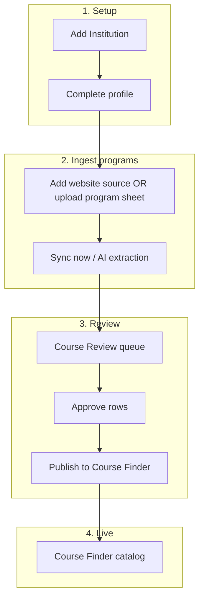
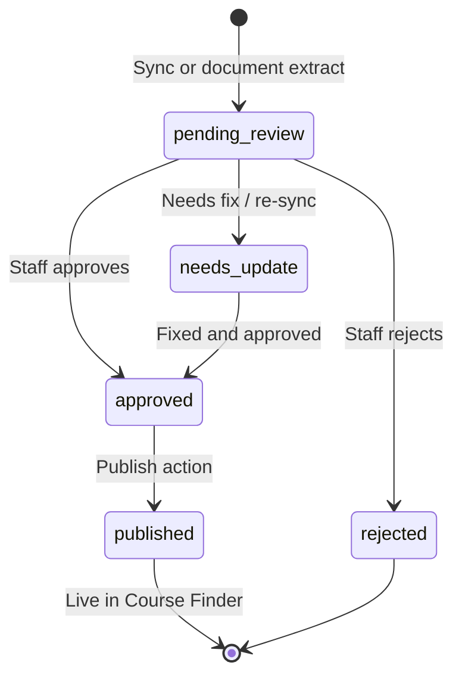

# Institutions Module — Staff Operational Guide

This guide explains how to use the **Institutions** area of Flow Link: managing partner schools, extracting programs with AI, publishing to **Course Finder**, and (for finance/commission staff) handling agreements, commissions, and claims.

It is written for **day-to-day staff and team leads**, not developers. Admins should use the permission and rollout sections when onboarding new users.

---

## 1. Module purpose and scope

### What this module is for

The Institutions module is your **partner school catalog and program pipeline**:

- Maintain a list of universities, colleges, and pathway providers you work with.
- Collect program information from **websites** and **uploaded documents**.
- Use AI to extract structured course data into a **review queue**.
- **Approve and publish** approved programs to **Course Finder** (the catalog counselors and students search).
- Manage **promotions**, **marketing campaigns**, and **AI suggestions** at the institution level.
- For commission/finance staff: manage **agreements**, **commission structures**, **claim cycles**, **invoices**, and **commission students** (confidential).

### What this module is **not**

- It is **not** the client/counselor CRM (that is Clients, Leads, etc.).
- It is **not** Course Finder itself — Course Finder is the **published output** (`/course-finder`).
- The **Client → Commission auto-sync** (linking enrolled clients to commission rows) is **planned but not active** yet.

### Real system, not a demo

All data is stored in Supabase (`upi_*` tables). Access is enforced in the **UI and the database**. Empty screens or error messages usually mean **permissions**, not “no data.”

---

## 2. Where to find it in the app

| Menu / route | Screen | Who needs access |
|--------------|--------|------------------|
| **Institution → Institutions** `/institutions` | Institution list & stats | Institutions **View** |
| **Institution → Course Review** `/institutions/review` | Program approval queue | Institutions **View** (Edit to action) |
| **Institution → AI Suggestions** `/institutions/suggestions` | Cross-school AI inbox | Institutions **View** (Edit to action) |
| Institution detail `/institutions/:id` | Single school workspace | Institutions **View** |
| **Course Finder** `/course-finder` | Published catalog (read/search) | Broader app access |
| **Commissions** `/commissions` | Global claims & invoice overview | Commission / accounting access |

---

## 3. User roles and permissions matrix

Access uses **two layers**:

1. **Module permissions** — set in **Team & roles → Permissions** (`institutions`, `commissions`).
2. **App roles & accounting** — e.g. `commission_admin`, active **Accounting** user, **Admin**.

The database applies the same rules (Row Level Security). If the UI lets you click something but the save fails, check permissions below.

### Role definitions (staff-facing)

| Role label | How it is granted | Typical job |
|------------|-------------------|-------------|
| **Institutions View** | Permissions → **Institutions** → View | Read catalog, review queue, suggestions (no changes) |
| **Institutions Edit** | Permissions → **Institutions** → Edit | Add schools, sources, uploads, sync, approve/publish |
| **Commission View** | Commissions **View**, or **Accounting** user, or `commission_admin` | See agreements, commissions, claims, confidential docs |
| **Commission Admin** | Commissions **Edit**, or **`commission_admin`** role, or Accounting **Finance/Super Admin** | Edit agreements, commissions, claims, confidential uploads |
| **Super Admin** | App role **Admin** / **Administrator** | Full access to everything |

**Note:** “Commission View” in this guide means *can see confidential commission data*. In the app, that includes anyone who is a **Commission admin**, an **Accounting team member**, or has **Commissions** module view/edit.

### Permissions matrix — what each role can do

| Action | Institutions View | Institutions Edit | Commission View | Commission Admin | Super Admin |
|--------|:-----------------:|:-----------------:|:---------------:|:----------------:|:-----------:|
| Open Institutions list & detail | Yes | Yes | Yes* | Yes | Yes |
| Edit institution profile | No | Yes | No** | No** | Yes |
| Add website sources & sync | No | Yes | No** | No** | Yes |
| Upload **catalog** documents | No | Yes | No** | No** | Yes |
| Upload **confidential** documents | No | No | No | Yes | Yes |
| Course Review — view queue | Yes | Yes | Yes* | Yes | Yes |
| Course Review — approve/reject/publish | No | Yes | No** | No** | Yes |
| AI Suggestions — view | Yes | Yes | Yes* | Yes | Yes |
| AI Suggestions — accept/dismiss | No | Yes | No** | No** | Yes |
| Promotions & campaigns | View | Edit | View* | View | Yes |
| Agreements / Commissions / Claims tabs | Locked | Locked | View | Edit | Yes |
| Commissions overview page `/commissions` | No | No | Yes | Yes | Yes |
| Delete test rows (dev flag only) | — | — | — | — | Env flag |

\* Commission View users can **read** catalog tables (institutions, staging, etc.) via database rules when they have confidential access.  
\*\* Unless they **also** have Institutions Edit.

### View-only banner

Users with **Institutions View** but not **Edit** see a yellow **view-only** notice. They can browse Course Review and institution pages but cannot save, sync, upload, or publish.

### Locked commission tabs

On institution detail, **Agreements**, **Commissions**, and **Claims** tabs are **hidden or locked** unless the user is Commission View or above (`commission_admin`, Accounting member, or Commissions module access).

---

## 4. Institution lifecycle workflow

End-to-end flow from adding a school to live programs in Course Finder.

### Step 1 — Add institution

**Who:** Institutions Edit  
**Where:** `/institutions` → **Add institution**

Enter at minimum:

- **Name** (required)
- **Country** (recommended)
- **Website URL** (recommended)

**Example:** *Conestoga College*, Canada, `https://www.conestogac.on.ca`

---

### Step 2 — Add sources

**Who:** Institutions Edit  
**Where:** Institution detail → **Sources** tab

Two ways to feed programs:

| Source type | When to use | Example |
|-------------|-------------|---------|
| **Website URL** | School publishes a program listing online | `https://www.conestogac.on.ca/fulltime-programs` |
| **Document from Documents tab** | You already uploaded a program sheet or brochure | Pick file under “Program sheet (from Documents)” |

**Add source** → then **Sync now** on the new row (or **Sync all**).

**What sync does:** Calls the system crawler/extractor. New or updated rows appear in **Course Review** with status `pending_review`. Sync status and errors show on the source row (e.g. failed crawl, Cloudflare block).

---

### Step 3 — Sync programs (automatic)

**Who:** Institutions Edit  
**Action:** **Sync now** / **Sync all**

You do not manually create course rows. Sync and document extraction write to **`upi_courses_staging`** (the review queue).

Monitor:

- Source row: `crawl_status`, pages scanned, confidence
- Failed sync: error text under the source
- **Course Review** filter: Status = `pending_review`, Institution = your school

---

### Step 4 — Review programs

**Who:** Institutions View (browse); Institutions Edit (action)  
**Where:** `/institutions/review` or institution → **View programs**

Use filters (saved in the URL — safe to bookmark and use browser Back):

- **Status** — start with `pending_review`
- **Institution** — one school at a time
- **Country / Program level** — narrow large queues
- **Search** — title, IELTS, campus, intake, etc.

Open a row → **pencil** to edit tuition, IELTS, PGWP, campus, notes, custom metadata.

**Review statuses:**

| Status | Meaning |
|--------|---------|
| `pending_review` | Newly extracted — needs staff review |
| `approved` | Ready to publish |
| `rejected` | Do not publish |
| `needs_update` | Re-sync or fix data, then approve again |
| `published` | Live in Course Finder |

---

### Step 5 — Approve and publish

**Who:** Institutions Edit  

1. **Approve** — row status → `approved` (single row or bulk).
2. **Publish** — pushes **approved** (or `needs_update` where allowed) rows to Course Finder via **Bulk Publish** or per-row publish button.

Publish only works on **approved** rows. The publish action calls the server; you may see a summary if some rows fail (permissions, validation, duplicates).

---

### Step 6 — Display in Course Finder

**Who:** Anyone with Course Finder access  
**Where:** `/course-finder`

After publish:

- Staging row status becomes **`published`**
- A link **View in Course Finder** appears on published rows
- Programs are searchable in the public catalog

**Example check:** Publish “Business Administration – Diploma” → open Course Finder → search institution name → confirm program appears with correct tuition/intake.

---

## 5. Document categories

Documents are uploaded on institution detail → **Documents** tab. **Document type** controls how AI processes the file.

### Public / catalog documents

Safe for **catalog / admissions / documentation staff**. Visible to anyone with Institutions access (not hidden as confidential).

| Document type | Purpose | AI behavior |
|---------------|---------|-------------|
| **Program sheet** | Official program list (PDF/Excel) | Extract **every program** → Course Review |
| **Brochure** | Marketing flyer | Detect **promotions** |
| **Promotion / Campaign** | Promo materials | Structured promo extraction |
| **Other** | General file | Generic extraction / suggestions |

**Who can view:** Institutions View and above (catalog tier).  
**Who can upload/edit:** Institutions Edit.

Documents appear under **Program materials** on the Documents tab.

---

### Confidential documents

Restricted to **commission and finance staff**. Hidden from catalog-only users (UI shows a count: “N confidential documents hidden”).

| Document type | Purpose | AI behavior |
|---------------|---------|-------------|
| **Agreement** | Partner contract (RAA/MOU) | Analyze terms, dates, renewal |
| **Commission sheet** | Payout tariff / rate card | Extract commission structure |
| **Invoice template** | How institution invoices you | Stored for claims/invoicing |
| **Renewal document** | Contract renewal pack | Renewal tracking |

**Who can view:** Commission View and above.  
**Who can upload/edit:** Commission Admin and above.

Documents appear under **Confidential** on the Documents tab (Tier B users only).

---

### Upload permissions summary

| Document type | Upload | View file list | View in UI section |
|---------------|:------:|:--------------:|--------------------|
| Program sheet, Brochure, Promo, Other | Institutions Edit | Institutions View | Program materials |
| Agreement, Commission sheet, Invoice template, Renewal | Commission Admin | Commission View | Confidential |

Storage bucket: **institution-documents** (private files; preview uses signed links).

---

## 6. Course Review workflow (detailed)

### Daily workflow (documentation / admissions team)

1. Open **Course Review** → filter `pending_review`.
2. Sort by institution or country if working in batches.
3. For each row:
   - Check **title**, **tuition**, **intakes**, **IELTS**, **PGWP**, **campus**.
   - Fix obvious AI errors (Edit sheet).
   - **Approve** or **Reject**; use **needs_update** if waiting on a new sync.
4. Filter `approved` → **Bulk Publish** (or publish per institution after QA).
5. Spot-check in **Course Finder**.

### Bulk actions

Select checkboxes → **Bulk Approve**, **Bulk Reject**, or **Bulk Publish** (Edit permission required).

If bulk update affects fewer rows than selected, you may see a warning — often **RLS** blocked some rows; ask an admin to confirm Institutions Edit on your account.

### Confidence scores

| Score | Guidance |
|-------|----------|
| **≥ 80%** | Usually reliable; still spot-check tuition/intake |
| **50–79%** | Review carefully |
| **< 50%** | Likely incomplete; edit or re-sync source |

---

## 7. AI Suggestions workflow

Two places suggestions appear:

### A. Global inbox — `/institutions/suggestions`

Cross-institution queue of AI-generated insights (new fields, program hints, commission notes, etc.).

| Tab | Use |
|-----|-----|
| **Pending** | Needs decision |
| **Accepted** | Applied / acknowledged |
| **Dismissed** | Not relevant |
| **All** | Audit |

**Actions (Edit required):** Accept, Dismiss, Defer (per row or bulk).

### B. Per institution — **AI Suggestions** tab

- **Ask AI** — free-text question about the school (`upi-ask-suggestions`).
- **Generate suggestions** — AI creates new suggestion records.
- Same accept/defer/dismiss on each card.

**Example prompt:** *“Which programs should we prioritize publishing for September intake?”*

---

## 8. Commission & claims (Commission staff only)

On institution detail (Tier B users):

| Tab | Purpose |
|-----|---------|
| **Agreements** | Contract metadata, validity, renewal countdown |
| **Commissions** | Commission models and rules |
| **Claims** | Claim cycles, commission students, invoicing, CSV export, carry-forward |

Global **Commissions** page (`/commissions`): overview of claim cycles and invoice counts by status.

Accounting users and `commission_admin` role holders see these areas; pure catalog staff see a **locked** message instead.

---

## 9. Screens and modules affected by the permission model

| Screen / module | Permission driver |
|-----------------|-------------------|
| Sidebar **Institution** section | Institutions **View** |
| Institutions list — **Add institution** | Institutions **Edit** |
| Institution profile fields | Edit = editable; View = read-only |
| Sources — add/sync/delete | Institutions **Edit** |
| Documents — catalog upload | Institutions **Edit** |
| Documents — confidential upload | Commission Admin |
| Documents — confidential list | Commission View |
| Course Review — filters & table | Institutions **View** |
| Course Review — approve/publish/edit | Institutions **Edit** |
| AI Suggestions — actions | Institutions **Edit** |
| Promotions — run campaign | Institutions **Edit** |
| Agreements / Commissions / Claims tabs | Commission View |
| `/commissions` overview | Commission View |
| Course Finder | Separate catalog (published output) |
| Dashboard institution stats | Institutions **View** (counts may be 0 if RLS blocks) |

Database policies (for IT/admin): migration `20260604140000_upi_two_tier_rls.sql` — helpers `can_view_upi_catalog`, `can_manage_upi_catalog`, `can_view_upi_confidential`, `can_manage_upi_confidential`.

---

## 10. Future Link — recommended permission assignments by department

Use as a **starting template**. Adjust per person.

| Department | Institutions | Commissions | App role / notes |
|------------|:------------:|:-----------:|------------------|
| **Admissions / Counselors** | View | — | Search Course Finder; usually no institution edits |
| **Documentation / Program research** | **View + Edit** | — | Primary catalog operators: sources, review, publish |
| **Marketing** | View + Edit | — | Brochures, promotions, campaigns; optional Edit if they upload |
| **Partnerships / BD** | View + Edit | View | Institution setup; may need to *see* agreements |
| **Commission / Finance** | View (optional Edit) | **View + Edit** | `commission_admin` or Accounting user |
| **Accounting (AP/AR)** | View | View | Active **accounting_users** record → confidential view |
| **Team leads / Ops** | View + Edit | View | Oversight without daily claim entry |
| **System administrators** | Admin bypass | Admin bypass | **Admin** / **Administrator** role |

### Minimal viable setups

| Persona | Setup |
|---------|--------|
| **“I only search programs for clients”** | Institutions **View** (or Course Finder only if separate policy) |
| **“I maintain the catalog”** | Institutions **View + Edit** |
| **“I handle partner invoices”** | Commissions **View + Edit** + Accounting or `commission_admin` |
| **“I do both catalog and commissions”** | Institutions **Edit** + Commissions **Edit** (or `commission_admin`) |

---

## 11. Admin setup — new staff members

### Checklist for each new user

1. **Create user** (or confirm they can log in).
2. Open **Team & roles → Permissions**.
3. Assign modules:

   | If they… | Grant |
   |----------|--------|
   | Maintain programs & publish | **Institutions** → View + **Edit** |
   | Read-only QA | **Institutions** → **View** only |
   | Handle agreements/claims | **Commissions** → View + **Edit** *or* role **`commission_admin`** |
   | Finance read-only on commissions | Add to **Accounting users** (active) *or* Commissions **View** |

4. Optional app roles (`user_roles`):

   - **`commission_admin`** — full commission UI + RLS confidential tier (includes accounting admin check in code).

5. Ask user to **log out and back in** (permission cache refreshes on session).

6. **Verify** (5 minutes):

   - [ ] Can open `/institutions`
   - [ ] Can open `/institutions/review` and see rows (not empty error)
   - [ ] If Edit: can save institution name change
   - [ ] If Edit: can Sync or upload program sheet
   - [ ] If commission: Agreements tab visible on a test institution
   - [ ] If catalog only: Agreements tab shows locked message

### Where permissions live (admin reference)

| Store | Fields |
|-------|--------|
| `user_module_permissions` | `user_id`, `module` (`institutions`, `commissions`), `can_view`, `can_edit`, `can_delete` |
| `user_roles` | e.g. `commission_admin`, `admin` |
| `accounting_users` | Active accounting membership → confidential **view** in UI |

---

## 12. Common troubleshooting

| Symptom | Likely cause | What to do |
|---------|--------------|------------|
| **“Access restricted”** on Institutions | No Institutions View | Admin: grant Institutions View in Permissions |
| Yellow **view-only** banner | View without Edit | Expected for read-only; request Edit if they should publish |
| **Course Review empty**, no error | No extracted programs yet | Add source → Sync; or upload program sheet |
| **Course Review empty** + red error | RLS / permission denied | Grant Institutions View; check user logged in |
| **Could not load courses. Check permissions** | Same as above | Confirm module permission + migration applied |
| **Agreements tab locked** | Catalog-only user | Expected; grant Commission access if needed |
| **“N confidential documents hidden”** | Catalog user | Expected; commission staff uploads those files |
| **Upload fails** silently / toast error | Wrong tier for doc type | Catalog user cannot upload Agreement/Commission sheet |
| **Sync failed** on source | Site blocks bots, bad URL | Fix URL; read `error_summary`; try document upload instead |
| **Publish failed** | Row not `approved`, or server validation | Approve first; read toast detail |
| **Published but not in Course Finder** | Cache or search mismatch | Search by institution; check `published_course_id` link from review row |
| **Preview broken** (document iframe) | Bad filename in storage | Use **Fix preview** on document row (Edit required) |
| **Spinner forever** on institution URL | Invalid institution ID | Use list page; bad links show “Institution not found” |
| Delete buttons on agreements/promos | Dev env flag on | Production: `VITE_ALLOW_TEST_DELETIONS=false` (default) |

### Permission vs data — quick test

Ask the user to open browser **Network** tab while loading Course Review:

- **200 with `[]`** → permission OK, no staged courses.
- **403 / RLS error in response** → fix Institutions (or Commissions) permissions.

---

## 13. Rollout checklist (organization)

Use when turning on the module for a team or go-live.

### Phase A — Admin & access

- [ ] RLS migration `20260604140000_upi_two_tier_rls.sql` applied to production
- [ ] Permission matrix agreed (section 10)
- [ ] Pilot users created: 1× catalog editor, 1× commission admin, 1× view-only
- [ ] `.env` production: `VITE_USE_MOCK_DATA=false`, `VITE_ALLOW_TEST_DELETIONS=false`

### Phase B — Pilot institution

- [ ] Add one real partner institution (profile complete)
- [ ] Add one website source OR upload one program sheet
- [ ] Sync / extract → rows in Course Review
- [ ] Approve 2–3 programs → Publish
- [ ] Verify in Course Finder
- [ ] (Commission) Upload test agreement + commission sheet on same institution — confirm catalog user cannot see them

### Phase C — Team enablement

- [ ] Share this guide with documentation & finance leads
- [ ] Walkthrough: lifecycle diagram (section 4)
- [ ] Define owner: who approves publish vs who uploads sources
- [ ] Define SLA: e.g. review queue cleared weekly

### Phase D — Scale

- [ ] Bulk onboarding of institutions (import or manual)
- [ ] Monitor Dashboard stats: pending review count
- [ ] Review AI Suggestions inbox weekly
- [ ] Plan Phase 2: Client → Commission bridge (not live yet)

---

## 14. Examples — three common scenarios

### Example A — New college from website only

1. Add **Northern Polytechnic**, Canada.
2. Sources → **Program listing page (URL)** → `https://example.edu/programs`.
3. **Sync now** → wait for `completed` (or check error).
4. Course Review → filter institution → approve 10 programs → **Bulk Publish**.
5. Counselor searches Course Finder → confirms programs show.

### Example B — PDF program list only (no good website)

1. Documents → **Program sheet** → upload `2026-Program-Guide.pdf`.
2. AI extracts → Course Review populates.
3. Edit rows with wrong intakes → Approve → Publish.

### Example C — Finance onboarding a partner

1. Catalog team creates institution + publishes programs (Examples A/B).
2. Commission admin uploads **Agreement** + **Commission sheet** (Confidential section).
3. Commissions tab → verify extracted rates.
4. Claims tab → create/open claim cycle when students enroll.
5. Catalog counselor **cannot** see agreement PDF — by design.

---

## 15. Glossary

| Term | Meaning |
|------|---------|
| **UPI / upi_** | Internal prefix for University/Partner Institution tables |
| **Staging** | Pre-publish course rows (`upi_courses_staging`) |
| **Publish** | Copy approved staging row to live **Course Finder** (`courses` table) |
| **Source** | Website URL or linked document used to extract programs |
| **Catalog tier** | Institutions module access — program & school operations |
| **Confidential tier** | Commission/accounting access — contracts & money |
| **Course Finder** | Published program catalog at `/course-finder` |

---

## 16. Support and escalation

| Issue type | Escalate to |
|------------|-------------|
| Permission / access | System admin (Team & roles) |
| Sync repeatedly fails on a domain | Program research lead + IT (may need manual PDF upload) |
| Publish errors for valid rows | Admin / dev (edge function logs: `upi-publish-courses`) |
| Commission calculation disputes | Finance + commission admin |
| Wrong data live in Course Finder | Institutions Edit user: set staging to `needs_update`, fix, re-publish |

---

*Last updated: aligns with Institutions module review Phases 1–4 (RLS two-tier model, Course Finder links, role UI gating, operational cleanup).*
