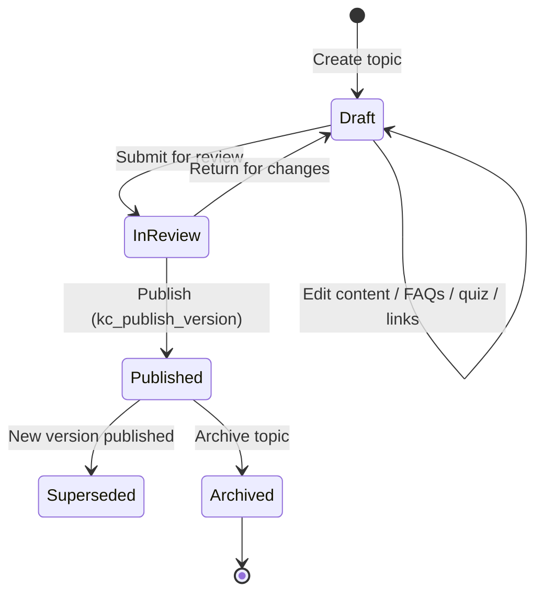
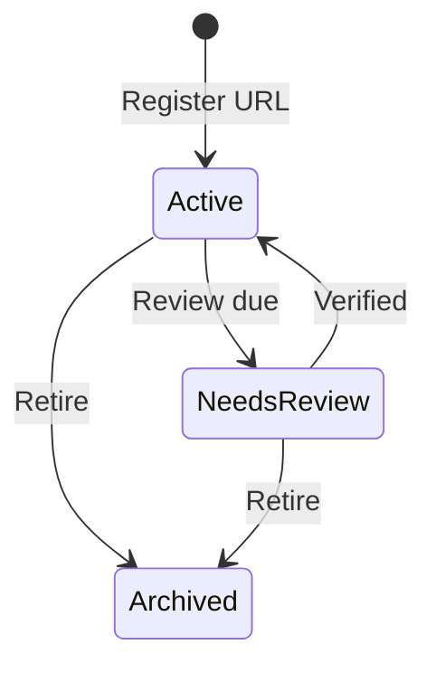

# Future Link Knowledge Centre — Functional Specification

**Document status:** Draft for approval  
**Version:** 1.0  
**Date:** 2026-06-27  
**Implementation contract:** Approved Knowledge Centre architecture (frozen business workflow)

**Rules for this document**

- Business workflow and data ownership are **frozen**.
- No business content generation in this spec.
- Potential improvements appear only in **Recommendations** (§17).
- **No production code** until this document is approved.

---

## 1. Module Overview

### 1.1 Purpose

The Knowledge Centre (KC) is the **single source of truth (SSOT)** for all counselling knowledge used during client interactions. It centralizes country guidance, shared articles, service-linked topics, FAQs, quizzes, downloadable counsellor tools, and the Official Sources Registry.

### 1.2 Objectives

| Objective | Measure |
|-----------|---------|
| One place for counselling knowledge | All staff counselling reads resolve to KC articles |
| No content duplication in client records | Client Education Record (CER) stores progress pointers only |
| Traceable knowledge versions | Every CER row snapshots `kc_article_version_id` at explain time |
| Live counselling always current | Opening a topic from a client always loads **current published** KC article |
| Governed official URLs | Articles reference `kc_official_sources`; URLs never duplicated in content |
| Reuse CRM foundations | Existing `countries`, `service_library`, `clients`, `client_timeline`, permissions |

### 1.3 Scope

**In scope (KC module)**

- Knowledge Centre navigation and read UI
- Knowledge Topics (articles) with version control
- Countries hub (scoped by `countries.code`)
- Services hub (scoped by `service_library.id`)
- Shared Knowledge Articles
- FAQs (`kc_faq_items`)
- Quiz (`kc_quiz_questions` — staff self-test UI; team profile in Phase 6)
- Downloads (`kc_download_assets`)
- Official Sources Registry (`kc_official_sources`)
- Internal linking (`kc_internal_links` + markdown tokens)
- Admin authoring, review, publish workflow
- Client Education Record module (progress only)
- Search, filters, reports (per implementation phases)
- Mobile-responsive layouts

**In scope (integration points)**

- Client Detail → Education tab → CER panel
- Client Timeline → link to CER / KC topic (event type `education_explained`)
- Deep links from Service Library (Phase 2 migration path — coexistence in Phase 1)

### 1.4 Out of Scope

| Area | Owner module | Reason |
|------|--------------|--------|
| Partner institution URLs, brochures, program data | Institutions (`upi_*`) | Partner knowledge, not counselling SSOT |
| Staff SOPs, UAT guides, build docs | `docs/guides`, `/guides` | Operational documentation |
| AI help bundle | `src/ai-help` | Product help, not counselling curriculum |
| Visa form files, fee tables, checklists in Service Library JSON | `service_library` (until Phase 2 migration) | Legacy SSOT during coexistence |
| Team Learning Profile (reading progress, certification) | Phase 6 | Design-only tables documented |
| Client portal KC browse (full) | Future portal phase | Acknowledgement only in later phase |
| Business content authoring (country guides text) | Content team | Tech delivers empty states + editors |

### 1.5 Guiding Principles

1. **SSOT** — Knowledge lives only in KC; progress lives only in CER; team learning lives only in Team Profile (Phase 6).
2. **Database first** — Schema + RLS before UI; no duplicate tables for countries/services.
3. **REUSE → EXTEND → CREATE** — Prefer `countries`, `service_library`, `user_module_permissions`, `AppLayout`, shadcn components.
4. **Never copy KC body into client** — CER stores IDs, status, notes, acknowledgement, timeline reference.
5. **Live read path** — `kc_resolve_live_article` always returns `current_version_id`.
6. **Immutable published versions** — Edits create new version rows; publish updates pointer.
7. **No URL duplication** — Official links via registry FK + chips.

---

## 2. User Roles

CRM `app_role` values map to functional roles. Module overrides via `user_module_permissions` (`knowledge_centre` key) apply on top of role defaults.

| Functional role | CRM mapping | Notes |
|-----------------|-------------|-------|
| Administrator | `admin`, `administrator` | Full KC + CER + publish |
| Branch Manager | `manager` | View KC + branch-scoped CER reports; no publish unless granted edit |
| Counsellor | `counselor` | View KC, create CER for assigned clients |
| Processing Team | `documentation` | KC author/review/publish (mirrors Service Library admin) |
| Marketing | No dedicated `app_role` | View-only KC if `knowledge_centre` view granted; no CER |
| Viewer | `viewer` | Read-only KC |
| Telecaller | `telecaller` | View KC; limited CER on assigned clients |
| Client (future portal) | `client` | No KC browse in Phase 1–5; acknowledgement in future phase |

### 2.1 Capability matrix (default behaviour)

| Capability | Administrator | Branch Manager | Counsellor | Processing Team | Marketing | Client (future) |
|------------|:-------------:|:--------------:|:----------:|:-----------------:|:---------:|:---------------:|
| **View KC articles (published)** | ✓ | ✓ | ✓ | ✓ | ✓* | — |
| **View KC drafts** | ✓ | — | — | ✓ | — | — |
| **Create knowledge topic** | ✓ | — | — | ✓ | — | — |
| **Edit knowledge topic** | ✓ | — | — | ✓ | — | — |
| **Approve / Publish** | ✓ | — | — | ✓ | — | — |
| **Archive topic** | ✓ | — | — | ✓ | — | — |
| **Download files** | ✓ | ✓ | ✓ | ✓ | ✓* | — |
| **Take quiz (self-test)** | ✓ | ✓ | ✓ | ✓ | ✓* | — |
| **Official Sources — view** | ✓ | ✓ | ✓ | ✓ | ✓* | — |
| **Official Sources — edit** | ✓ | — | — | ✓ | — | — |
| **CER — view** | ✓ | ✓** | ✓*** | ✓*** | — | own only**** |
| **CER — create (mark explained)** | ✓ | — | ✓*** | ✓*** | — | — |
| **CER — delete** | ✓ | — | — | — | — | — |
| **Reports / dashboards** | ✓ | ✓** | ✓*** | ✓ | — | — |

\*Marketing: only if `user_module_permissions.knowledge_centre.can_view = true` (not in `ROLE_DEFAULTS` until added).  
\**Branch Manager: branch-scoped via existing client/team visibility (`can_view_client`, branch filters on reports).  
\***Scoped to clients the user may view/edit per `user_client_permission`.  
\****Future portal: acknowledge topics already explained; no KC content mirror.

### 2.2 Enforcement layers

| Layer | Mechanism |
|-------|-----------|
| Route guard | `KnowledgeCentreProtectedRoute` (mirror `ServiceLibraryProtectedRoute`) |
| Module matrix | `useModulePermission("knowledge_centre")` |
| RLS | `can_view_knowledge_centre()`, `can_manage_knowledge_centre()`, `can_view_client` / `can_edit_client` for CER |
| Storage | `kc-downloads` bucket policies aligned with KC view |

---

## 3. Navigation Flow

### 3.1 Primary KC tree (sidebar under **Knowledge Centre**)

```
Knowledge Centre (Dashboard)
├── Countries
│   └── Country Hub (:countryCode)
│       ├── Knowledge Topics (country-scoped list)
│       ├── Official Sources (country-filtered)
│       └── Downloads (country-filtered)
├── Shared Knowledge Articles
│   └── Knowledge Topic (:slug)
├── Services
│   └── Service Hub (:serviceLibraryId)
│       ├── Knowledge Topics (service-scoped)
│       ├── FAQs (aggregated)
│       └── Downloads
├── FAQs (global browser)
├── Quiz (global browser / runner)
├── Downloads (global library)
├── Official Sources (master registry)
└── Admin (editors only)
    ├── Draft queue
    ├── Version history
    └── Source review queue
```

### 3.2 Route map

| Path | Screen |
|------|--------|
| `/knowledge-centre` | Dashboard |
| `/knowledge-centre/countries` | Countries index |
| `/knowledge-centre/countries/:code` | Country hub |
| `/knowledge-centre/articles` | Shared articles |
| `/knowledge-centre/articles/:slug` | Knowledge Topic reader |
| `/knowledge-centre/services` | Services index |
| `/knowledge-centre/services/:libraryId` | Service hub |
| `/knowledge-centre/faqs` | FAQ browser |
| `/knowledge-centre/quiz` | Quiz hub |
| `/knowledge-centre/quiz/:slug` | Quiz runner |
| `/knowledge-centre/downloads` | Downloads library |
| `/knowledge-centre/official-sources` | Official Sources Registry |
| `/knowledge-centre/search` | Search results |
| `/knowledge-centre/admin` | Admin console |
| `/knowledge-centre/admin/articles/:id` | Article editor |

### 3.3 Entry from CRM Client

```
Clients → Client Detail (/clients/:id)
└── Tab: Education
    ├── CER list (progress)
    ├── [Open in Knowledge Centre] → /knowledge-centre/articles/:slug?client=:id
    ├── [Mark Explained] → cer_log_education_record RPC
    └── [Launch Knowledge Centre] → /knowledge-centre?client=:id&country=&service=
```

Query params preserve client context for return navigation (mirror `service-library` `from=client` pattern).

### 3.4 Entry from Client Timeline

```
Client Timeline event (event_type: education_explained)
└── Click summary / "View topic"
    └── /knowledge-centre/articles/:slug  (live version, NOT stored body)
        └── Optional: ?cer=:cerId for audit context banner
```

### 3.5 Entry from Team Member Profile (Phase 6)

```
HR / Team Profile → Learning tab (future)
└── Reading progress, quiz attempts, certifications
    └── Deep link → /knowledge-centre/articles/:slug
```

Not implemented in Phases 1–5; navigation stub documented only.

### 3.6 Coexistence with Service Library (Phase 1)

`/service-library` remains available. KC is parallel SSOT; no automatic redirect until Phase 2 migration. Optional banner on Service Library: "Counselling knowledge is moving to Knowledge Centre."

---

## 4. User Journey

### 4.1 Primary counselling flow (Counsellor)

```
1. Open Client Detail
2. Select active country + service (from client profile / selected services)
3. Launch Knowledge Centre (pre-filtered) OR open Education tab
4. Browse Country / Service hub → select Knowledge Topic
5. Read live article (current published version)
6. Explain to client (offline — not system step)
7. Mark Explained (+ optional notes, acknowledgement checkbox if client confirms)
8. System creates CER row (version snapshot) + client_timeline event
9. Return to Education tab → see progress; continue remaining topics
```

### 4.2 Client revisits

- Counsellor opens same topic from CER → **always live KC article** (may show banner if live version ≠ explained version).
- New CER row only when counsellor marks explained again (re-counselling); prior rows remain audit history.
- Status on latest row reflects current counselling state for that topic.

### 4.3 Multiple counsellors

- Any counsellor with `can_edit_client` may log CER for same client/topic.
- `explained_by` captures actor; timeline shows who explained what and when.
- No lock on topic; concurrent explains create separate CER rows (unique constraint on `(client_id, kc_article_id, explained_at)`).

### 4.4 Updated knowledge version

| Event | System behaviour |
|-------|------------------|
| Article republished (v2 live) | Readers see v2 immediately |
| Existing CER | Retains `kc_article_version_id` = v1 snapshot |
| CER list UI | Shows "Explained on v1.2 · Live v1.3" when differ |
| Re-counselling | Counsellor reviews live v1.3 → new CER row with v1.3 snapshot |
| Compliance reports | "Version compliance" = clients explained before current major version |

### 4.5 Re-counselling workflow

```
Counsellor opens topic (live version)
→ Reviews changes (version history panel visible to editors; counsellor sees live only)
→ Mark Explained again OR update notes on new row
→ New CER + timeline event
```

### 4.6 Processing Team authoring journey

```
Admin → KC Admin → Create draft topic
→ Edit content, FAQs, quiz, downloads, source refs, internal links
→ Submit for review (status draft)
→ Reviewer (documentation/admin) publishes version
→ current_version_id updated; prior published → superseded
→ CER impact: no automatic client data change; reports flag stale explanations
```

### 4.7 Branch Manager journey

```
Reports → Branch counselling completion
→ Filter by branch / counsellor / country / service
→ Drill into pending topics per client
→ Read-only open KC topic (no CER create unless also counsellor)
```

---

## 5. Screen Mockups (Low-Fidelity Wireframes)

Layouts only — no implementation. Reuse `AppLayout`, `PageHeader`, `Card`, `Tabs`, `DataTable`.

### 5.1 Knowledge Centre Dashboard

```
┌─────────────────────────────────────────────────────────────────┐
│ [AppLayout header]  Knowledge Centre          [Search___] [?]   │
├──────────┬──────────────────────────────────────────────────────┤
│ KC Nav   │  Quick access                                        │
│          │  ┌─────────┐ ┌─────────┐ ┌─────────┐ ┌─────────┐     │
│ Countries│  │Countries│ │ Services│ │ Shared  │ │Downloads│     │
│ Shared   │  └─────────┘ └─────────┘ └─────────┘ └─────────┘     │
│ Services │  Recent / pinned topics (table)                      │
│ FAQs     │  ┌──────────────────────────────────────────────┐    │
│ Quiz     │  │ Topic title │ Country │ Service │ Version   │    │
│ Downloads│  └──────────────────────────────────────────────┘    │
│ Sources  │  Official sources due for review (alert strip)       │
│ Admin*   │  [Client context banner if ?client=]                 │
└──────────┴──────────────────────────────────────────────────────┘
```

### 5.2 Country Page

```
┌─────────────────────────────────────────────────────────────────┐
│ 🇦🇺 Australia                                    [Filter svc ▼]   │
├─────────────────────────────────────────────────────────────────┤
│ Tabs: [Topics] [Official Sources] [Downloads]                   │
├─────────────────────────────────────────────────────────────────┤
│ Topics list (cards or table)                                    │
│ ┌────────────────────────────────────────────────────────────┐  │
│ │ Topic A          │ Service: Student Visa │ v2026.1 │ →     │  │
│ │ Topic B          │ Shared              │ v2026.2 │ →     │  │
│ └────────────────────────────────────────────────────────────┘  │
└─────────────────────────────────────────────────────────────────┘
```

### 5.3 Service Page

```
┌─────────────────────────────────────────────────────────────────┐
│ Service: Australia Student Visa (from service_library label)    │
├─────────────────────────────────────────────────────────────────┤
│ Tabs: [Topics] [FAQs] [Downloads] [Quiz]                        │
│ Topic tree / list grouped by section                            │
│ Right rail: linked countries, related shared articles           │
└─────────────────────────────────────────────────────────────────┘
```

### 5.4 Knowledge Topic (reader)

```
┌─────────────────────────────────────────────────────────────────┐
│ Topic title                    Live v2026.03.1  [History]       │
│ Country · Service badges                                        │
├──────────────────────────────┬──────────────────────────────────┤
│ Article body (markdown)        │ Official Sources (chips)         │
│ Internal links               │ Related topics                   │
│                              │ Downloads for this topic         │
│ [Mark Explained]*            │                                  │
│ *if client context           │                                  │
├──────────────────────────────┴──────────────────────────────────┤
│ Stale banner: "You explained vX; live is vY" (if applicable)    │
└─────────────────────────────────────────────────────────────────┘
```

### 5.5 Downloads

```
┌─────────────────────────────────────────────────────────────────┐
│ Downloads Library    [Category ▼] [Country ▼] [Service ▼]     │
├─────────────────────────────────────────────────────────────────┤
│ ┌──────────┐ ┌──────────┐ ┌──────────┐                            │
│ │ PDF icon │ │ PDF icon │ │ XLS icon │  grid of DownloadCard     │
│ │ Meeting  │ │ Budget   │ │ Arrival  │                            │
│ │ Checklist│ │ Planner  │ │ Checklist│                            │
│ └──────────┘ └──────────┘ └──────────┘                            │
└─────────────────────────────────────────────────────────────────┘
```

### 5.6 Official Sources

```
┌─────────────────────────────────────────────────────────────────┐
│ Official Sources Registry   [+ Add] (editors)                   │
│ Filters: Country │ Category │ Status │ Review due                 │
├─────────────────────────────────────────────────────────────────┤
│ DataTable: Authority │ Title │ URL │ Last verified │ Status │ → │
└─────────────────────────────────────────────────────────────────┘
```

### 5.7 Quiz

```
┌─────────────────────────────────────────────────────────────────┐
│ Quiz: Australia Student Visa          Question 3 of 10          │
├─────────────────────────────────────────────────────────────────┤
│ Question text                                                   │
│ ○ Option A    ○ Option B    ○ Option C                          │
│ [Previous]  [Next]  [Submit]                                    │
│ Progress bar                                                    │
└─────────────────────────────────────────────────────────────────┘
```

### 5.8 Client Education Progress (Client Detail tab)

```
┌─────────────────────────────────────────────────────────────────┐
│ Client: Jane Doe    Education Record          [Launch KC]       │
│ Filters: Country │ Service │ Status                             │
├─────────────────────────────────────────────────────────────────┤
│ Topic │ Version explained │ Status │ By │ Date │ Ack │ [Open] │
│ ...                                                             │
│ [Mark Explained] [Add note]                                     │
└─────────────────────────────────────────────────────────────────┘
```

### 5.9 Manager Dashboard (Reports — Phase 5)

```
┌─────────────────────────────────────────────────────────────────┐
│ KC Reports — Branch: Sydney          [Date range ▼]             │
├─────────────────────────────────────────────────────────────────┤
│ KPI row: Completion % │ Pending │ Stale versions │ Quiz pass  │
├─────────────────────────────────────────────────────────────────┤
│ Chart: CER by counsellor │ Table: pending counselling by client│
└─────────────────────────────────────────────────────────────────┘
```

### 5.10 Search Results

```
┌─────────────────────────────────────────────────────────────────┐
│ Search: "GTE"          24 results                               │
│ Filters (chips): Country │ Service │ Kind │ Status              │
├─────────────────────────────────────────────────────────────────┤
│ Result cards with snippet, kind badge, version, path link       │
└─────────────────────────────────────────────────────────────────┘
```

### 5.11 Mobile View

```
┌──────────────────────┐
│ ☰  Knowledge Centre  │
├──────────────────────┤
│ [Search]             │
│ Quick tiles (2-col)  │
│ ┌────┐ ┌────┐        │
│ │Cnt │ │Svc │        │
│ └────┘ └────┘        │
│ Topic list (stack)   │
│ Full-width cards     │
│ Topic reader:        │
│ single column        │
│ Sources below fold    │
│ FAB: Mark Explained  │
└──────────────────────┘
```

---

## 6. Database Design

### 6.1 Reused existing tables (no duplication)

| Table | Use in KC/CER |
|-------|----------------|
| `countries` | Country identity (`code` FK) |
| `service_library` | Service identity (`id` FK) |
| `clients` | CER parent |
| `client_timeline` | CER timeline link (`timeline_event_id`) |
| `auth.users` | `explained_by`, authors, publishers |
| `user_module_permissions` | Module `knowledge_centre` |
| `user_roles` | Role-based RLS helpers |

### 6.2 New tables

| Table | Purpose |
|-------|---------|
| `kc_official_sources` | Master URL registry |
| `kc_articles` | Topic shell + `current_version_id` |
| `kc_article_versions` | Immutable version bodies |
| `kc_article_countries` | M:N country scope |
| `kc_article_services` | M:N service scope |
| `kc_faq_items` | FAQ rows per version |
| `kc_quiz_questions` | Quiz rows per version |
| `kc_download_assets` | Download metadata + storage path |
| `kc_article_source_refs` | Version → official source |
| `kc_internal_links` | Version → article links |
| `client_education_records` | CER progress |

**Phase 6 only (not created in Phases 1–5):** `kc_team_reading_progress`, `kc_team_quiz_attempts`, `kc_team_certifications`

### 6.3 ER Diagram

```mermaid
erDiagram
  countries ||--o{ kc_official_sources : scopes
  countries ||--o{ kc_article_countries : ""
  kc_articles ||--o{ kc_article_countries : ""
  service_library ||--o{ kc_article_services : ""
  kc_articles ||--o{ kc_article_services : ""
  kc_articles ||--o{ kc_article_versions : has
  kc_articles ||--o| kc_article_versions : current
  kc_article_versions ||--o{ kc_faq_items : ""
  kc_article_versions ||--o{ kc_quiz_questions : ""
  kc_article_versions ||--o{ kc_download_assets : ""
  kc_article_versions ||--o{ kc_article_source_refs : ""
  kc_official_sources ||--o{ kc_article_source_refs : ""
  kc_article_versions ||--o{ kc_internal_links : from
  kc_articles ||--o{ kc_internal_links : to
  clients ||--o{ client_education_records : ""
  kc_articles ||--o{ client_education_records : topic
  kc_article_versions ||--o{ client_education_records : snapshot
  client_timeline ||--o| client_education_records : timeline
```

### 6.4 Key foreign keys

| Child | Parent | On delete |
|-------|--------|-----------|
| `kc_article_versions.article_id` | `kc_articles.id` | CASCADE |
| `kc_articles.current_version_id` | `kc_article_versions.id` | SET NULL (defer FK) |
| `kc_article_countries.country_code` | `countries.code` | RESTRICT |
| `kc_article_services.service_library_id` | `service_library.id` | CASCADE |
| `kc_article_source_refs.official_source_id` | `kc_official_sources.id` | RESTRICT |
| `client_education_records.client_id` | `clients.id` | CASCADE |
| `client_education_records.timeline_event_id` | `client_timeline.id` | SET NULL |

### 6.5 Indexes

| Index | Columns | Purpose |
|-------|---------|---------|
| `idx_kc_articles_slug` | `slug` UNIQUE | Route resolution |
| `idx_kc_articles_kind_status` | `article_kind, status` | Hub listings |
| `idx_kc_versions_article` | `article_id, version_number` | History |
| `idx_kc_official_sources_url` | `official_url` UNIQUE | SSOT |
| `idx_kc_official_sources_review` | `status, last_verified_at` | Review queue |
| `idx_kc_article_countries_code` | `country_code` | Country hub |
| `idx_kc_article_services_lib` | `service_library_id` | Service hub |
| `idx_cer_client` | `client_id, explained_at DESC` | Education tab |
| `idx_cer_article` | `kc_article_id` | Reporting |
| `idx_cer_client_article` | `client_id, kc_article_id` | Latest per topic queries |

**Phase 3:** GIN/`tsvector` on `kc_article_versions.content_body` + `title` search.

### 6.6 Versioning strategy (database)

- `version_number`: monotonic integer per article.
- `version_label`: human label (e.g. `2026.03.1` — major.minor.patch semantics in §10).
- Published rows are **never updated**; new row for each publish.
- `kc_articles.current_version_id` points to single live published version.
- Prior published versions: `status = superseded`.

---

## 7. Permissions Matrix

Module key: `knowledge_centre`. Levels: `view`, `edit`, `delete` (delete ≡ admin archive + CER admin delete).

### 7.1 Knowledge Topic (`kc_articles` / versions)

| Action | Admin | Branch Mgr | Counsellor | Processing | Marketing | Viewer |
|--------|:-----:|:----------:|:----------:|:------------:|:---------:|:------:|
| View published | ✓ | ✓ | ✓ | ✓ | ✓* | ✓ |
| View draft | ✓ | — | — | ✓ | — | — |
| Create | ✓ | — | — | ✓ | — | — |
| Edit draft | ✓ | — | — | ✓ | — | — |
| Approve (review) | ✓ | — | — | ✓ | — | — |
| Publish | ✓ | — | — | ✓ | — | — |
| Archive | ✓ | — | — | ✓ | — | — |
| Delete | ✓ | — | — | — | — | — |

### 7.2 Quiz

| Action | Admin | Branch Mgr | Counsellor | Processing | Marketing | Viewer |
|--------|:-----:|:----------:|:----------:|:------------:|:---------:|:------:|
| View / take (self-test) | ✓ | ✓ | ✓ | ✓ | ✓* | ✓ |
| Author questions | ✓ | — | — | ✓ | — | — |
| Publish with article | ✓ | — | — | ✓ | — | — |

Team quiz attempts stored Phase 6 only.

### 7.3 Downloads

| Action | Admin | Branch Mgr | Counsellor | Processing | Marketing | Viewer |
|--------|:-----:|:----------:|:----------:|:------------:|:---------:|:------:|
| Download file | ✓ | ✓ | ✓ | ✓ | ✓* | ✓ |
| Upload / attach | ✓ | — | — | ✓ | — | — |
| Replace (new version) | ✓ | — | — | ✓ | — | — |

### 7.4 CER

| Action | Admin | Branch Mgr | Counsellor | Processing | Marketing | Viewer |
|--------|:-----:|:----------:|:----------:|:------------:|:---------:|:------:|
| View (scoped clients) | ✓ | ✓** | ✓*** | ✓*** | — | ✓*** |
| Create (mark explained) | ✓ | — | ✓*** | ✓*** | — | — |
| Edit notes / ack | ✓ | — | ✓*** | ✓*** | — | — |
| Delete | ✓ | — | — | — | — | — |

### 7.5 Official Sources

| Action | Admin | Branch Mgr | Counsellor | Processing | Marketing | Viewer |
|--------|:-----:|:----------:|:----------:|:------------:|:---------:|:------:|
| View registry | ✓ | ✓ | ✓ | ✓ | ✓* | ✓ |
| Create / edit | ✓ | — | — | ✓ | — | — |
| Verify (update last_verified) | ✓ | — | — | ✓ | — | — |
| Archive | ✓ | — | — | ✓ | — | — |

---

## 8. Workflow

### 8.1 Knowledge authoring



**Steps**

1. **Create** — `kc_articles` row (`status=draft`), initial `kc_article_versions` (`version_number=1`, `status=draft`).
2. **Edit** — Update draft version body only (not published rows).
3. **Review** — Optional `InReview` flag in `metadata` or version status (implementation detail).
4. **Publish** — RPC `kc_publish_version`: set version `published`, supersede prior, set `current_version_id`, set article `status=published`.
5. **Version increment** — Next edit creates `version_number+1` draft from copy or blank.
6. **CER impact** — No mutation of CER; reports show clients with `cer.kc_article_version_id` ≠ live version.

### 8.2 Quiz workflow

1. Quiz hub article (`article_kind=quiz`) scoped to service/country.
2. Questions authored in `kc_quiz_questions` against **draft version**.
3. Publish bundles questions with article version.
4. Staff self-test (Phase 1–5): local state, optional score toast; **no persistence**.
5. Phase 6: attempts → `kc_team_quiz_attempts`.

### 8.3 Download workflow

1. Upload file to `kc-downloads` bucket.
2. Create `kc_download_assets` row linked to article (and optional version).
3. Version-specific downloads: set `version_id`; global downloads: `version_id` NULL.
4. Replace file → new storage path + new row or version bump (no overwrite of published asset paths).
5. Counsellor downloads via signed URL; audit log optional (Recommendations).

### 8.4 Official Source workflow



1. Register in master registry (unique URL).
2. Articles reference via `kc_article_source_refs` only.
3. Scheduled review: `last_verified_at + review_frequency_days`.
4. Admin queue surfaces `needs_review` and overdue items.
5. URL change → update registry row; all article chips reflect new URL (no content edit).

### 8.5 CER workflow

1. Counsellor marks explained → `cer_log_education_record`.
2. Insert `client_education_records` with current `kc_article_version_id` snapshot.
3. Insert `client_timeline` (`event_type: education_explained`, metadata: `cer_id`, `article_id`, `version_label`).
4. Link `timeline_event_id` on CER row.
5. Optional `client_acknowledged` + timestamp.
6. Open topic anytime → `kc_resolve_live_article` (live content).

---

## 9. Search & Filters

### 9.1 Phase 3 scope

| Dimension | Source | UI |
|-----------|--------|-----|
| Country | `kc_article_countries` | Multi-select chip |
| Service | `kc_article_services` | Multi-select chip |
| Knowledge Topic | `kc_articles.title`, slug | Primary search |
| Tags | `kc_articles.metadata.tags` | Chip (optional jsonb) |
| Keywords | Full-text on version body | Search box |
| Status | `kc_articles.status` | Admin filter |
| Version | `version_label` | Admin filter |
| Owner | `created_by` / `published_by` | Admin filter |
| Review due | Official sources registry | Admin alert list |
| Article kind | `article_kind` enum | Tab / filter |

### 9.2 Search behaviour

- Default search: published topics only for non-editors.
- RPC `kc_search_articles(query, filters)` returns slug, title, snippet, kind, countries, services.
- Results page: `/knowledge-centre/search?q=...`
- Reuse `buildPageSearchIndex` patterns from Service Library where applicable.

### 9.3 Hub filters (Phase 1–2)

Country hub: filter by service, kind.  
Service hub: filter by country, section.  
Downloads: category, country, service.  
Official Sources: country, category, status, review due.

---

## 10. Versioning

### 10.1 Fields

| Field | Location | Meaning |
|-------|----------|---------|
| Knowledge version | `version_label` | Display label e.g. `2026.03.1` |
| Major version | `version_label` segment 1 | Year or programme cycle bump |
| Minor version | segment 2 | Content revision within cycle |
| Patch | segment 3 | Typos / non-substantive |
| Published date | `published_at` | When version went live |
| Review date | `metadata.reviewed_at` | Editorial review timestamp |
| Next review | `metadata.next_review_at` | Editorial schedule (optional) |

### 10.2 When a topic changes

1. Editor creates new version row (draft).
2. On publish, live pointer moves; old version `superseded`.
3. All read paths use `current_version_id`.
4. FAQs/quiz/downloads linked to specific `version_id` move with that version snapshot.

### 10.3 CER when newer version exists

| Data | Behaviour |
|------|-----------|
| `kc_article_version_id` on CER | Immutable snapshot at explain time |
| Topic reader | Always live version |
| UI banner | Show when snapshot ≠ live |
| Reports | "Stale explanation" = explained version < current major/minor per policy |
| Re-counselling | New CER row; does not delete old |

---

## 11. Downloads

### 11.1 Categories (`download_type` enum)

| Category | Enum value | Examples |
|----------|------------|----------|
| Counsellor Guide | `counsellor_guide` | Session scripts, talking points |
| Meeting Checklist | `meeting_checklist` | First meeting checklist |
| Budget Planner | `budget_planner` | Living cost worksheets |
| Arrival Checklist | `arrival_checklist` | Arrival guide / checklist |
| Settlement Checklist | `settlement_checklist` | Settlement guide |
| Other | `other` | Packing list, misc (use `metadata.subtype`) |

Functional names "Arrival Guide", "Settlement Guide", "Packing List" map to enum above; packing list uses `other` + `metadata.subtype = packing_list` until enum extension (see Recommendations).

### 11.2 Version control

- Download row tied to `version_id` when topic-specific.
- Global downloads (library page) may omit `version_id`.
- Replacing file requires new storage path; historic versions remain for audit.

### 11.3 Download permissions

- View KC → download permitted (same RLS as article read).
- Upload → `can_manage_knowledge_centre()`.
- Storage bucket `kc-downloads`: mirror `service-library-files` staff policies.

### 11.4 UI

- Global library page + per-topic right rail.
- `DownloadCard` component: title, category badge, version, file size, download button.

---

## 12. Official Sources Registry

### 12.1 Fields

| Field | Description |
|-------|-------------|
| Country | Optional `countries.code` scope |
| Category | immigration, education, health, banking, etc. |
| Authority | Issuing body name |
| Title | Display title |
| Official URL | Canonical URL (unique) |
| Last verified | `last_verified_at` |
| Review frequency | `review_frequency_days` (default 90) |
| Status | `active`, `needs_review`, `archived` |
| Owner | `created_by` / `metadata.owner_user_id` |

### 12.2 Article reference rules

1. **Never** paste raw official URL in article body without registry FK (editor warns on detect).
2. Insert via picker → `kc_article_source_refs`.
3. Render as `OfficialSourceChip` → opens URL from registry.
4. Registry URL update propagates to all chips automatically.

### 12.3 Review queue

- Auto-flag `needs_review` when `last_verified_at + frequency < today`.
- Admin Official Sources tab: sort by overdue.
- Verify action sets `last_verified_at` and `status=active`.

---

## 13. Client Education Record (CER)

### 13.1 Stored fields

| Field | Purpose |
|-------|---------|
| `client_id` | Client |
| `country_code` | Counselling context |
| `service_library_id` | Service context |
| `kc_article_id` | Knowledge topic |
| `kc_article_version_id` | Version at explain time |
| `knowledge_topic` | Denormalized title for lists |
| `status` | `explained`, `acknowledged`, `skipped`, `cancelled` |
| `explained_by` | Staff user |
| `explained_at` | Timestamp |
| `notes` | Counsellor notes |
| `client_acknowledged` | Boolean |
| `client_acknowledged_at` | Timestamp |
| `timeline_event_id` | Link to `client_timeline` |

**Not stored:** article body, FAQ text, quiz questions, download files, official URLs.

### 13.2 Progress tracking

- Education tab lists all CER rows for client (sort `explained_at DESC`).
- "Completion" for a service/country = set of required topics (from KC scope) vs CER rows (reporting Phase 5).
- Latest row per `(client_id, kc_article_id)` derived in UI/query for status display.

### 13.3 Timeline integration

```json
{
  "event_type": "education_explained",
  "summary": "Explained: {knowledge_topic} (v{version_label})",
  "metadata": {
    "cer_id": "...",
    "kc_article_id": "...",
    "kc_article_version_id": "...",
    "slug": "...",
    "country_code": "...",
    "service_library_id": "..."
  }
}
```

### 13.4 Multiple counsellors

- Separate rows per explain event; `explained_by` identifies actor.
- No edit of another user's row except admin.

### 13.5 Reporting hooks (Phase 5)

- Completion by client, counsellor, branch, country, service.
- Pending topics (required − explained).
- Acknowledgement rate.
- Version staleness count.

---

## 14. Reports & Dashboards (Phase 5)

### 14.1 Administrator

| Report | Description |
|--------|-------------|
| Knowledge usage | Article views (if analytics added) / CER counts |
| Most viewed topics | Rank by CER count or view events |
| Official source compliance | Overdue verifications |
| Version publish log | Versions published by date/editor |
| Archive audit | Archived topics and sources |

### 14.2 Branch Manager

| Report | Description |
|--------|-------------|
| CER completion by branch | % clients with required topics explained |
| Pending counselling | Clients with open topics |
| Counsellor activity | Explains per counsellor |
| Stale version alerts | Clients explained on old versions |

### 14.3 Counsellor

| Report | Description |
|--------|-------------|
| My CER activity | Explains this week |
| My pending clients | Topics not yet explained |
| Quiz self-test results | Phase 6 |

### 14.4 Training (Phase 6)

| Report | Description |
|--------|-------------|
| Quiz results | Pass rate by topic |
| Certification status | Team profile |
| Reading progress | Completion % |

### 14.5 Downloads report

- Download counts per asset (if logging enabled — Recommendations).

### 14.6 Version compliance

- Clients where `cer.version` major/minor behind live `version_label` per configurable rule.

**UI location:** `/reports` section or `/knowledge-centre/reports` with `reports` module permission.

---

## 15. Mobile Responsiveness

| Breakpoint | Layout |
|------------|--------|
| Desktop (≥1024px) | Full sidebar + content + right rail on topic reader |
| Tablet (768–1023px) | Collapsible sidebar; right rail stacks below content |
| Mobile (<768px) | Hamburger KC nav; single column; full-width cards; FAB "Mark Explained" on topic reader with client context |

**Touch targets:** Minimum 44px on quiz options and download buttons.

**Tables:** Horizontal scroll or card stack on mobile (`DataTable` responsive pattern).

**Client Education tab:** Card list instead of wide table on mobile.

Reuse `AppLayout` responsive behaviour; no separate mobile app.

---

## 16. UAT Checklist

### 16.1 Navigation

- [ ] KC appears in sidebar for staff with `knowledge_centre` view
- [ ] All hub routes load without error (empty state OK)
- [ ] Country → topic → back navigation preserves filters
- [ ] Service hub links resolve correct `service_library` label
- [ ] Client context query params persist Launch KC → return to client
- [ ] Timeline event opens live topic URL

### 16.2 Permissions

- [ ] Counsellor cannot access KC Admin
- [ ] Documentation can publish
- [ ] Viewer read-only; no CER create
- [ ] Client role cannot access KC routes
- [ ] CER scoped to `can_view_client` / `can_edit_client`
- [ ] Module permission override grants/revokes KC access

### 16.3 CER

- [ ] Mark Explained creates row with version snapshot
- [ ] Timeline event created and linked
- [ ] Open from CER loads **live** article not snapshot body
- [ ] Stale version banner when live ≠ snapshot
- [ ] Re-explain creates second row
- [ ] No article HTML/text in `client_education_records`

### 16.4 Quiz

- [ ] Questions render from published version
- [ ] Draft quiz not visible to counsellors
- [ ] Submit shows score (self-test)
- [ ] No quiz content in CER

### 16.5 Downloads

- [ ] Download works for each category enum
- [ ] Version-scoped download appears on correct topic version
- [ ] Unauthorized user cannot upload

### 16.6 Search

- [ ] Search finds topic by title keyword (Phase 3)
- [ ] Filters combine correctly
- [ ] Drafts excluded from counsellor search

### 16.7 Official Sources

- [ ] Duplicate URL rejected at registry
- [ ] Article chip opens registry URL
- [ ] URL update in registry updates chip without article edit
- [ ] Review due queue shows overdue sources

### 16.8 Versioning

- [ ] Publish increments live pointer
- [ ] Prior version superseded, still viewable in admin history
- [ ] CER snapshot unchanged after new publish
- [ ] `kc_resolve_live_article` returns current version

---

## 17. Recommendations (not in approved architecture)

These are **optional future improvements** — do not implement without explicit approval.

1. **Enum extension** — Add `packing_list` to `download_type` instead of `other` + metadata subtype.
2. **View analytics** — `kc_article_views` table for "most viewed" without inferring from CER only.
3. **Download audit log** — Track who downloaded which asset for compliance.
4. **Formal review states** — Dedicated `kc_article_reviews` table instead of metadata flags.
5. **Marketing role** — Add `marketing` to `app_role` enum vs module-only access.
6. **Required topic sets** — `kc_required_topics(service_library_id, country_code, article_id)` for automated pending counselling reports.
7. **Portal acknowledgement API** — Secure endpoint for client portal Phase 4+.
8. **Service Library fast migration** — `kc_service_library_bindings` table in Phase 2 to map legacy tabs to KC articles.

---

## 18. Implementation Plan

**Gate:** Implementation starts only after approval of this Functional Specification.

| Phase | Scope | Deliverables |
|-------|-------|--------------|
| **Phase 1** | Database, Navigation, Core UI | Migrations (`kc_*` foundation + RLS + bucket); `knowledge_centre` module key; routes; `AppLayout` nav; KC Dashboard; empty hub pages; protected routes |
| **Phase 2** | Knowledge Topics, Official Sources, Downloads | Article reader; admin editor shell; publish RPC; Official Sources CRUD; download upload/list; FAQ display on topics |
| **Phase 3** | Search, Filters, Versioning | Full-text search RPC; filter chips; version history panel; stale banner; review metadata |
| **Phase 4** | Client Education Record | `client_education_records`; Education tab on Client Detail; `cer_log_education_record`; timeline integration; Mark Explained flow |
| **Phase 5** | Reports | Manager/admin dashboards; completion, pending, staleness, source compliance reports |
| **Phase 6** | Team Learning & Certification | `kc_team_*` tables; Team Profile learning tab; quiz attempt persistence; certification workflow |

### 18.1 Phase dependencies

```
Phase 1 → Phase 2 → Phase 3
Phase 2 → Phase 4 (CER needs articles + publish)
Phase 4 → Phase 5 (reports need CER data)
Phase 2 → Phase 6 (quiz content); Phase 6 independent of Phase 4
```

### 18.2 Reuse checklist (every phase)

- Components: `PageHeader`, `Card`, `Tabs`, `DataTable`, `Badge`, `Dialog`, `ServiceLibraryQuiz` patterns
- Permissions: `useModulePermission`, `user_module_permissions`, RLS helpers
- Layout: `AppLayout`, collapsible nav section pattern from Institutions
- Client scoping: `can_view_client`, `can_edit_client`
- Storage: bucket policy pattern from `service-library-files`

### 18.3 Content policy

- Phases 1–5 ship with **empty states** only; no seeded business content.
- Content team populates via KC Admin after Phase 2.

---

## 19. Approval sign-off

| Role | Name | Date | Approved |
|------|------|------|----------|
| Product Owner | | | ☐ |
| Lead Architect | | | ☐ |
| Engineering | | | ☐ |

**Upon approval:** Proceed to Phase 1 implementation per §18.

---

*End of Functional Specification v1.0*
