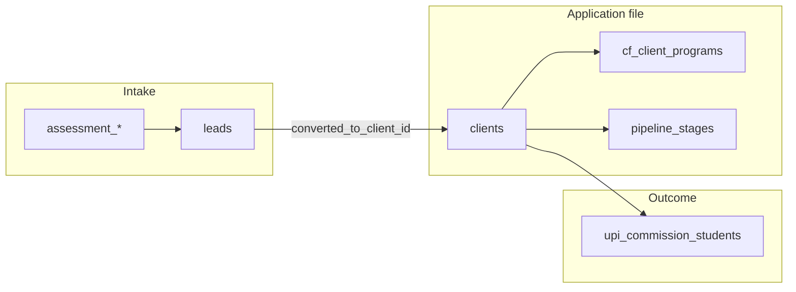

# Dashboard V2 — Admissions & Revenue Schema Report

**Audit date:** 2026-06-05  
**Scope:** Can Applications, Offers, Visa Cases, Revenue, and Counselor Productivity be surfaced from **existing** tables and relationships — without new SQL views or migrations?  
**Companion doc:** [DASHBOARD_V2_DATA_AVAILABILITY_REPORT.md](./DASHBOARD_V2_DATA_AVAILABILITY_REPORT.md) (Phase 1 operational dashboard)

---

## Executive summary

| Domain | Can surface today? | Primary anchor | Gap |
|--------|-------------------|----------------|-----|
| **Applications** | **Yes (partial)** | `clients` | No dedicated `applications` table; admissions data is spread across `clients`, `leads`, `cf_client_programs`, `assessment_*`, pipelines |
| **Offers** | **Yes** | `offers` + `offer_events` | Two parallel offer systems (`offers` vs `service_offers`); ROI RPCs already exist |
| **Visa cases** | **Yes (proxy only)** | `clients` + forms/docs | No `visa_cases` entity; visa progress inferred from permit fields, forms, documents, pipeline stages |
| **Revenue** | **Yes (CRM billing)** | `client_invoices` + payments | Multi-currency rollup is client-side only; accounting GL and Odoo revenue are separate paths |
| **Counselor productivity** | **Yes** | `vw_counselor_productivity` + assignment FKs | View exists but is **not yet on Dashboard V2**; incentive tables add payout depth |

**Bottom line:** Dashboard V2 can evolve into an admissions and revenue dashboard **without schema changes**, by wiring existing tables, views, and RPCs. The main limitation is that “visa case” and “application” are **modelled as attributes and related records on `clients`**, not first-class case tables — so executive KPIs work, but deep visa-case analytics will eventually need aggregation views.

---

## 1. Application-related tables

There is **no `applications` table**. In this system, an application is represented by a **`clients` row** (with `application_id`, `application_type`, pipeline/stage fields) plus related child records.

### Core application record

| Table | Role | Key fields / relationships |
|-------|------|---------------------------|
| **`clients`** | Primary application / case file | `application_id`, `application_type`, `status`, `country`, `intake`, `interested_country`, `interested_course`, `pipeline_id`, `current_stage_id`, `lead_stage`, `lead_temperature`, `lead_score`, `enrollment_probability`, `source_lead_id`, `converted_at`, `workflow_template_id`, `linked_institution_id`, service arrays (`admission_services`, `visa_services`, `coaching_services`, …) |
| **`client_profile`** | Extended applicant profile | Test scores, passport, education, visa refusal history |
| **`client_education`**, **`client_family_members`**, **`case_people`**, **`case_sections`** | Structured case data | Per-applicant sections |
| **`client_section_settings`** | Section visibility / config | Links client ↔ case sections |

### Pre-client / conversion path

| Table | Role | Key fields / relationships |
|-------|------|---------------------------|
| **`leads`** | Formal lead records (separate from telephony `clients`-as-leads path) | `lead_number`, `status` (`new`→`converted`), `lead_type`, `assigned_counselor_id`, `converted_to_client_id`, `converted_at`, service/country arrays |
| **`clients.source_lead_id`** | Back-link after conversion | FK to originating lead |
| **`lead_handoffs`** | Telecaller → counselor handoff | `client_id`, `from_user`, `to_user`, `status`, `direction` |
| **`lead_remarks`**, **`remark_presets`** | Qualification notes | Feed `fn_recalc_lead_score` on `clients` |

### Admissions / program selection

| Table | Role | Key fields / relationships |
|-------|------|---------------------------|
| **`cf_client_programs`** | Course/program shortlist → final choice | `client_id` → `clients`, `course_id` → `cf_courses`, `status` (`shortlisted` \| `final`), `is_primary`, `finalized_at` |
| **`cf_courses`**, **`cf_universities`**, **`cf_countries`** | Course finder catalogue | Program metadata |
| **`cf_shortlists`**, **`cf_saved_searches`** | Counselor search history | Usage analytics (partial) |
| **`upi_commission_students`** | Institution enrollment record | `client_id`, `enrollment_status`, `program_name`, intake fields, study permit fields — links CRM client to partner institution |

### Assessment funnel (top-of-funnel applications)

| Table | Role |
|-------|------|
| **`assessment_invitations`**, **`assessment_sessions`**, **`assessment_leads`**, **`assessment_programs`**, **`assessment_questions`**, **`assessment_email_verifications`**, **`assessment_pdf_wrapper`** | Self-serve assessment → lead capture |

### Pipeline / stage (application progress)

| Table / view | Role |
|--------------|------|
| **`stage_pipelines`** | Pipeline definition (`country`, `service_category`) |
| **`pipeline_stages`** | Ordered stages per pipeline |
| **`client_stage_history`** | Stage transition audit (`entered_at`, `stage_id`, `pipeline_id`) |
| **`vw_client_current_stage`** | Current stage + progress % per client |
| **`vw_stage_distribution`** | Client count per stage (already on Dashboard V2) |
| **`workflow_templates`** | Document checklist by country/category |

### Supporting application artefacts

| Table | Role |
|-------|------|
| **`client_documents`**, **`client_files`**, **`binders`** | Document submission & packages |
| **`client_tasks`**, **`client_timeline`**, **`client_appointments`** | Work items and activity |
| **`service_catalogue`** | Priced services attached to applications |
| **`calendar_event_crm_links`** | Meetings linked to CRM clients |

### What “Applications” means in practice



**Implication:** Application KPIs query `clients` (+ joins), not a standalone applications module.

---

## 2. Offer-related tables

Two **parallel offer systems** exist — marketing/portal offers vs internal service pricing.

### Marketing & portal offers (primary for Dashboard V2)

| Table | Role | Key fields / relationships |
|-------|------|---------------------------|
| **`offers`** | Offer definition | `title`, `discount_type`, `discount_value`, `is_active`, `valid_from`/`valid_to`, `target_countries`, `applicable_services`, `redemption_count` |
| **`client_offers`** | Offer attached to a client | `client_id` → `clients`, `offer_id` → `offers`, `status`, `used_at`, `attached_by` |
| **`offer_events`** | Funnel events | `event_type` (`viewed`, `claimed`, `redeemed`, …), `offer_id`, `client_id`, `counselor_id`, `revenue_amount`, `tracking_code` |
| **`offer_templates`** | Automation templates | `trigger_type`, linked to `offers.template_id` |
| **`offer_groups`**, **`offer_group_members`**, **`offer_audience_targets`** | Segmentation | Audience targeting |
| **`offer_tracking_codes`** | Per-counselor attribution codes | Links counselor → offer |

### Production RPCs (no new views needed)

| RPC | Returns | Used by |
|-----|---------|---------|
| **`offer_roi_stats(date, date)`** | views, claims, redemptions, redemption_rate, total_discount, influenced_revenue per offer | `OffersAnalytics.tsx` |
| **`counselor_offer_stats(date, date)`** | redemptions, discount, attributed_revenue per counselor | `OffersAnalytics.tsx` |

### Internal service pricing offers (secondary)

| Table | Role |
|-------|------|
| **`service_offers`** | Branch/service combo discounts (`offer_name`, `discount_percent`, `uses_count`, `valid_from`/`valid_until`) |
| **`service_catalogue`** | Master service price list (fee_inr, fee_cad, …) |

### Offer ↔ revenue link

| Path | Join |
|------|------|
| Event funnel | `offer_events` → `offers` |
| Invoice attribution | `client_invoices.applied_offer_id` → `offers`, plus `offer_discount_amount`, `attributed_counselor_id`, `tracking_code` |
| Portal redemption | `client_offers.status` = `active` / `used_at` |

### Loyalty / referral (offer-adjacent)

| Table | Role |
|-------|------|
| **`referrals`**, **`credit_wallet`**, **`point_transactions`**, **`point_redemptions`** | Referral points economy |

---

## 3. Visa-related tables

There is **no `visa_cases` table**. Visa workflow is **distributed** across client fields, forms, documents, and pipeline stages.

### Client-level visa fields (case status proxy)

| Location | Fields |
|----------|--------|
| **`clients`** | `visa_services[]`, `study_permit_number`, `study_permit_approved_date`, `study_permit_expiry`, `application_type`, `consent_form_submitted`, `consent_form_date` |
| **`client_profile`** | `visa_refusal_history`, `passport_available` |
| **`leads`** | `visa_services[]`, `visa_locked`, `visa_lock_reason` |

### Forms & questionnaires (visa filing workflow)

| Table | Role | Relationships |
|-------|------|---------------|
| **`visa_forms`** | Form library (PDF templates) | `country`, `category`, links to `questionnaire_schemas` |
| **`questionnaire_schemas`**, **`questionnaire_instances`** | Dynamic questionnaires | `client_id`, `status`, `submitted_at`, `reviewed_at` |
| **`filled_forms`** | Completed PDF outputs | `client_id`, `form_id` → `visa_forms`, `status`, `validated_at` |
| **`questionnaire_email_templates`** | Client-facing form emails | — |

### Documents & compliance (visa evidence)

| Table | Role |
|-------|------|
| **`client_documents`** | Uploaded evidence (`document_type`, `status`) |
| **`client_files`** | Portal submissions (`status`: verified / pending / action_required / rejected) |
| **`document_verifications`** | Fraud/risk review (`reviewer_status`, `risk_level`) |
| **`document_fingerprints`** | Dedup |
| **`binders`** | Compiled visa/application packages |
| **`client_document_extractions`**, **`client_document_extraction_queue`** | OCR pipeline |

### Service library / SOP checklists (country-specific visa steps)

| Table | Role |
|-------|------|
| **`service_library`**, **`service_library_sop_tasks`**, **`service_library_sop_completions`** | SOP task completion per client |
| **`service_library_submission_checklist`**, **`service_library_submission_completions`** | Submission checklist completion |
| **`service_library_countries`**, **`service_library_overrides`**, … | Country-specific config |

### Institution-side visa/enrollment (partner view)

| Table | Role |
|-------|------|
| **`upi_commission_students`** | `study_permit_number`, `study_permit_approved_date`, `study_permit_expiry`, `cas_issued_date`, `enrollment_status` |

### Marketing / content

| Table | Role |
|-------|------|
| **`dsh_media`** | `content_type` includes `visa_approval` |

### Pipeline as visa case stage

Visa progress can be **proxied** via `stage_pipelines` where `service_category` relates to visa services, plus `vw_client_current_stage` / `vw_stage_distribution`.

**Implication:** Visa KPIs work as **counts and status proxies** (permits issued, forms pending, documents verified, binders complete). A dedicated “visa case dashboard” with SLA/time-in-stage per case type will need **aggregation views** (Phase 2).

---

## 4. Revenue / payment tables

Revenue is tracked in **three layers** — CRM client billing (production), institution commission (UPI), and accounting GL (schema ready, UI partial).

### CRM client billing (primary for admissions dashboard)

| Table / view | Role | Key fields |
|--------------|------|------------|
| **`client_invoices`** | Invoice header | `amount`, `amount_paid`, `currency`, `status`, `due_date`, `applied_offer_id`, `offer_discount_amount`, `attributed_counselor_id`, `assigned_counselor_id`, `collected_by`, `converted_by`, FX columns |
| **`client_invoice_payments`** | Payment rows | `amount`, `paid_at`, `method`, `payment_status`, `is_refund`, multi-currency amounts |
| **`client_invoice_payment_allocations`** | Payment → invoice allocation | — |
| **`client_invoice_installments`** | Scheduled installments | — |
| **`client_invoice_receipts`** | Receipt records | Immutable snapshots |
| **`client_invoice_refund_requests`**, **`client_invoice_adjustments`** | Refunds & adjustments | — |
| **`client_invoice_reminders`** | Collection follow-ups | — |
| **`client_invoice_aging`** *(view)* | AR aging buckets | Already on Dashboard V2 |
| **`client_invoice_snapshots`** | Immutable invoice history | — |
| **`invoice_number_sequences`**, **`receipt_number_sequences`** | Numbering | — |

### Offer-attributed revenue

| Path | Fields |
|------|--------|
| Invoice | `client_invoices.applied_offer_id`, `offer_discount_amount`, `attributed_counselor_id` |
| Events | `offer_events.revenue_amount` where `event_type = 'redeemed'` |
| RPC | `offer_roi_stats`, `counselor_offer_stats` |

### Institution commission revenue (partner admissions revenue)

| Table | Role | Key fields |
|-------|------|------------|
| **`upi_claim_cycles`** | Claim period rollup | `total_expected`, `total_received`, `status`, `currency` |
| **`upi_commission_invoices`**, **`upi_invoice_line_items`** | Partner invoices | — |
| **`upi_commissions`**, **`upi_commission_rules`** | Commission programs | — |
| **`upi_commission_students`** | Per-student commission | `commission_amount`, `commission_status`, `tuition_amount` |
| **`upi_invoices`** | Institution billing | — |

### Accounting module (separate GL — not wired to Dashboard V2)

| Table | Role |
|-------|------|
| **`accounting_journals`**, **`accounting_journal_lines`**, **`accounting_coa`** | General ledger |
| **`accounting_ar_invoices`**, **`ar_invoice_line_items`** | Accounting AR (linked via `accounting_clients`) |
| **`accounting_ap_bills`**, **`accounting_bank_accounts`**, **`accounting_petty_cash`** | AP, banking |
| **`financial_accounts`**, **`owner_profiles`** | Owner/firm financial structure |

Sync: **`clients`** → **`accounting_clients`** via trigger `fn_sync_accounting_client`.

### Loyalty / non-invoice revenue signals

| Table | Role |
|-------|------|
| **`referrals`**, **`credit_wallet`**, **`point_transactions`** | Referral economy |
| **`incentive_payouts`**, **`incentive_runs`** | Staff payout (cost side, not client revenue) |

**Implication:** **CRM billing + UPI commission** are immediately queryable for an admissions revenue dashboard. **GL revenue** (P&L) requires wiring `accounting_journals` queries — schema exists, dashboard does not.

---

## 5. Counselor assignment relationships

Counselor ownership is modelled through **multiple FK columns** and one **productivity view**.

### Assignment & ownership columns

| Table | Counselor FK columns | Meaning |
|-------|---------------------|---------|
| **`clients`** | `assigned_counselor_id`, `owner_id`, `created_by` | Primary case owner vs assigned counselor vs creator |
| **`leads`** | `assigned_counselor_id` | Lead-stage assignment |
| **`client_invoices`** | `assigned_counselor_id`, `attributed_counselor_id`, `converted_by`, `collected_by`, `followed_up_by` | Billing attribution chain |
| **`client_tasks`** | `assigned_to` | Task ownership |
| **`lead_handoffs`** | `from_user`, `to_user` | Telecaller ↔ counselor transfers |
| **`offer_events`** | `counselor_id` | Offer attribution |
| **`offer_tracking_codes`** | Per-counselor tracking | Promo code ownership |
| **`whatsapp_conversations`** | `assigned_user_id` | Inbox assignment |
| **`cf_client_programs`** | `shortlisted_by`, `finalized_by` | Program selection actions |
| **`calendar_event_crm_links`** | Via `calendar_events.user_id` | Meeting owner |

### Access control (who can see which client)

| Table | Role |
|-------|------|
| **`client_access`** | Explicit per-user client permissions |
| **`team_members`**, **`teams`**, **`default_team_members`** | Team-based access |

### Productivity & incentives (existing analytics)

| Object | Metrics | Status |
|--------|---------|--------|
| **`vw_counselor_productivity`** *(view)* | `handoffs_accepted`, `tasks_done`, `enrollments` (clients with `status IN ('enrolled','visa_approved')` owned by counselor) | **Production — not on Dashboard V2 yet** |
| **`counselor_offer_stats`** *(RPC)* | redemptions, discount, attributed_revenue per counselor | Production — `/offers` only |
| **`incentive_plans`**, **`incentive_runs`**, **`incentive_line_items`**, **`incentive_payouts`**, **`incentive_targets`**, **`incentive_slabs`** | Plan definition, period runs, payouts | Admin pages (`IncentivesAdmin`, `PeriodClose`) |
| **`discount_wallets`**, **`wallet_ledger`**, **`wallet_allocations`** | Counselor discount budgets | Admin pages |

### Enrollment definition (used in productivity view)

From `vw_counselor_productivity` migration:

```sql
count(DISTINCT c.id) FILTER (
  WHERE c.owner_id = p.id AND c.status IN ('enrolled', 'visa_approved')
) AS enrollments
```

---

## 6. Executive KPIs addable to Dashboard V2 immediately (no schema changes)

Below: KPIs **not yet on Dashboard V2 Phase 1**, grouped by admissions/revenue theme. Each includes the exact existing source.

Legend: **Query** = direct table/view/RPC count or sum · **Chart** = needs client-side grouping · **Table** = leaderboard/list

### A. Applications & admissions

| KPI / widget | Source | Query pattern | Dashboard V2 today? |
|--------------|--------|---------------|---------------------|
| Enrollments / visa approved | `clients` | `count` where `status IN ('enrolled','visa_approved')` | No |
| Applications by status | `clients` | `group by status` | No |
| Applications by type | `clients` | `group by application_type` | No |
| New applications (7d / 30d) | `clients` | `count` where `created_at >= …` | No |
| Pipeline stage funnel | `vw_stage_distribution` | Already wired | **Yes** |
| Country / intake demand | `vw_country_intake_trends` | Select view | No (on `/reports` only) |
| Lead → client conversion rate | `leads` | `converted_to_client_id IS NOT NULL` / total | No |
| Open leads (formal) | `leads` | `count` where `status NOT IN ('converted','lost')` | No |
| Final program selections | `cf_client_programs` | `count` where `status = 'final'` | No |
| Shortlisted programs (pending final) | `cf_client_programs` | `count` where `status = 'shortlisted'` | No |
| Assessment invites sent | `assessment_invitations` | `count` | No |
| Assessment sessions completed | `assessment_sessions` | `count` where `status = 'completed'` | No |
| Avg application progress % | `vw_client_current_stage` | `avg(client_progress_percent)` | No |
| Institution-linked applications | `clients` | `count` where `linked_institution_id IS NOT NULL` | No |

### B. Offers

| KPI / widget | Source | Query pattern | Dashboard V2 today? |
|--------------|--------|---------------|---------------------|
| Active offers | `offers` | `count` where `is_active` | No |
| Active client offers | `client_offers` | `count` where `status = 'active'` | No |
| Redemptions (30d) | `offer_events` | `count` where `event_type = 'redeemed'` + date filter | No |
| Offer influenced revenue (30d) | `offer_roi_stats` RPC or `client_invoices` | Sum `influenced_revenue` / `amount` where `applied_offer_id IS NOT NULL` | No |
| Top offer by ROI | `offer_roi_stats` RPC | Top row | No |
| Counselor offer attribution | `counselor_offer_stats` RPC | Top N counselors | No |
| Total discount given (30d) | `offer_events` or invoices | Sum `offer_discount_amount` | No |
| Active service combo offers | `service_offers` | `count` where `is_active` | No |

### C. Visa cases (proxy metrics)

| KPI / widget | Source | Query pattern | Dashboard V2 today? |
|--------------|--------|---------------|---------------------|
| Study permits on file | `clients` | `count` where `study_permit_number IS NOT NULL` | No |
| Permits approved (30d) | `clients` | `count` where `study_permit_approved_date >= …` | No |
| Permits expiring (90d) | `clients` | `study_permit_expiry` within window | No |
| Visa forms pending | `filled_forms` | `count` by `status` (not validated) | No |
| Questionnaires in progress | `questionnaire_instances` | `count` where `status NOT IN ('submitted','reviewed')` | No |
| Binders generated | `binders` | `count` | No (was V1, dropped from Phase 1 exec row) |
| Documents pending verification | `document_verifications` | `count` where `reviewer_status IS NULL` | No |
| Portal files action required | `client_files` | `count` where `status = 'action_required'` | No |
| SOP tasks incomplete | `service_library_sop_completions` | Inverse completion vs tasks | Partial (needs join logic) |
| Partner enrollments pending | `upi_commission_students` | `count` where `enrollment_status = 'pending'` | No |

### D. Revenue & collections

| KPI / widget | Source | Query pattern | Dashboard V2 today? |
|--------------|--------|---------------|---------------------|
| Outstanding AR | `client_invoice_aging` | Sum `balance_due` | **Yes** |
| AR aging chart | `client_invoice_aging` | Group `aging_bucket` | **Yes** |
| Overdue invoice count | `client_invoice_aging` | Count where bucket ≠ `current` | **Yes** (hint on KPI) |
| Collections (30d) | `client_invoice_payments` | Sum `amount` where `paid_at >= …` AND NOT `is_refund` | No |
| Invoiced (30d) | `client_invoices` | Sum `amount` where `created_at >= …` | No |
| Collection rate | `client_invoices` | `sum(amount_paid) / sum(amount)` for sent/partial/paid | No |
| Refund requests pending | `client_invoice_refund_requests` | `count` by status | No |
| Commission expected (firm-wide) | `upi_claim_cycles` | Sum `total_expected` where active cycles | No |
| Commission received | `upi_claim_cycles` | Sum `total_received` | No |
| Offer-discounted invoice count | `client_invoices` | `count` where `applied_offer_id IS NOT NULL` | No |
| Referral points outstanding | `credit_wallet` | Sum `available_points` | No |

### E. Counselor productivity

| KPI / widget | Source | Query pattern | Dashboard V2 today? |
|--------------|--------|---------------|---------------------|
| Counselor leaderboard | `vw_counselor_productivity` | Order by `enrollments` or `tasks_done` | No |
| Handoffs accepted | `vw_counselor_productivity` | Column `handoffs_accepted` | No |
| Tasks completed | `vw_counselor_productivity` | Column `tasks_done` | No |
| Enrollments by counselor | `vw_counselor_productivity` | Column `enrollments` | No |
| Active caseload per counselor | `clients` | `count` group by `assigned_counselor_id` | No |
| Pending handoffs | `lead_handoffs` | `count` where `status = 'pending'` | No |
| Offer-attributed revenue by counselor | `counselor_offer_stats` RPC | Top N | No |
| Incentive payout total (period) | `incentive_payouts` | Sum `net_amount` for current period | No |
| Discount wallet utilization | `discount_wallets` + `wallet_ledger` | Balance vs allocated | No (admin pages only) |

---

## Recommended Dashboard V2 evolution (Phase 1b — still no SQL views)

Add a second executive row and two chart panels using **only** the sources above:

```
┌─────────────────────────────────────────────────────────────────────────┐
│  ADMISSIONS KPIs                                                        │
│  Enrollments · New Apps (30d) · Final Programs · Lead Conversion ·      │
│  Study Permits · Assessment Completed · Open Formal Leads               │
├─────────────────────────────────────────────────────────────────────────┤
│  REVENUE KPIs                                                           │
│  Collected (30d) · Invoiced (30d) · Collection Rate · Offer Revenue ·   │
│  Commission Expected · Active Offers                                    │
├──────────────────────────────┬──────────────────────────────────────────┤
│  Applications by status      │  Counselor productivity (table)          │
│  (bar — clients.status)      │  (vw_counselor_productivity)             │
├──────────────────────────────┴──────────────────────────────────────────┤
│  Offer ROI summary card (offer_roi_stats RPC — top 5 offers)            │
└─────────────────────────────────────────────────────────────────────────┘
```

All widgets in this layout are **Ready** against existing schema.

---

## Gaps that will eventually need SQL views (Phase 2 — out of scope now)

| Gap | Why views help | Interim workaround |
|-----|----------------|-------------------|
| Unified lead → application → enrollment funnel | Spans `leads`, `clients`, `upi_commission_students` | Separate KPI counts |
| Visa case SLA / time-in-stage | Requires history joins across forms + docs + stages | Proxy counts only |
| Multi-currency revenue rollup | Many FX columns on invoices/payments | Single-currency sum or dominant currency |
| Counselor revenue attribution (all sources) | Splits across invoices, offers, commission | Use existing RPCs separately |
| Firm-wide commission dashboard | Multiple UPI tables | Sum `upi_claim_cycles` client-side |
| GL / P&L revenue | Journal line aggregation is heavy | Defer to accounting module |
| Service offer vs marketing offer unified ROI | Two offer systems | Show as separate KPI rows |

---

## Schema drift reminders (unchanged from Phase 1 audit)

| Object | Issue |
|--------|-------|
| `vw_stage_distribution` | Used on Dashboard V2; not in `types.ts` |
| `whatsapp_*` | Migration exists; not in `types.ts` |
| `incentive_*`, pipeline DDL | In live DB / types; not all in repo migrations |

Regenerating `types.ts` is recommended before Phase 1b implementation but is **not a schema change**.

---

## Related files

| File | Relevance |
|------|-----------|
| `src/dashboard/hooks/useDashboardV2Data.ts` | Current Phase 1 data hook |
| `src/dashboard/components/DashboardV2.tsx` | Current dashboard shell |
| `src/pages/OffersAnalytics.tsx` | Offer ROI RPC consumer (pattern to reuse) |
| `src/pages/Reports.tsx` | Country/intake, campaign views |
| `supabase/migrations/20260509125053_*.sql` | Analytics views + counselor productivity |
| `supabase/migrations/20260530161822_*.sql` | `offer_roi_stats`, `counselor_offer_stats` |
| `supabase/migrations/20260523004405_*.sql` | Billing tables + `client_invoice_aging` |
| `supabase/migrations/20260602120000_cf_client_programs.sql` | Program selection |
| `docs/system-map/flows/leads-and-conversion.md` | Application/lead model semantics |

---

*Next step when ready: implement Phase 1b widgets in `useDashboardV2Data` + `DashboardV2` using the KPI table in section 6 — still without new SQL views.*
